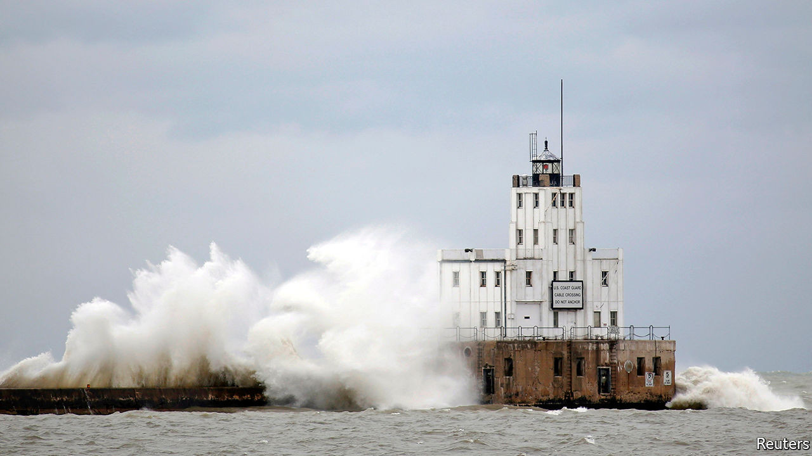

## Stormy waters

# Ports are highly exposed to climate change and often ill-prepared

> Over half of global trade passes through ports with high climate risks

> Sep 12th 2020

IN MID-JANUARY a storm gathered over Lake Michigan. Gale-force winds dragged water up and dumped it on Milwaukee. The city was “pummelled”, says Adam Tindall-Schlicht, the director of its port, which was badly damaged. Dock walls were ripped off and washed inland. The trade routes the port serves, including those for steel from Europe, were disrupted. Climate change has exacerbated the risk of such storms. Mr Tindall-Schlicht notes that water levels on the Great Lakes have never been so high.

Seaports are by their nature exposed to the elements. But they are also choke-points of global trade, handling 80% of the world’s goods. So disruption at a port can have far-reaching consequences. When Hurricane Katrina shut down three ports that process 45% of America’s agricultural goods, national food prices rose by 3%. Hurricane Harvey had a similar effect on the price of fuel. One study modelled floods hitting the port of Rotterdam in the Netherlands. It estimated the impact on trade would add an extra 64% to 86% to the overall cost, on top of the direct damages.

To find out how big the risk to global trade is, The Economist asked Four Twenty Seven, a climate-risk consultancy, to assess the world’s 340 or so biggest ports, according to the Institute of Shipping Economics and Logistics. The analysis looked at the ports’ annual throughput, measured in 20-foot equivalent units, and their exposure to six types of climate-related events, including storms and wildfires. Fully 55% of global trade passes through ports which have a high risk of at least one type of event. (“High” in this case means roughly the exposure that South Carolina has to hurricanes.) About 8% of trade was vulnerable to three or more climate hazards.

Some ports, particularly big ones in rich countries, have built defences. But often ports are ill-prepared. Ageing infrastructure is one problem. Mr Tindall-Schlicht says much of his port was built in the 1960s.

Other ports do not have the proper procedures in place. Jan Brooke of the World Association for Waterborne Transport Infrastructure highlighted a recent survey that asked 67 ports if they had performed climate-risk assessments, installed early-warning systems or made contingency plans. Only 15% had done all three. Over a fifth had done none at all.

One reason is that it is not always clear who is responsible for a port’s resilience. Many ports are government-owned but operated by a firm. In America building a storm barrier is primarily the purview of the Army Corps of Engineers. Protecting the roads that serve ports is done by state or federal departments of transportation. Rarely do all the actors co-ordinate.

Another hurdle, particularly in poor countries, is climate financing. Ports often go to development banks to raise funds. The banks are used to supporting big infrastructure projects. It is hard to get small amounts of money for a single port.

Efforts to ease the problem are under way. UNCTAD, the UN trade and development body, is teaching port managers about climate resilience. Networks of ports and groups of civil engineers are drawing up guidelines on adaptation. But there is often little incentive to prepare. Ms Brooke notes that the ports hit by extreme events are the ones most willing to adapt. Sadly, their number is only likely to grow.■

For more coverage of climate change, register for The Climate Issue, our fortnightly [newsletter](https://www.economist.com//theclimateissue/), or visit our [climate-change hub](https://www.economist.com//news/2020/04/24/the-economists-coverage-of-climate-change)

## URL

https://www.economist.com/finance-and-economics/2020/09/12/ports-are-highly-exposed-to-climate-change-and-often-ill-prepared
