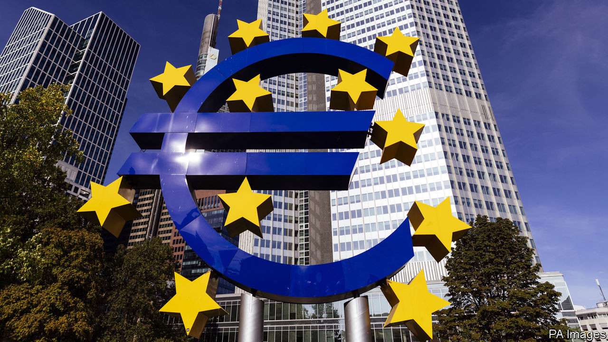
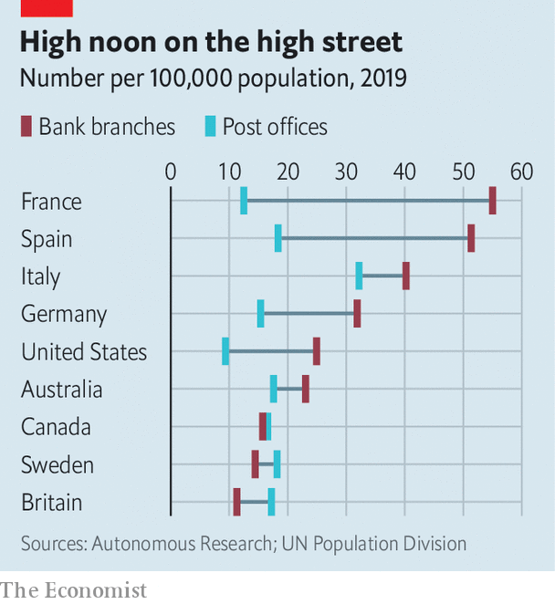

## Badwill hunting

# Why are European banks merging?

> An ECB accounting change is encouraging new alliances

> Sep 10th 2020BERLIN

WHEN CAIXABANK and Bankia, its state-owned peer, announced on September 3rd that they were exploring a merger to create Spain’s biggest domestic lender, politicians, regulators and analysts offered unusually unanimous applause. If the deal goes through, it will boost consolidation within the Spanish market, hitherto highly fragmented beneath the two international giants, Banco Santander and BBVA. It may also inspire similar deals elsewhere in the European Union.

If European banks want to catch up with American and Chinese ones, they must push for consolidation. European banks have a 6.7% return on capital on average, the lowest of any region, according to the Banker, a trade publication. Among American banks, it is 14.4%. Greater scale would also help them make the big investments in technology platforms and data analysis required to keep up with digitisation. As it is, parts of the region are massively overbanked, especially when compared with post offices, which are also stalwarts of the analogue era (see chart).

Yet mergers and acquisitions between European banks have plummeted over the past decade. At the start of last year merger talks between Deutsche Bank and Commerzbank, Germany’s largest listed lenders, ended after a mere six weeks. According to S&P Global Market Intelligence, the number of mergers in 2019 fell to the lowest level since the global financial crisis. Only 40 bank takeovers involved buyers or targets based in the European Economic Area or Switzerland. That compared with 62 in 2018 and 122 in 2011.

Two factors could boost the urge to merge. The first is the fallout of covid-19, which has left banks saddled with bad loans and struggling with rock-bottom interest rates. That challenges many banks’ ability to soldier on alone. Secondly, the European Central Bank encouraged banks in July to recognise an accounting gain known as negative goodwill, or “badwill”, that they generate when they buy a rival below tangible book value, or at a lower price than the sum of its assets minus liabilities.

This accounting technique enables banks to use badwill to offset restructuring charges—eg, from branch closures or lay-offs—though it cannot be used to pay dividends to shareholders, explains Stuart Graham of Autonomous, a financial-research firm. It is not unprecedented: American regulators allowed banks to use badwill to shore themselves up during the financial crisis. Some dismiss badwill as dodgy accounting but it could be pivotal. A €2bn ($2.4bn) badwill bonus has encouraged Intesa Sanpaolo, Italy’s largest bank, to take over UBI Banca, another Italian bank, this year. It would have a bearing on the proposed Spanish bank merger. For the same reason, Mr Graham predicts that Italy’s Monte dei Paschi di Siena, the country’s oldest bank, could be a takeover target.

Cross-border mergers are not yet on the menu, though. Ronit Ghose of Citigroup, a bank, says bank bosses need to feel confident about their domestic businesses to launch international forays. They are not. Moreover, it is harder to achieve cost-cutting synergies across borders because Europe’s financial market is far from unified. The absence of a common European deposit-insurance scheme is another obstacle; one is not planned until 2025.

Jörg Eigendorf, a spokesman for Deutsche Bank, concedes that in the near future the competitiveness gap between European and American banks is only likely to grow. Sadly, even if Deutsche and Commerzbank rejoined the merger fray, the combination of two such serial underperformers would not change that. ■

## URL

https://www.economist.com/finance-and-economics/2020/09/10/why-are-european-banks-merging
