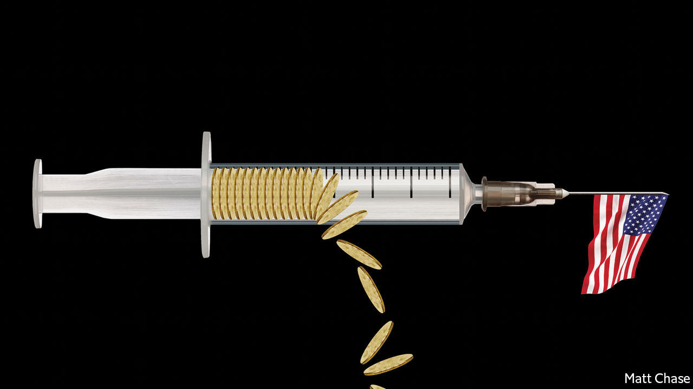
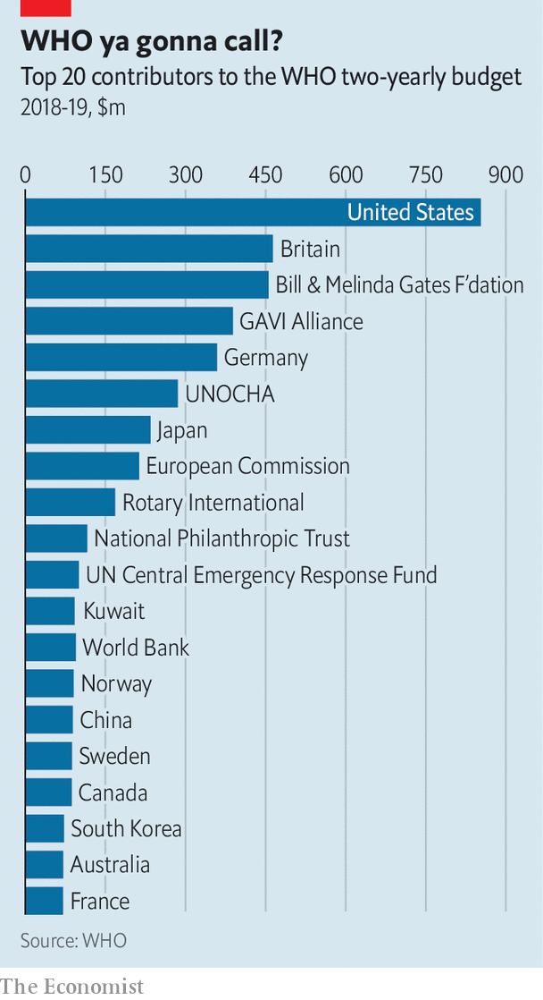

## Covid-19 and beyond

# The world needs a better World Health Organisation

> The WHO has done well against covid-19. But it needs more muscle and more money

> Sep 12th 2020GENEVA

Editor’s note: Some of our covid-19 coverage is free for readers of The Economist Today, our daily [newsletter](https://www.economist.com/https://my.economist.com/user#newsletter). For more stories and our pandemic tracker, see our [hub](https://www.economist.com//news/2020/03/11/the-economists-coverage-of-the-coronavirus)

THE GLASS and metal headquarters of the World Health Organisation (WHO), the UN’s health agency, contrast starkly with their bucolic surroundings in the hills around Geneva. The only dabs of colour are the flags of its 194 member-states. For now the American flag still flutters beside the rest. But if President Donald Trump has his way, by July 2021 it will be gone. America is the WHO’s biggest donor. A tenth of its staff are American. Its influence runs through the agency, right down to the peanut-butter cups in the staff vending machine.

It is an odd time to cut ties with the world’s foremost public-health body. There is a pandemic going on. Mara Pillinger, a health-policy researcher at Georgetown University in Washington, DC, says the WHO has done a “pretty remarkable job” of coping with covid-19, given the constraints built into the way it works. Nonetheless, the twin threats of Trumpism and coronavirus have illuminated both the agency’s strengths and its weaknesses, and raised questions about its future.

The WHO’s emergency work is governed by a legal framework known as the International Health Regulations, the current version of which has been in force since 2005. They spell out how public-health emergencies should be handled. They set the rules for how nations should behave. And they constrain the WHO. Member-states are bound to report outbreaks of diseases as soon as they can, but if they fail to do so, or delay as China did with covid-19, the organisation has no way of compelling them.

Before 2005 the rules were different. Gro Harlem Brundtland, a former Norwegian prime minister who led the WHO from 1998 to 2003, slammed China for failing to report an outbreak of SARS promptly in 2003. Those days are gone, she says; member-states have now limited what the head of the WHO can do and say. Tedros Adhanom, the current director-general, has not openly criticised China. But nor has he lambasted America, points out Jeremy Hunt, a former British health secretary. Such tact is crucial. UN bodies work by consensus, he says: “That is the price you pay for getting all the countries in the world around the table.”

Ordinarily the job of the WHO is to identify the best public-health measures, share that information and offer technical support to members that need it. It is the main forum where countries co-operate on matters of health. The practical work of public health is not its job. However, when others fail it will step in. It has provided mental-health services in Syria and airlifted ambulances into Iraq. It failed in its response to an outbreak of Ebola in West Africa in 2014 which killed more than 11,000 people. But when the disease struck the eastern Democratic Republic of Congo in 2018 it played a leading role in bringing it under control. When others thought it too dangerous to send staff into the field, the WHO stayed. Two staff were killed by rebels, who often attacked clinics. Dr Tedros visited Congo 14 times, showing unusual pluck for someone in his position.

The WHO was central in the eradication of smallpox, a disease killed almost 300m people in the 20th century. It has helped almost wipe out polio, which in the 1980s paralysed 350,000 people in 125 countries each year. The disease is now found in only three countries. The WHO receives information from countries on outbreaks, organises vaccination programmes and often acts as a kind of vaccine-approval agency.

One problem for the WHO, argues Dr Pillinger, is that much of its work is invisible. It co-operates closely with governments and lets them take credit for its efforts. When things go wrong, of course, it makes a convenient scapegoat, as Mr Trump has realised.

Its response to covid-19 has come under intense scrutiny, as it should. Dr Brundtland thinks the WHO declared the outbreak a public-health emergency far too late. That could be because China, once again, withheld information about a novel outbreak. It was, she says, “concealing and waiting and shouldn’t have done, according to International Health Regulations”.

Some say the WHO was too slow to issue guidance on the use of dexamethasone, a drug that can treat some of the sickest patients. Others have blasted it for dragging its feet before promoting the wearing of fabric masks on buses and in shops. Initially it did not have the evidence on which to base such guidance, explains Maria Van Kerkhove, a WHO epidemiologist. It needed to know whether masks would be available and what the science said about the efficacy of the widespread use of the fabric kind. It asked researchers at Stanford University to investigate. On the basis of their research in June it changed its advice to say that such masks should be worn in public where physical distancing is impossible.

But overall the organisation has responded to covid-19 swiftly. At the start of the outbreak officials worked with technology and social-media companies to encourage them to promote accurate information. It coined the phrase “infodemic” to describe the rapid spread of misinformation about the new virus.

It has helped co-ordinate global efforts to find treatments and vaccines. It is working with drug firms to safeguard the supply of medicines. It is now a key player in COVAX, a plan to distribute 2bn doses of a covid-19 vaccine in 2021. The WHO has rushed to digest research produced at high speed and explain what it means. Behind the scenes member-states are regularly told where the WHO thinks their measures are not aggressive or comprehensive enough.

Its efforts will be further analysed. In May the World Health Assembly, the WHO’s decision-making forum, requested a full independent evaluation of the agency’s response to the pandemic as well as that of individual countries. It will be published next year. Whatever its conclusions, many of the WHO’s weaknesses are already apparent. Last month officials in the German and French health ministries circulated a paper saying the agency is severely underfunded, chronically over-mandated by member-states, and weak by design.

Money is the most immediate problem. The WHO’s budget is a piddling $2.5bn a year (roughly what America spends on health care for a typical small city). “It’s a sad figure,” says Howard Koh, a professor at the Harvard Chan School of Public Health and a former assistant secretary for health in the Obama administration. With this “we expect them to solve the world’s pandemics.” In emergencies the WHO often has to go cap in hand to its funders to scrounge more cash. In the middle of the Ebola outbreak in Congo in 2018-19 it ran out.

Its work is made harder because only 20% of its $2.5bn in funding is guaranteed and comes without strings. Much of that comes from a small number of large donors (see chart). It is like an oil-dependent country, argues Dr Tedros, too reliant on a single source of income, namely America. Other big countries, such as China and France, contribute trifling amounts. The other 80% comes in the form of around 3,000 unpredictable and voluntary contributions earmarked for specific projects. Almost half are for less than $500,000. They are messy, difficult to manage and fragment the organisation, says the WHO’s boss.

Since he took over in 2017, Dr Tedros has tried to secure the agency’s finances. He set up the WHO Foundation to create a more reliable source of money. He is trying to persuade member-states to give more unconditional funding. Even before the pandemic he had pushed health up the political agenda. Staff at a big health charity say that under him the WHO has gone from discussing its work with health ministers to talking to heads of state.

Dr Tedros credits his staff for feeding him good ideas, such as setting up a WHO Academy to support the training of health workers around the world. He established the role of chief scientist. He has reached out to the private sector, something the WHO has hesitated to do before, for fear of conflicts of interest. He says he is willing to work with the food industry to eliminate trans fat, a particularly unhealthy type of fat, from food by 2023. The agency is looking into working with big tech firms on digital health technologies.

Dr Tedros is the first director-general to be elected by a secret ballot of all member-states—giving him greater independence, he says. A smaller group of countries, the WHO’s executive board, used to control these elections. The reforms he has implemented so far have been ambitious, but member-states must push them further.

Beyond pandemics, the work of promoting science-based policy, strengthening health systems and expanding access to care is not glamorous. But it is vital. The agency’s record on covid-19 is far from perfect but it had long warned of the possibility of a pandemic on such a scale. In 2018 it talked about “Disease X”, an illness caused by a pathogen never seen before in humans that would cause the next pandemic and wreak havoc. Dr Tedros set up a new division to prepare for it. Many countries did not listen.

The world has no better idea than it did a year ago whether an outbreak as bad as covid-19 is a once-in-a-century event or will happen again tomorrow. Meanwhile, new demands on the WHO are emerging. A fresh outbreak of Ebola in Congo requires attention. Poorer countries will need support dealing with covid-19 along with existing diseases such as diabetes and measles. The WHO will have to spread its already limited resources even more thinly.

Dr Tedros has tried to convince the Trump administration that America should stay part of the WHO but says it set “completely unacceptable” conditions for doing so (he did not specify what they were). Joe Biden has promised that America would rejoin the WHO immediately, should he win the presidency. Either way, the possibility of the organisation’s main donor bunking out has made other countries realise that they should do more to bolster it. An internal panel is looking at reforms to the International Health Regulations. The WHO may need the power to investigate outbreaks more independently and to establish a system so that it can issue warnings about public-health emergencies earlier. A year ago the risks of a weak global health system were hard to calculate. Today the costs of failure are measured in trillions of dollars and the loss so far of around 900,000 lives to covid-19. ■

## URL

https://www.economist.com/international/2020/09/12/the-world-needs-a-better-world-health-organisation
