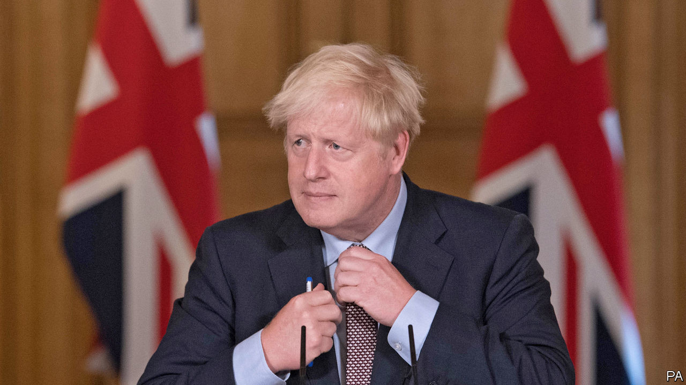

## Brexit and international law

# Britain threatens to flout international law

> Boris Johnson’s readiness to break a treaty as a negotiating tactic is both foolish and dangerous

> Sep 9th 2020

IT IS STAGGERING to see a British minister brazenly admit to Parliament that the government intends to breach international law. Yet that is what Brandon Lewis, the Northern Ireland secretary, did this week—even if he sought to qualify the move as “very specific and limited”. The plan in the proposed internal-market bill is to override parts of the Brexit withdrawal agreement, a treaty ratified only in January, that relate to trade between Great Britain and Northern Ireland. Because it will remain subject to the European Union’s customs code and single-market rules, special treatment is needed for the province to avert a hard border with Ireland. Reflecting the fact that there is no precedent for Britain unilaterally breaching an international treaty in this way, the government’s most senior legal adviser promptly quit.

What is Boris Johnson’s government playing at? It may be that he is resigned to Britain leaving the transition period on December 31st without a trade deal with the EU in place. The Brexit talks seem irretrievably stuck, so some in Downing Street now favour this option. Yet a kinder interpretation is that the prime minister is engaging in a tactical ploy to ratchet up the pressure on the EU. Threats to rewrite the withdrawal agreement are of a piece with his insistence that, unlike his predecessor, Theresa May, he will not blink at the last minute, and his claim that no deal would be a “good outcome” for Britain. By making no deal look more chaotic, he may hope to force EU leaders to compromise in their rigid demand for a level playing-field on state subsidies (see [article](https://www.economist.com//node/21791761)).

Yet such a tactical game is unlikely to work. As the world’s biggest market, the EU is a tough negotiator that does not commonly give in to threats. EU leaders know that the disruption and economic damage caused by no deal would be far worse for Britain than it would be for them. Faced with a similar prospect last year, it was not the EU but Mr Johnson who gave ground by accepting a separate status for Northern Ireland which implied customs checks in the Irish Sea. Moreover, to rewrite the withdrawal agreement unilaterally would undermine trust in the British negotiators. As EU leaders are already asking, how can they do a trade deal with a country that is talking of ripping up a treaty it agreed with them less than a year ago?

The ramifications of Mr Johnson’s threat to breach international law go wider than Britain’s relationship with the EU. Because his plan revives fears of a hard border in Ireland, it would go down very badly in America. Congress has already made clear that it will not ratify a free-trade deal with Britain if Brexit undermines the Good Friday peace process. The other prospective partners that post-Brexit Britain hopes to do trade deals with will be similarly deterred by the sight of it breezily overriding international commitments. Mrs May was right this week to wonder how other countries could now be reassured that Britain can be trusted to abide by its legal obligations.

Britain is a proud founding father of international law. If it is seen to be flouting it, that will only encourage others who dislike the concept (Vladimir Putin? Xi Jinping?) and would prefer to escape any constraints that it imposes. The Chinese press was quick to report the British case; China imposed its new security law unilaterally on Hong Kong. It would not be too far-fetched to expect other countries to think of their own cases. Spain, for example, might wish unilaterally to revisit the Treaty of Utrecht of 1713, under which it handed sovereignty over Gibraltar to Britain.

If Mr Johnson is unhappy with certain provisions in the withdrawal agreement, there is a procedure to clarify them in a joint committee with the EU. That is the right forum to use, not unilateral domestic legislation. He should drop his plan immediately and return to the negotiating table to secure a good deal with Britain’s biggest trade partner, which is what he promised voters he would do before last December’s election. ■

## URL

https://www.economist.com/leaders/2020/09/09/britain-threatens-to-flout-international-law
