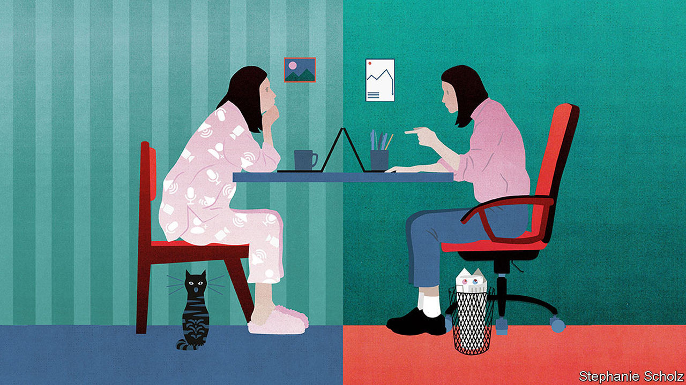

## The future of work

# Is the office finished?

> The fight over the future of the workplace

> Sep 12th 2020

Editor’s note: Some of our covid-19 coverage is free for readers of The Economist Today, our daily [newsletter](https://www.economist.com/https://my.economist.com/user#newsletter). For more stories and our pandemic tracker, see our [hub](https://www.economist.com//news/2020/03/11/the-economists-coverage-of-the-coronavirus)

MOST PEOPLE associate the office with routine and conformity, but it is fast becoming a source of economic uncertainty and heated dispute. Around the world workers, bosses, landlords and governments are trying to work out if the office is obsolete—and are coming to radically different conclusions (see [article](https://www.economist.com//briefing/2020/09/12/covid-19-has-forced-a-radical-shift-in-working-habits)). Some 84% of French office workers are back at their desks, but less than 40% of British ones are. Jack Dorsey, the head of Twitter, says the company’s staff can work from home “forever” but Reed Hastings, the founder of Netflix, says home-working is “a pure negative”. As firms dither, the $30trn global commercial-property market is stalked by fears of a deeper slump. And while some workers dream of a Panglossian future without commutes and Pret A Manger, others wonder about the threat to promotions, pay and job security.

The disagreement reflects uncertainty about how effective social distancing will be and how long it will take before a covid-19 vaccine is widely available. But it is about more than that: the pandemic has revealed just how many offices were being run as relics of the 20th century, even as it triggered the mass-adoption of technologies that can transform white-collar work. As a result the covid calamity will prompt a long-overdue phase of technological and social experimentation, neither business as usual nor a fatal blow to the office. This era holds promise but also brings threats, not least to companies’ cultures. Instead of resisting change, governments need to update antiquated employment laws and begin reimagining city centres.

Two hundred years ago steam power brought workers to factories where they could use new machines. As corporate giants emerged in the late 19th century, staff were needed to administer them. They held planning meetings and circulated memos, invoices and other paperwork to record what they had done. All this required workers to be close together and created the pattern of people commuting by car or train in order to meet in a central office.

This system always had glaring shortcomings, some of which have become worse over time. Most people hate the hassle and expense of commuting, which eats up over four hours a week for the average American worker. Some dislike the noise and formality of offices, or suffer from discrimination within them. Office-bound workers find it harder to look after their children, a growing issue as more families have two working parents.

You might think that new technologies would have shaken up this unsatisfactory status quo. After all, the PDF electronic document was born in 1991, the cost of bandwidth collapsed in the 2000s, and Zoom and Slack, two firms whose technology powers remote working, are both nearly a decade old. Yet inertia has allowed the office to escape serious disruption. Before covid-19 struck, for example, flexible-office companies (including the troubled WeWork) had a tiny global market share of under 5%. Most businesses were unwilling to switch wholesale to remote-working technologies before their clients did; or to write off sunk costs in the form of property assets and leases.

Covid-19 has upended all this. Before the pandemic only 3% of Americans worked from home regularly; now a huge number have tried it. Even Xerox, a firm synonymous with office printers spewing unread pages, has many of its staff working from home. As more people adopt remote-working technologies there is a powerful network effect, with each new customer making the service more useful. Together Microsoft Teams, Zoom, Google Meet and Cisco Webex now have well over 300m users. Bureaucratic hurdles to remote work have been blasted out of the way. Civil courts are operating remotely. Notaries have gone online and some banks have eliminated the need for new customers to enter a branch to confirm their identity and open an account.

How much of this change will stick when a vaccine arrives? The best available guide is from countries where the virus is under control. There the picture is of an “optional office”, which people attend, but less frequently. In Germany, for example, 74% of office workers now go to their place of work, but only half of them are there five days a week, according to surveys by Morgan Stanley. The exact balance will depend on the industry and city. In places with easy commutes more workers will go to the office; megacities with long, expensive journeys may see fewer.

Companies will have to adapt to this pattern of sporadic attendance in which the office is a hub, not a second home. There is a risk that over time a firm’s social capital erodes, creativity flags, hierarchies ossify and team spirit fades, as Mr Hastings fears (see [article](https://www.economist.com//business/2020/09/12/can-reed-hastings-preserve-netflixs-culture-of-innovation-as-it-grows)). The answer is more targeted staff interactions, with groups gathering at specific times to refresh friendships and swap information. New technologies that “gamify” online interactions to prompt spontaneity may eventually supersede the stilted world of Zoom. As they retool their cultures firms will need to rejig their property: sober investors expect a reduction of at least 10% in the stock of office space in big cities. With the typical corporate lease lasting at least half a decade, this will take time to play out.

For governments the temptation is to turn the clock back to limit the economic damage, from the collapse of city-centre cafés to the $16bn budget shortfall that New York’s subway system faces. Britain’s government has tried to cajole workers back to the office. But rather than resist technological change, it is far better to anticipate its consequences. Two priorities stand out.

First, a vast corpus of employment law will need to be modernised. Already the gig economy has shown that it is out of date. Now new prickly questions about workers’ rights and responsibilities loom: can firms monitor remote workers to assess their productivity? Who is liable if employees injure themselves at home? Any sense that white-collar workers are getting perks will create simmering resentment in the rest of the workforce.

The second priority is city centres. For a century they have been dominated by towers filled with swivel chairs and tonnes of yellowing paper. Now complex urban-planning rules will need a systematic overhaul to allow buildings and districts to be redeveloped for new uses, including flats and recreation. If you step back into the office this month, sit down and log on to your computer—but don’t get too comfortable.■

## URL

https://www.economist.com/leaders/2020/09/12/is-the-office-finished
