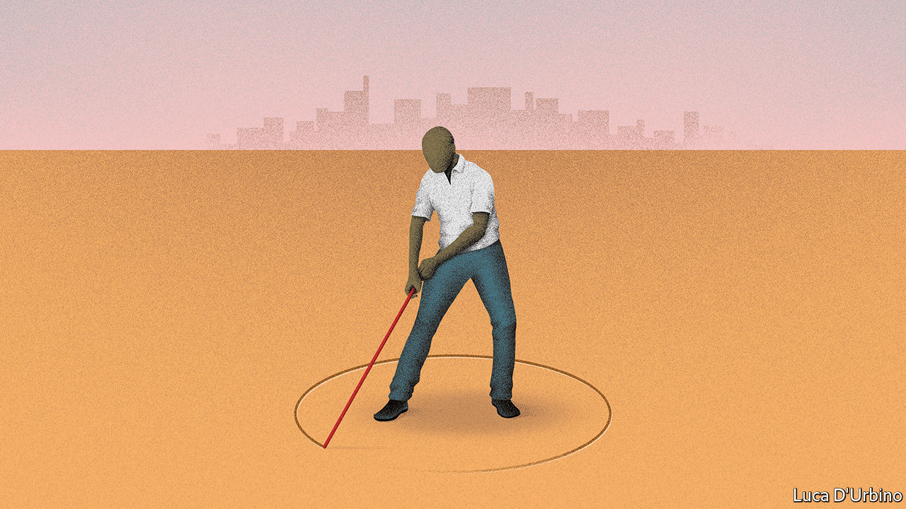

## Land reform

# Who owns what?

> Enforceable property rights are still far too rare in poor countries

> Sep 12th 2020

TWENTY YEARS ago a Peruvian economist made a startling observation. People in poor countries are not as poor as they seem. They have assets—lots of them. But they cannot prove that they own them, so they cannot use them as collateral. Hernando de Soto estimated that the total value of informally owned land, homes and other fixed assets was a whopping $9.3trn in 2000 ($13.5trn in today’s money). That was more than 20 times the total of foreign direct investment into developing countries over the preceding decade. If small farmers and shantytown-dwellers had clear, legal title to their property, they could borrow money more easily to buy better seeds or start a business. They could invest in their land—by irrigating it or erecting a shop—without fear that someone might one day grab it. Property rights would make the poor richer, he argued.

Since his book, “The Mystery of Capital”, was published, its ideas have spread. Indonesia, Thailand and Vietnam have pursued vast titling projects, mapping and registering millions of land parcels. India wants to use drones to map its villages. Ethiopia has registered millions of tracts. Rwanda has mapped and titled all its territory for $7 per parcel, thanks to cheap aerial photography. Studies suggest that titling has boosted agricultural productivity, especially in Asia and Latin America. The World Bank wants 70% of people to have secure property rights by 2030.

That is unlikely to happen, however. Despite all these efforts, only 30% of the world’s people have formal titles today. In rural sub-Saharan Africa a dismal 10% do (see [article](https://www.economist.com//middle-east-and-africa/2020/09/12/the-quest-for-secure-property-rights-in-africa)). Just 22% of countries, including only 4% of African ones, have mapped and registered the private land in their capital cities. As covid-19 destroys jobs, there has been a global upsurge in evictions and home demolitions, says the UN. Some 1bn people, nearly one in five adults, according to another survey, fear they will be evicted within five years, often because they do not formally own the land under their homes. Almost half of sub-Saharan women fear that divorce or widowhood would mean losing their fields or the roof over their heads.

As Mr de Soto warned, establishing a system of secure property rights is hard. Simply giving property-holders a title deed is not enough. A legal document is worth little if its owner cannot easily use it. Even in Rwanda, 87% of sales involving parcels of rural land were still done informally five years after the drive to give everyone deeds ended. Other countries have seen similar failures. All too often the institutions needed to enforce property rights smoothly, impartially and transparently are missing.

In many countries transactions are painfully slow. Registering a property takes an average of 108 days in South Asia and 64 in Latin America, as against just 24 days in OECD countries. In India two-thirds of civil-court cases are land disputes, which take an average of 20 years to resolve. New software platforms that make transactions and mediation easier should help. But technology can do only so much.

Other laws often undermine property rights. In more than 30 countries daughters and widows do not have the same land-inheritance rights as sons or widowers. In dozens more women find it hard to own land because of customary law, which is unwritten but vigorously enforced in many villages. Mining and forestry laws may override land laws, as in Mozambique. Ethiopia’s registering of millions of land parcels in the 2000s was undermined by restrictions on their use as collateral.

Restrictive planning laws make matters worse. In South Asia, where 130m people live in slums, zoning rules and land-hoarding by government agencies make it harder and costlier for people to buy formal property. And where title is insecure, land is less likely to be developed. Instead, people are pushed into low-rise slums far from the centre: the resulting sprawl means South Asian cities are growing twice as fast in area as in population. In Anglophone Africa some planning laws draw on colonial-era statutes designed for spacious English suburbs. In Dar es Salaam in Tanzania, the minimum plot size for a formal dwelling is 400 square metres. A slum home is perhaps one-fortieth of that.

One reason why reform is hard is that politicians often have a strong incentive to oppose it. In much of the developing world, the power to allocate land—or to decide who does so—is extremely lucrative. Politicians are often the worst land-grabbers, in order to enrich themselves and to reward supporters. Stronger property rights for the little guy would make such looting harder.

Ruling parties often ally with rural traditional leaders to thwart change. Globally 2.5bn-3bn people live on some 6bn hectares of communal land (or three Russias and a Brazil). In Africa more than 50% of people do. Since 1990, 39 of Africa’s 54 countries have passed land laws to give people on communal land stronger ownership rights. Yet in some countries, such as Malawi and Zambia, chiefs have blocked reforms. In others toxic deals between urban and rural bigwigs deprive poor people of rights to their own land. This is an acute problem in South Africa’s “former homelands”, where many black people were consigned during apartheid and where one-third of South Africans still live, with minimal property rights.

Well-meaning laws sometimes have loopholes for elites to exploit. Rules that allow expropriation in the public interest are abused to transfer land to cronies, for example. One study of African and Asian laws found that only half required compensation in the case of state-led expropriation. Some governments simply ignore the law. Officials in Brazil, Colombia and Kenya have thrown slum-dwellers out of their shacks or bulldozed rural people’s ancestral land. In Niger, Indonesia and the Philippines land-rights activists have been locked up or intimidated. Property rights cannot work unless the law applies to everyone.

Land is an emotive issue, especially where memories of colonial expropriation still linger. In parts of southern Africa, when a baby is born, its umbilical cord is buried in the ground. The introduction of modern, legally enforceable property rights will always be politically fraught. Nonetheless, reformers must keep up the long, hard slog of recording who owns what, cementing individual property rights in law and building the institutions to uphold them. As Mr de Soto argued, capitalism should be for the many, not just the few. ■

## URL

https://www.economist.com/leaders/2020/09/12/who-owns-what
