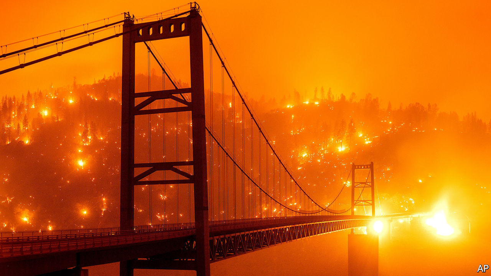
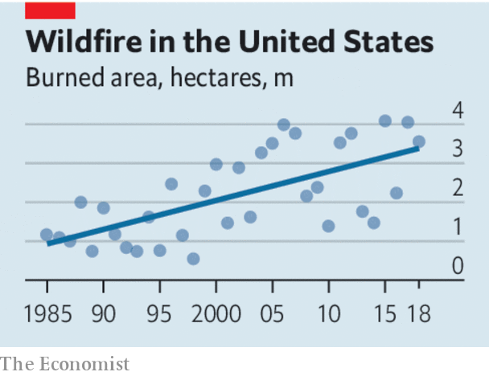

## Golden State ablaze

# Why is California burning?

> It’s time to think harder about incentives

> Sep 12th 2020

FOR DECADES environmentalists have warned that the world is going to burn. Mostly, they meant it figuratively. But footage of fires sweeping through the Siberian steppe, the Amazon forest, parts of Australia and now, once again, California, make it easy to believe the planet is, literally, on fire. New infernos have been whipped up by strong winds and scorching temperatures across the Golden State. On September 7th PG&E, a utility serving northern California, shut off the power supply to tens of thousands of homes in an attempt to stop live lines from sparking more blazes. So far this year, California has seen more than 2.5m acres (1m hectares) burned and more than 3,700 structures destroyed—all before the autumn months when the Santa Ana winds normally stir up the worst of the annual blazes. With over three months remaining of this year’s fire season, few doubt the state is facing its worst yet.

The fires themselves cannot be stopped; they are fuelled by climate change layered on top of an ecosystem that burns regularly as part of its natural cycle. Hotter temperatures and drier landscapes mean more fires. But the damage need not be so great. Much of California’s mess is of its own making. It has made itself more vulnerable with a litany of out-of-date regulations and self-defeating policies.

California does deserve credit for being the only American state to have adopted fire-safe building codes for what is known as the “wildland-urban interface”, where houses are sparsely dotted through tall, flammable trees and vegetation, often on steep slopes that flames can race up. Evidence suggests the codes do help limit damage. However, they apply only to new structures, and do nothing about the need to retrofit the vast majority of existing houses and other properties. Nor are there subsidies or other incentives to nudge people and firms to take on the onerous and expensive task of making buildings safe.

Furthermore, the codes date back to 2008 and have not yet been updated to include the latest science on why buildings burn. That includes strong evidence that the first five feet around a structure are key to its defence but all too often consist of flammable materials. Today, landscapers can still draw up designs where bark mulch—an almost perfect fuel—is laid down around the periphery of a home, office, or even hospital.

Fire-risk maps and zoning, which determine who must follow building codes, are in desperate need of a rethink. Among other things, they consider urbanised areas “unburnable”, which ignores science showing that the majority of buildings catch fire when flying embers are blown a mile or more away from the flaming vegetation. As a result, communities that are at risk from wildfires are not held to fire-safety rules—sometimes with dire consequences. When Coffey Park in Santa Rosa was destroyed by wildfire in 2017, the city vowed to rebuild better; but it wavered because of unfounded fears that being fire-safe would be a lot more costly. Stringent fire codes were not enforced, and the community once more had to evacuate during a fire in 2019 rather than shelter-in-place.

California is compounding its problems by undermining the correct pricing of risk, which is essential to encourage homeowners to move out of the most dangerous areas. The state has imposed ill-conceived new rules on insurers, temporarily barring them from refusing to renew policies in high-risk areas. And regulators are discouraging the industry from using fire risk as a reason to turn down business anywhere in the state.

No wonder California is caught in a burn-rebuild-burn-again cycle. The fires are not going away. But if state leaders rethought their misguided policies, they would at least wreak less havoc. ■

For more coverage of climate change, register for The Climate Issue, our fortnightly [newsletter](https://www.economist.com//theclimateissue/), or visit our [climate-change hub](https://www.economist.com//news/2020/04/24/the-economists-coverage-of-climate-change)

## URL

https://www.economist.com/leaders/2020/09/12/why-is-california-burning
