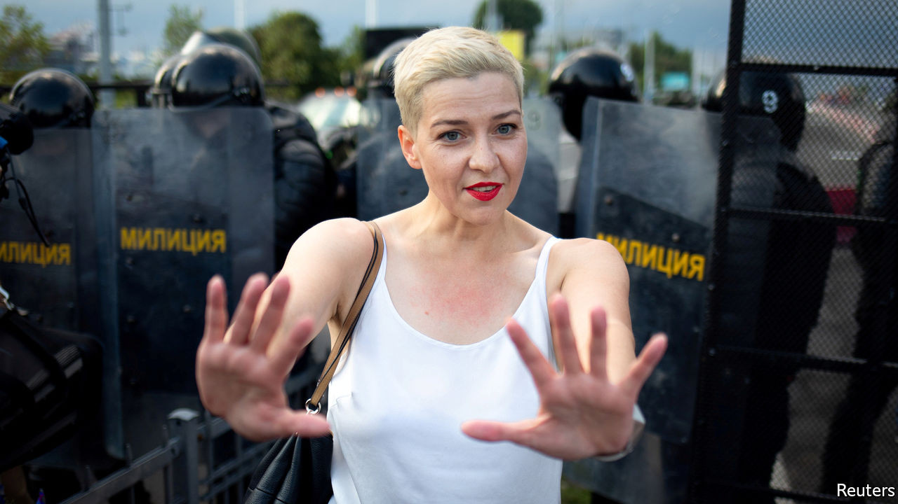

## A desperate despot’s dodgy deal

# Will Putin save Lukashenko?

> In exchange for Russian support, an autocrat prepares to sell out his country

> Sep 12th 2020

“FIRST THEY stole our country. [Now] they are stealing the best of us.” So said Svetlana Alexievich, a Nobel prize-winning writer, of the rulers of her native Belarus. Since mass protests erupted after a blatantly rigged presidential election in August, riot police and plain-clothes goons have been beating up peaceful demonstrators. On September 7th, in broad daylight, men without uniforms abducted Maria Kolesnikova (pictured), one of three women leading the protests and the only one still inside the country. They threw her into a van and drove her to the border with Ukraine, like gangsters trying to drive a rival off their turf. Defiantly, she ripped up her passport, so she could not cross. She is now in detention in Belarus.

Ms Kolesnikova is being persecuted not only for her role in the protests but also, more importantly, because she is the leading member of the National Co-ordinating Council. This body was launched by Svetlana Tikhanovskaya, who probably won the election on August 9th but who has been forced into exile. It aims to negotiate a peaceful end to the unpopular dictatorship of Alexander Lukashenko. He has refused to negotiate, just as he has refused to talk to the German chancellor, Angela Merkel.

He prefers to talk to Vladimir Putin, the president of next-door Russia, who props up his regime. Mr Putin, whose own challenger, Alexei Navalny, has been poisoned by a nerve agent, has endorsed Mr Lukashenko’s rigged election and his use of violence. He has warned the West not to meddle in Belarus, which Russia has subsidised for many years and with which it has a common market. At Mr Lukashenko’s request, Mr Putin has pledged to support Belarus with his own law-enforcers if necessary. He has also dispatched propagandists to run its airwaves and consultants to manage the crisis. Russia’s prime minister and finance minister have flown to Minsk to talk about an economic rescue package.

The West’s reaction has been divided, slow and weak. The Baltic states and Poland, which have had first-hand experience of Soviet occupation, have imposed sanctions on Mr Lukashenko and offered support to the Belarusian opposition. Germany and France, however, appear to have heeded Mr Putin’s warning to stay out of the dispute. The European Union has yet to impose any sanctions on Mr Lukashenko, though some measures are under discussion. Such caution about Belarus contrasts with bolder statements about Mr Navalny’s poisoning from Mrs Merkel. She has pointed a finger at the Kremlin and raised the possibility of cancelling Nord Stream 2, a huge and controversial gas-pipeline project (see [article](https://www.economist.com//europe/2020/09/12/angela-merkel-is-losing-patience-with-vladimir-putin)).

The EU should speak up loudly about Belarus, and with one voice. Simply warning Mr Putin against sending troops is not enough. A Russian invasion was unlikely from the start. Instead, Mr Putin wants the tottering Belarusian tyrant to integrate his country more deeply with Russia, giving Mr Putin control over its defence, internal security and certain key economic assets. In return, Mr Lukashenko might get an honorary post in Moscow some day. Russia might be hoping for a soft Anschluss. That would be no more acceptable than Mr Putin’s annexation of Crimea, a Ukrainian peninsula, in 2014.

Belarusians have woken up. They will not submit quietly to Moscow’s rule and they continue to protest in vast numbers. They deserve support. The EU should impose personal sanctions against Mr Lukashenko and his henchmen. And it must state that any agreement with Russia signed by Mr Lukashenko on behalf of the people who have clearly rejected him has no legal basis or validity. No one should recognise a dodgy deal struck by a desperate despot who would sell his country to save himself. ■

## URL

https://www.economist.com/leaders/2020/09/12/will-putin-save-lukashenko
