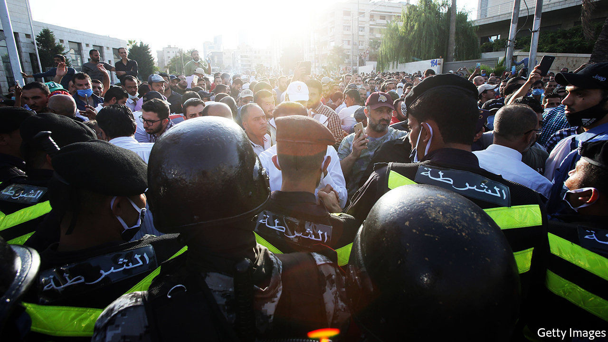

## Failing the test

# Schools in Jordan struggle with covid-19 and jailed teachers

> The government blames Islamists for bad behaviour in class

> Sep 12th 2020BEIRUT

SCHOOLS AROUND the world are grappling with how to teach during a pandemic. Some in Jordan have an added complication: teachers in jail. In July the authorities raided the office of the national teachers’ union, which represents more than 100,000 people. It was ordered to close for two years and its board members were arrested. When teachers came out to protest, an estimated 1,000 of them were detained as well, some under laws meant to restrict gatherings to curb the spread of covid-19. Authorities have used gag orders to limit reporting on the unrest.

The board members were released after a month in detention. Some teachers were freed after signing pledges not to protest again, on pain of heavy fines. Schools opened as planned on September 1st. Still, the academic year may bring more protests. Far from a simple labour dispute, the crackdown on teachers is a symptom of Jordan’s bigger economic and political woes.

Unions in Jordan split roughly into two camps. An umbrella trade federation, which represents 200,000 mostly low-skilled and poorly paid workers (in a country of 10m), receives state funding and is seen as weak and quiescent. More active in recent years have been syndicates that serve middle-class professionals. They joined protests over a new income-tax law in 2018, which led to a general strike that saw doctors walk out of hospitals and pharmacists shut their shops.

The teachers’ union falls somewhere in between. It is Jordan’s largest, with members across the country. Even many experienced teachers earn just 400-500 dinars ($560-710) a month, barely above the official poverty line of 340 dinars for a family of five. Last year the union went on strike for four weeks, the longest public-sector walkout in Jordan’s history, to demand a 50% pay rise. It settled for a promise of increases of 35-75% based on seniority.

The rises were postponed in April, however, when the government froze public-sector salaries because of a financial shortfall caused by the pandemic. Even before covid-19, Jordan’s economy was sluggish: annual growth has been a meagre 2% since 2014. This year it may contract by 4-5%. Lockdowns forced 250,000 labourers out of work. A six-month closure of the airport idled a tourism industry that employs another 50,000 people. Fitch, a ratings agency, thinks the slump will double Jordan’s current-account deficit to 6% of GDP.

The IMF approved $1.3bn in emergency financing in March. But the kingdom, long reliant on foreign aid, may need more help. In 2012, to calm protests inspired by the Arab spring, Gulf states pledged $5bn in aid over five years. In 2018 they offered just $2.5bn. Jordan’s neighbours are frustrated by some of its policies. It refused to join a blockade of Qatar in 2017, for example, despite pressure from Saudi Arabia and the United Arab Emirates.

They have also urged Jordan to end its tolerance for the Muslim Brotherhood, an Islamist group some Gulf monarchs see as a threat. King Abdullah of Jordan is hardly a supporter: he once described the Brotherhood as “wolves in sheep’s clothing”. But the group’s political party, the Islamic Action Front, has been allowed to stand for elections and win seats in parliament. That tolerance seems to have run out. In July the high court dissolved the Brotherhood. Its assets had already been transferred to a state-sanctioned splinter group. Islamists will probably boycott the next parliamentary election, scheduled for November.

That points to a larger problem: Jordanians are frustrated by a government that seems unresponsive. Officials suggest that the teachers’ union was under the Brotherhood’s sway. Though the group does have some influence, the claim is overblown. The crackdown on the union was unpopular at a time when public anger was already rising over the economy and repeated lockdowns. Lately parents have even been concerned about the situation in schools: several have seen covid-19 outbreaks. Jailing teachers is not the sort of social-distancing measure they have in mind. ■

Editor’s note: Some of our covid-19 coverage is free for readers of The Economist Today, our daily [newsletter](https://www.economist.com/https://my.economist.com/user#newsletter). For more stories and our pandemic tracker, see our [hub](https://www.economist.com//news/2020/03/11/the-economists-coverage-of-the-coronavirus)

## URL

https://www.economist.com/middle-east-and-africa/2020/09/12/schools-in-jordan-struggle-with-covid-19-and-jailed-teachers
