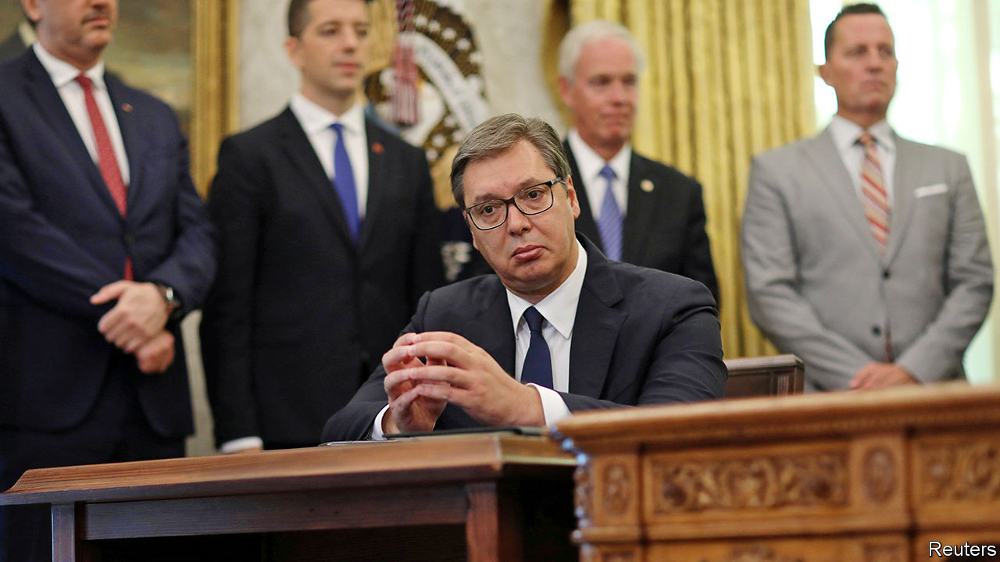

## Next year in Jerusalem

# Serbia and Kosovo awkwardly embrace Israel

> But will the Balkan enemies really set up embassies in Jerusalem?

> Sep 12th 2020JERUSALEM

IT IS RARE that events in two of the world’s most enduring troublespots—the Balkans and Israel-Palestine—spill over into each other, least of all in a peaceful way. But on September 4th President Donald Trump telephoned his friend Binyamin Netanyahu, Israel’s prime minister, to say he had persuaded the leaders of Serbia and Kosovo—once part of the same country, now mortal enemies—to give Israel a warm embrace. Kosovo and Israel, he said, would recognise each other. And both Balkan countries, flouting the policy of the European Union, which they hope to join, will recognise Jerusalem as Israel’s capital.

This was a second diplomatic coup for Messrs Trump and Netanyahu after last month’s agreement between Israel and the United Arab Emirates (UAE) to open full diplomatic relations with each other (see [article](https://www.economist.com//node/21791751)). Kosovo would become one of just a handful of majority-Muslim countries to recognise Israel. Ron Dermer, Israel’s ambassador to America and one of Mr Netanyahu’s closest advisers, is said to have been behind the breakthrough.

How Mr Trump cajoled the two Balkan countries into taking such steps is unclear. Their leaders were at the White House to sign an American-brokered economic agreement, to the chagrin of the EU, which is trying separately to persuade the foes to come to terms with each other (Serbia does not recognise Kosovo’s independence). Officials hope the economic deal will boost foreign investment in both countries, perhaps leading to warmer relations.

The deal may not be all it seems at first glance. The opening of embassies in Jerusalem is not due to take place before mid-2021. By then Mr Trump may have had to vacate the White House. And before the ink had dried on the accord, some Serbian sources said their country would not, after all, move its embassy to Jerusalem if Israel recognised Kosovo (which Israel has been reluctant to do, lest it encourage the Palestinians). The president of Serbia, Aleksandar Vucic (pictured), looked somewhat bemused when Mr Trump announced that Serbia would be making the move.

“This is more about American politics than the Balkans or the Middle East,” says Dahlia Scheindlin, an Israeli expert on the Balkans. “Trump is facing a threatening political environment and wanted a foreign- policy spectacle, something his friend Netanyahu is well-versed at orchestrating.” Mr Trump’s election campaigners certainly hope his recent Middle East diplomacy will impress American evangelical Christians and pro-Israel conservatives. ■

## URL

https://www.economist.com/middle-east-and-africa/2020/09/12/serbia-and-kosovo-awkwardly-embrace-israel
