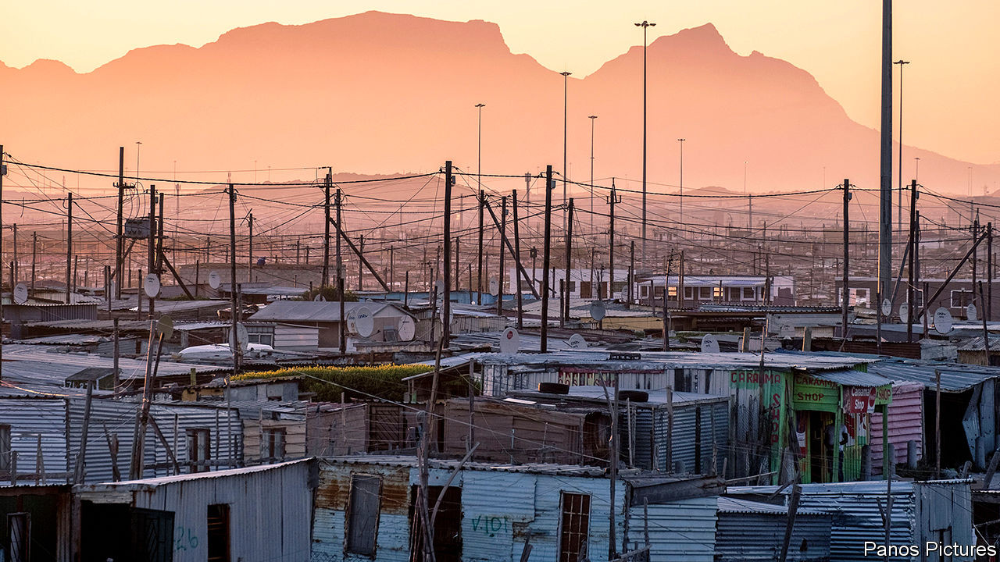
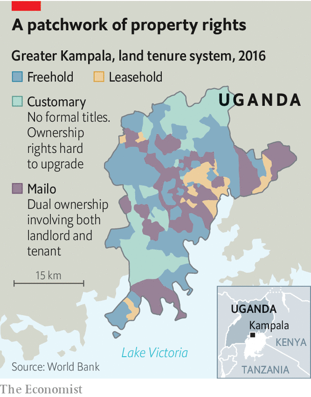
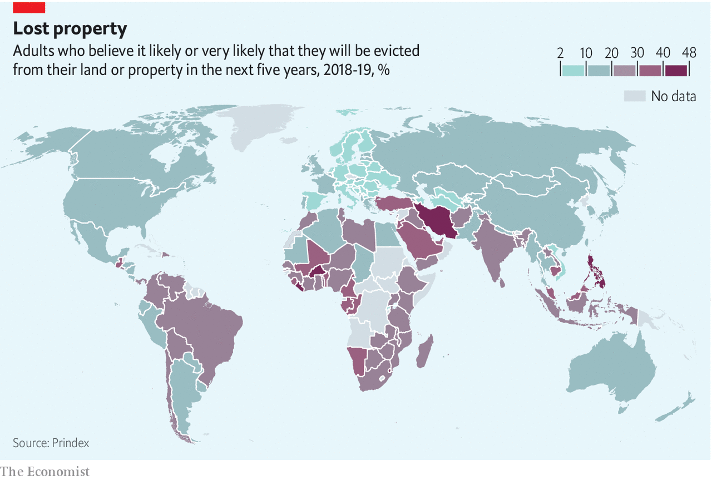
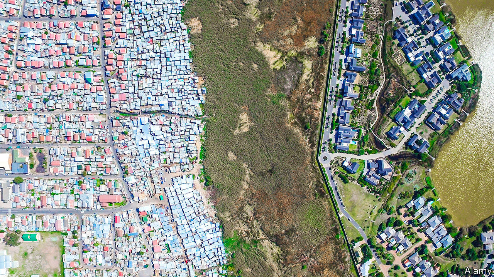

## Dreams of fields

# The quest for secure property rights in Africa

> Handing out title deeds is not enough

> Sep 12th 2020KHAYELITSHA

BUILDERS ARE busy outside Louisa Qangiso’s house in Khayelitsha, a township on the outskirts of Cape Town. The 49-year-old is putting up eight studio flats in her backyard that she will rent out for 3,000 rand ($177) per month. This could almost triple the value of her property, from roughly 570,000 to 1.6m rand. These are life-changing sums for Ms Qangiso, a grandmother whose warehouse job pays just 5,000 rand a month. “This is my dream come true,” she says, holding back tears.

The dream is reality because of Ms Qangiso’s grit—and because, unlike most people in the township, she can demonstrate ownership of her property. Aided by Bitprop, a startup, she proved her claim on the land, then used the title to raise money for the building works. Over the next decade she will split the rent with Bitprop, which also designs the flats, until its share is paid back. Thereafter the takings, as well as the increase in the asset value, are hers.

Ms Qangiso’s story encapsulates the latent power of property rights. Twenty years ago Hernando de Soto, a Peruvian economist, published “The Mystery of Capital”, in which he argued that, without formal title, the real estate on which billions of poor people live and work is “dead capital”. He estimated these assets to be worth $9.3trn ($13.5trn in today’s money).

Partly inspired by Mr de Soto, over the past two decades there has been a flurry of attempts to map and parcel land in the developing world. Between 2004 and 2009 the World Bank committed to 34 land-titling and registration projects worth more than $1bn, compared with three between 1990 and 1994.

Yet the potential of property rights remains largely unrealised, especially in Africa. Perhaps 90% of rural land in Africa is not formally documented. Just 4% of African countries have mapped and titled the private land in their capital cities. Well-meaning reformers have often neglected the myriad other factors affecting whether titles are useful or not, such as custom, other laws and the capacity of the state to enforce people’s legal property rights. They have also underestimated the ability of vested interests, such as traditional leaders and urban elites, to obstruct reform.

Covid-19 highlights the harm that insecure property rights cause. Evictions and land grabs are rising, as newly jobless tenants cannot pay rent and bigwigs figure they can get away with skulduggery while everyone’s attention is on the pandemic. The economic fallout of the coronavirus is so severe that some African countries face a lost decade. So they need growth-boosting reforms more than ever.

As history shows, land reform is hard. Policies in the colonial era varied, but white rulers often designated huge areas terra nullius (unoccupied land) and appropriated it for their colonies. Formal property rights were reserved for settlers and European firms. The rest of the agricultural land was given “customary” tenure, meaning it could be used but not owned, and that it was always subject to seizure by the state. Colonists often ruled indirectly, via state-sanctioned “tribal” leaders who exercised control over the land.

After independence most African governments kept bifurcated systems. Urban elites replaced white colonists in state institutions. Customary systems in rural areas endured. Only towards the end of the 20th century did the notion of formalising more of the land take off. By this time the idea that a lack of property rights was a brake on development was commonplace.

Africa has half of the world’s usable uncultivated land, and its agricultural productivity is far below its potential. That is a huge drag on growth. Because people in the countryside do not have title to their land they typically cannot rent it out while they are away, and they may fear it may be taken by someone else. This discourages migration to the cities, where wages are higher.

Insecure tenure makes cities poorer, too. Dense urban populations normally make it easier for people to share ideas and find work. But African cities sprawl inefficiently. The World Bank reckons that in some of them 30% of land is not built on, compared with 14% in, say, Paris. Overlapping tenure regimes are one reason why. In Kampala, Uganda, a bewildering mix of freehold, leasehold, customary and “dual ownership” systems gum up formal land markets (see map).

Weak property rights aggravate many other ills. They encourage environmental degradation—if it is not clear who owns the forest it is easier for well-connected businesses to claim it and cut it down. Land disputes are a common cause of conflict. Informal land markets mean governments miss out on taxes. And sexist traditions often make women’s property rights especially insecure. According to a survey by Prindex, a research group, nearly half of women in sub-Saharan Africa worry that they would lose land if they were divorced or widowed.

All rich, democratic countries have secure property rights, enabling owners to buy, sell, subdivide and collateralise their assets. Many poor countries have tried to build something similar, usually starting with a formal registry of land ownership. In 2012, for example, Rwanda, completed a programme to map and title all of its land using aerial photography, paid for by Britain’s government. Those carrying out the project had to tread carefully. Many of the original occupants of plots had been killed in the genocide in 1994; others had been locked up for their part in it. The team made visits to prisons to help resolve land disputes. The cost per parcel was just $7—much lower than efforts that relied on traditional surveying. Before the project most women were not recognised as landholders; at the end, a woman’s name was on 92% of the deeds.

Yet the overall impact of titling initiatives has been disappointing. Most African countries still use paper records. They usually do not know how many titles they have issued or whether more than one person claims ownership; in Khayelitsha, the staff at a local advice centre note that 15% of the titles in the surrounding area are in the names of dead people. The share of Africans who have formal title deeds is therefore unknown, but in some countries it is most likely in the single digits.

Poor administration compounds the problem. On average in Africa it takes 59 days to register a property. Transferring deeds costs 9% of the property’s value, more than twice the share in the OECD, a club of mostly rich countries. Land surveyors are scarce and monopolistic. A lack of trust does not help, either. In a different part of Khayelitsha from where Ms Qasingo lives, a group of women meet members of Khaya Lam (My Home), a charitable project that pays for title deeds to be proven. One lady struggles to believe that someone would help her for next to nothing. Waving her title she asks: “Is this for real?” Corruption in South Africa means people are sceptical, says Temba Nolutshungu of the Free Market Foundation, a think-tank. “People are used to being lied to by those with a political agenda.”

Technology may help. There is a good deal of enthusiasm around digital platforms such as Cadasta. These help users to prove ownership of their land and resolve disputes, rather than having to go to a bureaucrat’s office.

A crucial lesson of the past few decades, however, is that if land reform is treated purely as a top-down technical task, it will not work well. It is not enough simply to map and register a property, as several high-profile efforts show. In Ethiopia, after 20m certificates were issued in the 2000s, land records were rarely updated. In Uganda a project to digitise records has struggled with a lack of data. Even Rwanda’s scheme has had teething problems. Though land administration is working well in Rwandan cities, 87% of rural transactions remain informal (mostly because the cost of registering sales is too high).

In sub-Saharan Africa formal title seems to bring less additional security of tenure than it does in other parts of the world. In July Prindex published results of a 140-country survey on how secure people feel in their properties (see map below). It found that there was only a small difference in perceived security between sub-Saharan Africans with formal documentation (70%) and those without (65%). This was the lowest gap anywhere.

The authors suggest this may be further evidence of what researchers call the “Africa effect”. Titling also seems to make less difference to productivity in Africa than in Asia or the Americas. A paper co-authored by Steven Lawry of the Centre for International Forestry Research found that agricultural productivity increased by no more than 10% in the African studies they reviewed, compared with 50-100% in the papers from Latin America and Asia—partly because successful efforts in other regions were more efficient and pursued titling alongside other reforms.

Another explanation for the Africa effect is that customary systems offer more security than was previously assumed. These arrangements, which cover perhaps 625m people and 78% of Africa’s land, vary hugely in how they combine collective ownership with rights of individuals or families. Yet over the past 30 years there has been what Admos Chimhowu of the University of Manchester calls a “quiet paradigm shift” in customary land laws.

Since 1990, 39 of Africa’s 54 countries have passed laws overhauling communal land rights. Most create something of a middle ground between the individualistic freehold systems popular in the West and the colonial customary model where occupants had no formal rights to the land on which they lived and worked. Mr Chimhowu characterises the “old” customary system as one that did not recognise property at all, where power was vested in chiefs and where markets were absent or informal. In the “new” customary tenure, communal rights are recognised as property, local leaders are more accountable and there are greater links with formal markets. This, at least, is the theory.

In reality the potential of new laws, like that of titling efforts, has been undermined by vested interests. Control of land rights is so lucrative that Africa’s ruling parties and traditional authorities are reluctant to let it go. “Traditional leaders balk at surrendering what is...colonially encouraged ownership over their citizens’ lands,” notes Liz Alden Wily, an expert on land and customary law. In countries such as Ghana, Malawi, Namibia and Zambia, chiefs have stymied new laws that would have reduced their power to allocate land.

Since the end of apartheid in South Africa, successive laws have given “traditional” authorities more clout. The 35-40% of people who live in the former “homelands” created under white rule, or other communal areas, are unable to own their land. Black South Africans can now buy property outside the homelands, but inside them they remain, in effect, subjects.

Several studies have found that chiefs, in cahoots with politicians, use their powers to sell land to mining or other firms without the say-so of their people. In 2016 South Africa’s public protector, a legal ombudsman, found that the leaders of the Bapo ba Mogale people of North West province, who live on platinum-rich land, had somehow lost 800m rand that was supposed to belong to their people. Activists who raised the issue were beaten up.

A process that was meant to correct some of the injustices of apartheid has instead been hijacked by corrupt elites. Land restitution schemes are “captured” by those who have access to money and connections, according to a study of 62 land projects by the Institute for Poverty, Land and Agrarian Studies, an academic group.

Another way in which African bigwigs exert power over land, to the detriment of ordinary citizens, is what Ms Wily calls “state landlordism”. This can take several forms. Some bigwigs abuse the process of mapping communities to grab the choicest surrounding land for agri-businesses, as in Tanzania. Some take an expansive interpretation of the state’s power to seize land in the “public interest”. In Kenya a law passed in 2012 was supposed to reduce the political power of the ministry of lands by setting up an apolitical land commission. But vested interests have eroded its authority and land grabs have increased over the past eight years. The designation of dozens of protected forests has frequently served to deprive indigenous people of their land.

State landlordism is an urban problem, too, especially as cities have grown to encompass erstwhile farmland. A report published in 2019 by ENACT, a research group funded by the EU, suggested that drug-traffickers are small fry compared with criminal landlords. “Land allocation, real estate and property development”, it wrote, “may be the largest type of organised criminal activity in Africa”.

In Kibera, a slum in Nairobi, more than 90% of residents rent their homes from absentee landlords. ENACT cites a survey estimating that 42% of these landlords “reputedly had associations with state and political actors”, while 41% were government officials and 16% were politicians. In Ghana there is a similar pattern, where urban land ownership is dominated by state bodies, political leaders and chiefs.

Those who benefit from a murky status quo can also take advantage of archaic planning laws. In former British colonies many cities are governed by laws influenced by the UK Town and Country Planning Act of 1947, which was not designed for dense Kenyan slums. This is one reason why English-speaking cities have more sprawl than French-speaking ones. French planners were generally keener on compact, dense cities, while English-speaking cities have 50% more patches of built-upon land with no surrounding developments.

Despite state landlordism, promising reforms continue. Land-rights lawyers are campaigning for governments to obey their own laws. Rwanda is trying to reverse the slide into informalisation. In Ethiopia several states are issuing certificates that allow people to formally rent out their land and to borrow against it.

The pandemic has made everything harder. Titling has slowed in Ethiopia. It is hard to gather around a map or a smartphone if you are meant to be social distancing. Courts that are not sitting cannot resolve disputes. Elsewhere covid-19 has underlined the fragility of many Africans’ land rights. Women are at risk, especially those whose husbands or fathers have died. There is some evidence that in Kenya widows were thrown out of their homes by their in-laws during lockdown, as they are seen as a burden.

Back in Khayelitsha, a few miles from Ms Qasingo’s house, is a reminder of how the pandemic and a lack of property rights combine to make people’s lives insecure. On the same day your correspondent met Ms Qasingo, scores of people left destitute by the pandemic set up shacks on state-owned land. Many had been evicted from their previous abodes; their jobs gone because of covid-19. Their new homes could be bulldozed at the click of an official’s fingers. It would be tragic if one legacy of a pandemic that forced billions to stay in their homes was that it made it harder for others to keep theirs. ■

## URL

https://www.economist.com/middle-east-and-africa/2020/09/12/the-quest-for-secure-property-rights-in-africa
