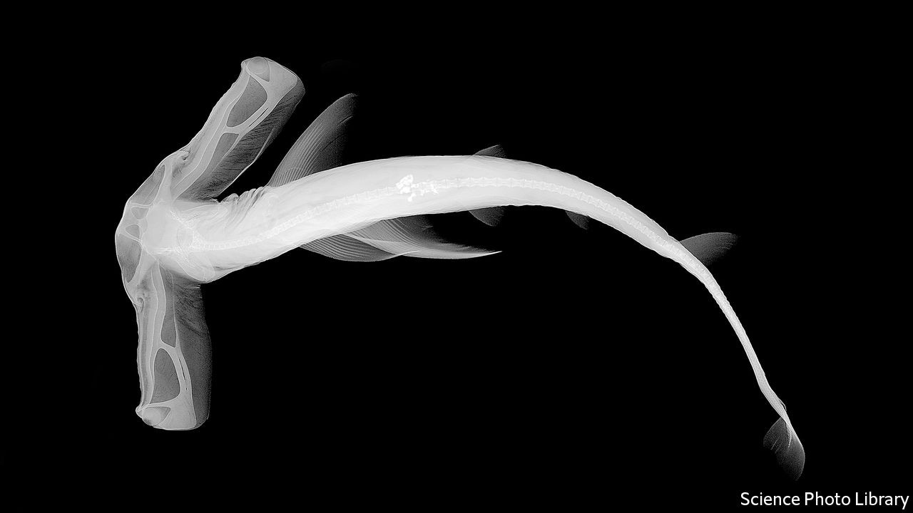

## Palaeontology

# How the shark forgot his skeleton

> Bony skeletons may be even older than palaeontologists thought

> Sep 12th 2020

VERTEBRATES—THOSE animals with a backbone—are a diverse bunch, encompassing everything from tuna and budgerigars to snakes, chinchillas and human beings. One way biologists divide them up concerns the composition of their skeletons. Most vertebrates sport hard, calcified bones, and are dubbed the osteichthyans. A second, much smaller category is the chondrichthyans, whose members include sharks, rays and skate. Unlike their hard-boned cousins, chondrichthyans make do with structural parts made of soft, tough cartilage.

Palaeontologists had long assumed that cartilage was the more primitive arrangement. Osteichthyan fetuses, after all, begin life with a cartilaginous skeleton that is gradually replaced by harder, more durable bone as they grow. But a paper just published in Nature Ecology & Evolution suggests that view may be mistaken. In it a team led by Martin Brazeau of Imperial College London describe the discovery of a 410m-year-old fossil in Turgen, a district of Mongolia close to the Russian border. The fossil is the partial skull of a new species of placoderm, a type of armoured fish, which Dr Brazeau and his colleagues have dubbed Minjinia turgenensis.

Placoderms are of interest to palaeontologists because they are an immediate common ancestor of both the chondrichthyans and the osteichthyans, which are thought to have split from each other around 400m years ago. Yet when Dr Brazeau’s team scanned their fossil with X-rays, they discovered tissues defined by microscopic curved struts and rods called trabecles––very similar to the bones found in modern-day bony vertebrates. If an ancestor of both the chondrichthyans and the osteichthyans had the ability to grow a hard skeleton, that implies that, rather than bony fish inventing the trick, it was the ancestors of today’s sharks and their cousins that forgot it.

Exactly why is a matter of conjecture. One possibility is that it was an evolutionary adaptation. “Sharks don’t have swim bladders, which evolved later in bony fish, but a lighter skeleton would have helped them be more mobile in the water and swim at different depths,” speculates Dr Brazeau. “This may be what helped sharks to be one of the first global fish species, spreading out into oceans around the world 400m years ago.”

Whatever the reason, the fact that sharks are still around 400m years later suggests that a soft skeleton is a highly successful strategy, evolutionarily speaking. Yet it may also be a limited one. The swim bladders developed by bony fish to modulate their buoyancy would soon be co-opted for another purpose: transformed into a primitive set of lungs, they allowed their bearers to breathe air, and therefore to colonise the land. Given that inch, early terrestrial vertebrates took a few feet, as it were. The rest is history.■

## URL

https://www.economist.com/science-and-technology/2020/09/12/how-the-shark-forgot-his-skeleton
