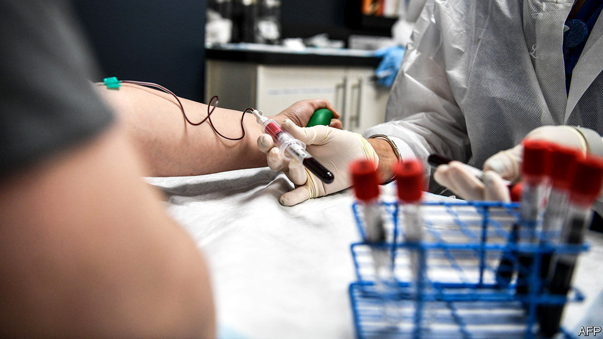

## Immunology

# Some good news on covid-19

> The virus seems to generate a robust and fairly long-lasting immune response

> Sep 9th 2020

THE BEST hope for ending the covid-19 pandemic is a vaccine. There is no shortage of candidates. The World Health Organisation is tracking 34 in various stages of development. How well they will work, though, is another matter. On September 9th AstraZeneca, a drug firm, announced it was pausing its trials after a participant fell ill. Such pauses are common in vaccine development, a discipline in which effort does not always bring reward. Despite much research, only an imperfect vaccine is available for dengue fever (it has limited efficacy and can cause nasty side-effects). In 1987 the first trial of an HIV vaccine began in Maryland. Three decades later, the cupboard remains bare.

The news about covid-19 in two new papers is more encouraging. The first, written by a team of scientists at deCODE genetics, an Icelandic company, and published in the New England Journal of Medicine, reports antibody levels in 1,200 Icelanders who had been infected with the SARS-CoV-2 virus and recovered. More than 90% tested positive for antibodies twice—once immediately post-infection and again four months later. People who had suffered more serious disease, such as those who had been hospitalised, developed higher levels of antibodies. So did men and older people, both of whom are at greater risk of more severe illness.

The four-month lifespan is cheering for two reasons. Antibodies that hang around are more likely to offer immunity. That means a vaccine that provokes their production should provide reasonably long-lasting protection. They are also easier to find. That suggests that results from population-wide antibody screening programmes, which aim to chart the spread of the virus, should be fairly accurate.

In the second study, scientists led by Tao Dong, an immunologist at the Medical Research Council (MRC), in Britain, went hunting for T-cells. These get less press than antibodies, but play an equally vital role in battling infections and securing long-term protection. (Their importance is vividly demonstrated by HIV, which targets and kills them.)

As described in Nature Immunology, the researchers compared blood samples from 28 mild and 14 severely ill covid-19 patients, as well as 16 healthy donors. The paper describes a “robust” T-cell response in infected people and, as with the Icelandic work, different responses in those who developed mild and severe cases of the illness. Specifically, mild cases were characterised by more CD8+ cells, which kill infected cells directly, rather than CD4+ ones, which regulate the immune response more generally. The MRC study found T-cells that could recognise eight separate parts of the virus, including the spike protein that allows it to penetrate human cells. That target list could offer useful hints for refining vaccines in future.

Al Edwards, an immunologist turned biochemical engineer at the University of Reading (who was not involved with either paper), is cautiously optimistic. The immune response to the disease seems to be working roughly as expected, he says. If that continues, then vaccines developed to trigger long-lasting immunity should work—at least in theory.

In practice, it is still too early to celebrate. Dr Edwards warns that immunology has never been a predictive science. There is no test that can show definitively that a vaccine will work short of actually trying it in the real world. ■

Editor’s note: Some of our covid-19 coverage is free for readers of The Economist Today, our daily [newsletter](https://www.economist.com/https://my.economist.com/user#newsletter). For more stories and our pandemic tracker, see our [hub](https://www.economist.com//news/2020/03/11/the-economists-coverage-of-the-coronavirus)

## URL

https://www.economist.com/science-and-technology/2020/09/09/some-good-news-on-covid-19
