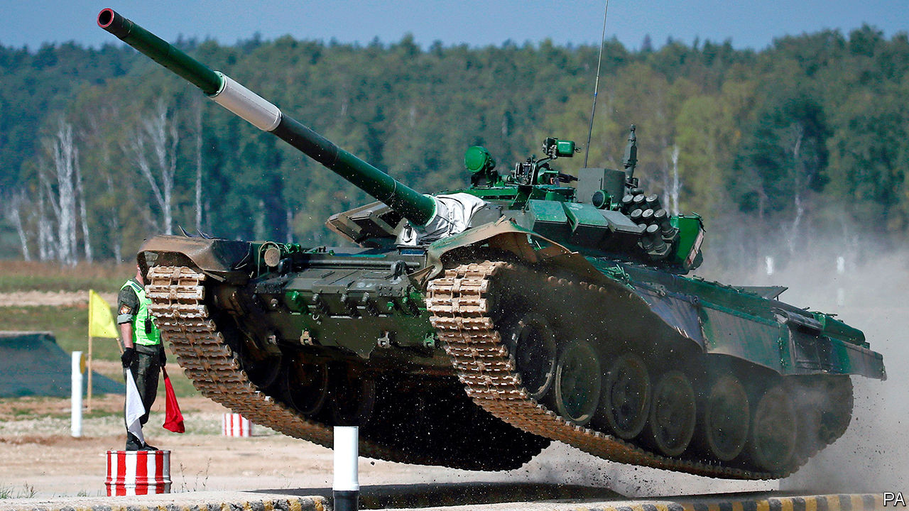

## Armoured warfare

# Tanks have rarely been more vulnerable

> Some armies are scrapping theirs. Others are innovating

> Sep 12th 2020

TANK BATTLES are rare these days. Crews that wish to prove themselves can turn instead to the Tank Biathlon, part of the International Army Games—a sort of Olympics with guns—organised each year by Russia. On September 5th Russian tanks raced and blasted their way to victory over teams from China, Belarus and Azerbaijan.

A century after its debut at the Battle of the Somme, the tank—an armoured vehicle typically equipped with a cannon on a turret—remains the backbone of most armies. The International Institute for Strategic Studies (IISS), a think-tank, counts over 5,000 in Europe, and 54,000 globally.

Nothing else can move soldiers around, shield them and wield big guns all at once. Russia was able to slice through Ukraine’s defences with its superior T-72s in 2014. Their absence can be keenly felt. The mostly tank-free offensive against Islamic State in 2016-17 was grinding and bloody, even with help from American bombing. “High-intensity combat operations between technologically comparable countries is unimaginable without the large-scale use of tanks,” says Viktor Murakhovsky, a retired colonel of Russia’s Tank Troops.

Yet in some recent conflicts, tanks have struggled. In February Turkish drones destroyed dozens of Syrian tanks in a two-day killing spree. In the past, camouflage could hide tanks from most planes. Today, sensors can pick out things like engine heat and tracks on the ground. “It must be doubted whether existing concepts of armoured manoeuvre will remain viable,” concluded Nick Reynolds and Jack Watling, both experts at the Royal United Services Institute, another think-tank.

Some armies are therefore cutting back. America’s Marine Corps, which has more tanks than most European nations, said in March that it planned to scrap them, to focus on countering China in the Pacific. The tank, it said, had a “long and honourable history in the wars of the past” but was “operationally unsuitable for our highest-priority challenges in the future”. (America’s army still has plenty.) Britain, the first country to make use of the tank, is debating how far to prune its own ageing fleet, to free money for next-generation weapons. The Netherlands scrapped its heavy armour almost a decade ago, though it now leases 18 tanks from Germany.

For most countries, the answer is not to junk the tank but to modernise it. One big change is the view from inside. Tankers of the 1980s saw the battlefield through a pair of periscopes—“a bit like looking through a straw”, says Mr Watling. The newest ones are studded with cameras and other sensors that project a 360-degree view on panoramic displays inside. Such “see-through armour” allows the gunner to aim at one target while the commander looks for the next. Doing away with periscopes also avoids breaks in the armour. Mr Murakhovsky thinks future tanks will use drones to peer around corners and over hills.

Tanks are also beefing up their defences. “Active protection systems” are designed to neuter threats before they hit a tank’s armour. “Soft-kill” methods detect and misdirect the radio, infrared or laser beams that guide anti-tank weapons to their targets. “Hard-kill” systems, such as Russia’s Afghanit and the Israeli Trophy and Iron Fist, intercept and blow up missiles as they home in (the catch being that nearby infantry could be caught in the blast). Ben Barry, a former brigadier in the British Army and now at the IISS, reckons that many of NATO’s anti-tank weapons would struggle to penetrate the newest Russian protection systems.

But these adornments come at a price. Tanks are expensive as it is (a new Russian T-14 Armata costs $4m, for instance). Operating the machines can cost several hundred dollars per kilometre. Piling on defences to protect soldiers—politically essential in wars of choice—adds to the bill, and the machine’s weight. For that reason, only a few NATO countries are investing in hard-kill protection.

And even snazzy new defences are struggling to keep up with innovations in attack. Mr Barry notes that the Israeli Trophy system carries just two rounds, so firing several missiles at the same time could defeat it. “The death of the tank comes round every five years or so,” says Jon Hawkes, head of land warfare for Janes, a research company. “But the tank is more vulnerable now than it has ever been. We’re reaching the apex of the armour versus gun race—and armour has lost that race.”

Tactics, rather than technology, can help redress the balance. Massed tank formations can dominate if they get within 2km of their target, in range of their guns, says Mr Watling. Before they get there, however, they can be pummelled with long-range artillery and missiles.

That means that, in the tank battles of the future, armoured forces would probably fight more slyly, using concealment, cover, darkness and dispersal—much as Serbia did against NATO in 1999. If they can be kept safe, tanks remain uniquely potent weapons. In war games set in the Baltic states, Russian tanks with air cover—to bat away threats like the drones that picked off Syrian tanks in February—“easily punch through” lighter NATO forces, says Chris Dougherty of the Centre for a New American Security, a think-tank in Washington. In war games set in Taiwan, he says, China struggles to seize the island without heavy armour. Heavy metal still counts. ■

## URL

https://www.economist.com/science-and-technology/2020/09/12/tanks-have-rarely-been-more-vulnerable
