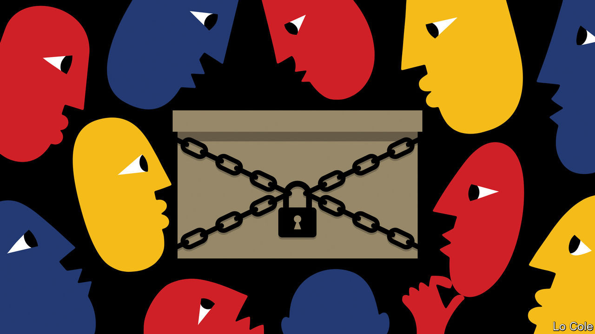

## Bello

# No good options for Venezuela’s divided opposition

> Foes of Nicolás Maduro are split over whether to boycott a legislative election

> Sep 10th 2020

EVEN BY RECENT abysmal standards, this has been a bad year for Venezuelans. Covid-19 has struck a country whose health system collapsed long ago. Because of mismanagement and, since last year, swingeing American sanctions, the economy is sinking to subsistence level: GDP is set to decline by about 15% this year, and will be 72% smaller than it was in 2013. A survey by three Venezuelan universities reckons that 79% of the population are extremely poor and that 30% of under-fives suffer chronic malnutrition or stunting. The dictatorial regime of Nicolás Maduro stays in power by harassing opponents, locking up dissidents and, in some cases, slashing prisoners’ feet with razor blades.

This has been a bad year for Venezuela’s opposition, too. In January 2019 Juan Guaidó, the young Speaker of the opposition-controlled National Assembly, proclaimed himself the country’s interim president, on the ground that Mr Maduro’s election to a second term was rigged. Mr Guaidó was swiftly recognised by Donald Trump’s administration, and by most democracies in Europe and Latin America. The assumption among officials in Washington and in opposition circles in Caracas was that American sanctions against the oil industry would soon encourage the armed forces to turn against Mr Maduro, forcing a transition to democracy.

It hasn’t worked. A small military rebellion flopped last year. Aides to Mr Guaidó were linked to an amateurish invasion attempt led by mercenaries from Florida in May. Despite further American sanctions, 20 months after Mr Guaidó’s pronunciamiento Mr Maduro remains in firm control. His approval rating was just 13% in August, but Mr Guaidó’s has fallen from 61% in early 2019 to 26%, according to Luis Vicente León of Datanálisis, a pollster.

The opposition now faces a dilemma. A legislative election is due on December 6th. The assembly’s term, and thus Mr Guaidó’s “interim presidency”, ends on January 5th. He and his allies have called for a boycott of the vote on the grounds that it will not be free or fair. Instead, they plan to prolong the life of the outgoing assembly. There is no constitutional basis for doing so.

Henrique Capriles, the opposition’s presidential candidate in 2012 and 2013 and electorally its most successful figure, has been negotiating with the government over taking part in the legislative vote. Last month the regime released 50 political prisoners (of some 300) and pardoned 60 who are in exile. Having taken over three of the main opposition parties, it has reversed that decision on one. And it wrote to the European Union inviting it to observe the election, something which has not happened in Venezuela since 2006.

Mr Capriles says he is fighting to improve electoral conditions. This week he registered a slate of candidates, though he says he wants a postponement of the election. “A return of politics” requires “no prisoners, no persecuted”, he told El País, a Spanish newspaper. He thinks the invitation to the EU opens space for further negotiation on the political conditions. He insists that his adversary is Mr Maduro, not Mr Guaidó, and that he could still pull his candidates out.

One reading of all this is that Mr Maduro has succeeded in dividing the opposition. In fact, those divisions were already there. They are not just between moderates, like Mr Capriles, and radicals, who mainly back Mr Guaidó, but also between exiles and those in Venezuela. By financing the interim government, the United States has created a perverse incentive for Mr Guaidó’s team to prolong the status quo. The end of the assembly’s term is a reality check.

Electoral abstention has always failed as a political strategy, says Mr León. His poll finds that 52% think the opposition should call on people to vote. “The big question is how to achieve change in Venezuela,” Mr Capriles says. The implicit answer of the opposition radicals is by military action by the United States. That is not going to happen.

Rather, argues Mr Capriles, sanctions should be used to negotiate a return to democracy. That can only happen after the American election in November, since the sanctions relief that is the necessary carrot for the regime is in the gift of the United States. Mr Trump will surely not offer it before then lest he anger Venezuelan-Americans in Florida. Mr Capriles is taking a risk, that he ends up being seen to have legitimised a fraudulent election. But he is right that Mr Guaidó’s strategy is a dead end that suits Mr Maduro fine.

## URL

https://www.economist.com/the-americas/2020/09/10/no-good-options-for-venezuelas-divided-opposition
