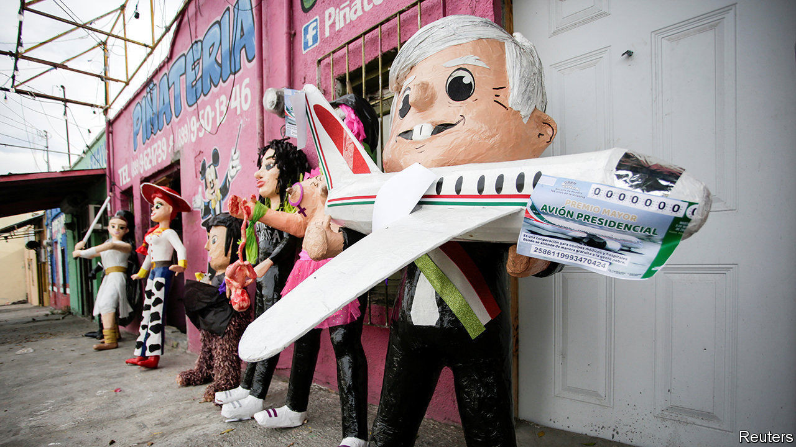

## Air show

# The Mexican president’s plane isn’t selling

> So he has organised a raffle

> Sep 10th 2020MEXICO CITY

IT SHOULD HAVE been easy. The delivery in 2016 of a luxurious jet for Mexico’s then-president, Enrique Peña Nieto, symbolised an out-of-touch government in a country with lots of poor people. In his campaign to succeed Mr Peña in 2018, Andrés Manuel López Obrador promised to stick a for-sale sign in the window of the Boeing 787-8 Dreamliner, which was bought for $127m (plus $81m for customised fittings). As president, he would travel by commercial airline like ordinary folk. He won the election in a landslide.

Now the “pharaonic” example of “waste and opulence” has become “elegant” and the “pride of a nation”, in the words of the marketing brochure written to tempt a buyer with showier tastes than the Mexican president and $130m to spend. The flannel didn’t work. For 21 months the aeroplane, christened the José María Morelos y Pavón (after a Mexican independence hero), has sat unsold in a hangar in California. A symbol of past excess has become a sign of present ineptitude.

The market for used wide-body private jets is minuscule. Selling them often takes years. Sellers rarely recover fitting costs because new owners have their own ideas about colour schemes and comfy seats. Sloppy maintenance and the recession caused by the pandemic have lowered the plane’s value to $72m, insiders told Expansión, a business-news outlet.

Stymied, in January Mr López Obrador suggested raffling off the plane. The winner would get money to pay for a year or two of maintenance. A month later, perhaps realising its impracticality, he thought better of the idea. Now the prize is 2bn pesos ($93m) in cash, which is to be divided among 100 winners. The total prize money is not vastly less than the plane’s original value. Some 2.5bn pesos in proceeds will go towards equipment for hospitals coping with covid-19. The National Lottery (Lotenal), which is heavily indebted and lost money in seven of the past ten years, is managing the raffle. The prize draw is on September 15th.

The maths do not add up. The 6m tickets, still bearing the image of the plane, are priced at 500 pesos each, more than four times the minimum daily wage. If they sell out, just 500m pesos will be left for hospitals once prize money, administrative costs and the ticket sellers’ cut are paid. To ensure that the scheme would raise enough money to keep the president’s promise to hospitals, the recently renamed Institute for the Return of Stolen Goods to the People (INDEP), which auctions assets seized from criminals, agreed to contribute 2bn pesos to pay for the prizes. Normally, it gives the proceeds to hospitals and the poor.

By September 8th less than two-thirds of the tickets had been sold. The president has said that several rich businessmen will “voluntarily” buy tickets and distribute them to workers. INDEP will stump up an extra 500m pesos to donate 1m tickets to hospitals caring for the poor. The way things are going the government will struggle to break even on the raffle. The air show is exciting to watch but will get Mexico nowhere. Some Mexicans fear that is true of the president, too. ■

## URL

https://www.economist.com/the-americas/2020/09/10/the-mexican-presidents-plane-isnt-selling
