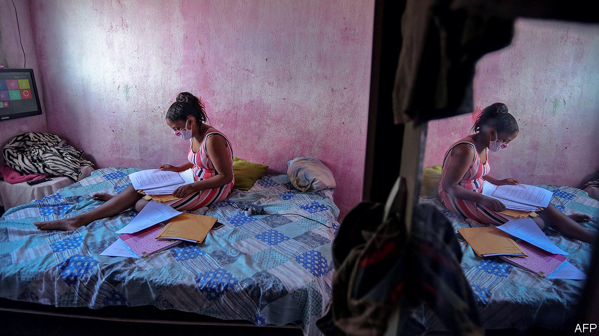
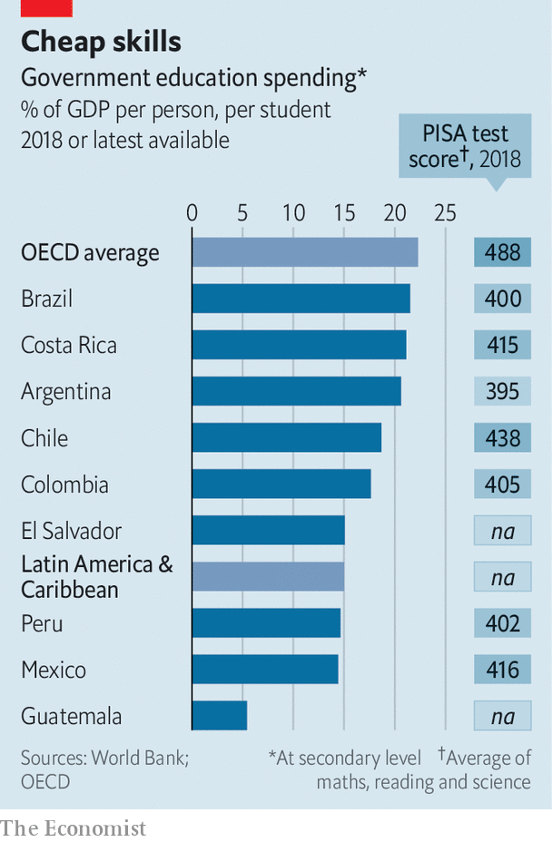

## Home truths

# The pandemic further weakens Latin America’s underperforming schools

> Before covid-19 more children than in past decades were going to school. Too few were learning

> Sep 12th 2020MEXICO CITY AND SÃO PAULO

Editor’s note: Some of our covid-19 coverage is free for readers of The Economist Today, our daily [newsletter](https://www.economist.com/https://my.economist.com/user#newsletter). For more stories and our pandemic tracker, see our [hub](https://www.economist.com//news/2020/03/11/the-economists-coverage-of-the-coronavirus)

UNIVERSITY WAS always the plan for Camila Dantas, a 19-year-old high-school graduate from Cidade de Deus, a favela in Rio de Janeiro. Her father, who works in construction, was the first person in his family to go to university. Her mother irons clothes. Ms Dantas works in a nail salon and studies for the entrance exam at night. Favelados, or residents of informal settlements, are still a tiny minority of university students. Ms Dantas and her friends see higher education as a “necessary step” towards improving their lives. 

The pandemic, and the recession it has caused, threaten their plans. All but ten of the 50-odd students in Ms Dantas’s online test-prep course have dropped out. Her boyfriend chose work in a tattoo parlour over a fine-arts degree to help his mother pay the bills. A survey published in June by American University in Washington, DC, found that 84% of Latin American universities expect enrolment to fall this year, with half anticipating declines of 10-25%.

Latin America, with less than a tenth of the world’s population, has a third of recorded deaths from covid-19. Although the rate of new infections is slowing, most schools are closed in all but two countries, Uruguay and Nicaragua. More than 95% of the region’s 150m pupils remain at home.

Most countries have set no date for reopening. In many parts of Mexico schools may not reopen until a vaccine becomes available, leaving pupils to learn from a few hours of daily television programming. Bolivia will offer neither in-person nor remote learning until 2021. When schools in São Paulo and Rio de Janeiro, Brazil’s biggest cities, reopen next month, less than half of pupils will attend in person. 

If schools stay closed for seven months from March this year, which looks certain in most places, and governments fail to compensate, children could lose the equivalent of an eighth of their years of schooling, estimates the World Bank. Lifetime earnings per pupil could fall by more than $15,000 (adjusted for purchasing-power parity). The share who fail to meet proficiency standards in reading and maths could rise from 53% to 68%. The education interruption will worsen income inequality in the world’s most unequal region. “It’s a silent crisis,” says Emanuela di Gropello, an education expert at the bank. 

Rich families can make up for the enforced holiday. In Brazil they are hiring laid-off private-school teachers to tutor their children in small groups, or “learning pods”. Poor ones lack computers and internet connections at home. Their children are also missing out on school meals, a lifeline in many countries. They would be completely isolated but for WhatsApp, which teachers across Latin America use to send assignments. Juliana Rohsner, the head of a school on the poor outskirts of Vitória, the capital of the Brazilian state of Espírito Santo, oversees 37 chat groups, on which staff respond to messages from pupils and parents at all hours. She worries teachers will burn out.

Although 74% of Brazilian pupils have taken part in some kind of distance learning during the pandemic, the share drops to 61% in the north and to 52% in the north-east. The rest are getting no instruction. Pupils from rural areas and those living in favelas are the most likely to miss out. Peru announced plans in April to buy 800,000 tablets for pupils in rural areas, but the first shipment will not arrive until October.

Fiscal challenges exacerbate digital ones. In Brazil municipal revenues, which provide 40% of school funding, could fall by 20-30% because of the recession. Public schools across Latin America expect a jump in enrolment as middle-class parents become unable to pay private-school fees. That will further strain budgets. 

The pandemic interrupts three decades of progress in education. As a commodities boom boosted economies, governments spent more on schooling. Primary-school enrolment is now nearly universal in most countries. In Mexico, the share of children who finish that stage doubled to two-thirds between 1990 and 2015. Higher primary-school attendance has led to higher enrolment in secondary schools, though graduation rates vary from around a quarter in poor countries, like Guatemala, to more than 80% in richer ones, like Chile.

Encouraged by economic growth and the rising expectations of lower-middle-class parents, the share of 18-to-24-year-olds in university doubled between 2000 and 2013 to 43%. That is a faster expansion than anywhere else in the world. While students from the poorer half of the population accounted for 16% of the total in 2000, they made up 25% in 2013. In Brazil, quotas for black and low-income students increased their representation. 

Quality did not improve as enrolment expanded. PISA tests, which measure learning among 15-year-olds around the world, show Latin America near the bottom, though poorer regions are largely not measured (see chart). In 2018 Latin American youngsters were the three years behind their peers in OECD countries (ie, rich ones). The gap in proficiency between those at the top of the social pyramid and those at the bottom is wide. In Brazil, Argentina, Peru and Uruguay, the poorest fifth of students are, on average, four years of schooling behind the richest fifth. Parents who can afford to almost always send their children to private schools. Latin America has the world’s highest rate of enrolment in private primary schools.

Since the well-off do not send their children to public schools (which teach four-fifths of pupils), they are not especially bothered about improving them. Government spending per student, relative to average incomes, is lower in Latin America than in the OECD.

Teacher training is neglected across the region. In Mexico, teachers are hired and promoted based on union connections rather than merit. Last year Mexico’s populist president, Andrés Manuel López Obrador, reversed a reform enacted in 2013 to improve their quality. A few places have sustained reforms. Chile has doubled its education budget since 2005. Its PISA scores are the highest in the region, though still below the OECD average. Ceará, a poor state in Brazil’s north-east that outperforms richer states, has a record of reforms going back 15 years, including extending daily classroom hours in primary schools from four (the Latin American norm) to seven. It is an exception. 

Latin American schools do not equip pupils for work, says Miguel Székely, a former education official in Mexico. Unprepared for university, half of students drop out, which makes the region’s expansion of enrolment less impressive. Students who complete university earn large salaries. Those with just a secondary education tend not to. A Brazilian aged 25 to 34 with a bachelor’s degree makes 2.3 times as much as a high-school graduate of the same age (in the United States the ratio is 1.7). 

If students are not to lose a whole year of learning, governments will have to adapt curriculums and train teachers to help their charges catch up. So far, they have done little. Brazil’s federal government spent the first six months of the pandemic lobbying states to reopen schools. It has failed to present a single policy to counter covid-induced learning loss. Two education ministers resigned in June, the second after five days in the job. 

The country’s more distant future may be a bit brighter. Last month its Congress approved a revamp of Fundeb, a mechanism that provides a large share of state schools’ financing and to which the federal government contributes. Under the new law, the federal government will raise its contribution (from 10% to 23% by 2026). The law sets a minimum level for spending per pupil, which is more than 50% higher than the current average. Fundeb will funnel more money to poor districts. This may help reduce educational inequality.

But it will not immediately help pupils locked out of their classrooms. Many will join Ms Dantas’s boyfriend in choosing work over study. Some may turn to crime, worries Cláudia Costin, who was education secretary in the city of Rio de Janeiro from 2009 to 2014. She remembers “competing with militias” (organised-crime outfits) for high-schoolers’ attention.

Ms Dantas hopes that the pandemic will delay her dream, not destroy it. She still plans to start studying journalism in 2021. Her three-year-old brother is waiting to return to nursery school. One day, perhaps, he’ll make it to university, too.■

## URL

https://www.economist.com/the-americas/2020/09/12/the-pandemic-further-weakens-latin-americas-underperforming-schools
