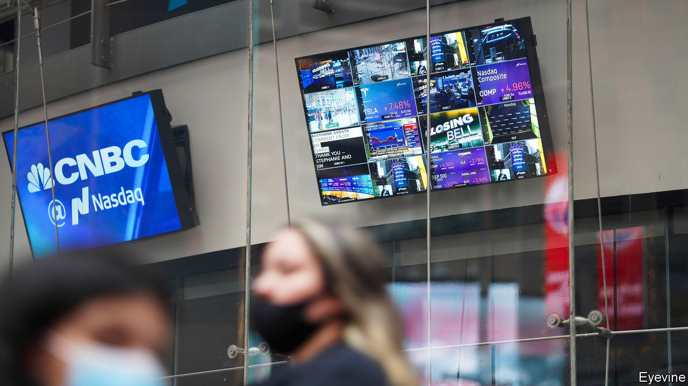
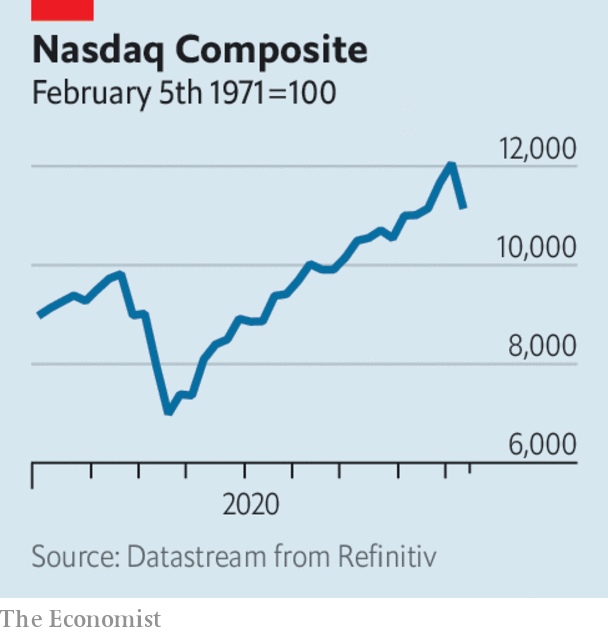

# Business this week

> Sep 10th 2020

A sell-off in tech stocks led to the worst trading period for the Nasdaq since mid-March, at the start of the covid-19 crisis. Over a few days the share prices of Amazon, Alphabet, Facebook and Microsoft fell by more than 10% from recent highs; Apple’s dropped by 16%. The rout also put a dent in the S&P 500, which fell back from a record close, and other stockmarkets. Tech companies’ share prices have soared this year, far ahead of the rest of the market. Some investors think they are long overdue for a price correction; others that this week was just a blip. See [article](https://www.economist.com//node/21791718).

SoftBank’s share price fell by 7% in a day, after it was revealed as the mystery “whale” making risky bets in tech stocks. The Japanese conglomerate has reportedly placed huge amounts of call options (derivatives that allowed it to buy shares at a set price on a specific date) on companies listed on the Nasdaq. See [article](https://www.economist.com//node/21791718).

Slack’s quarterly earnings disappointed investors. Although revenue was up by 49% year on year, the messaging platform has not done as well as other team-communication services during the pandemic, such as Zoom, and expects sales to slow this quarter. It also faces an assertive challenge from Microsoft’s Teams app. In July Slack filed an antitrust suit in the EU accusing Microsoft of unfairly bundling Teams with Office software.

It was also a rough week for the oil market. The price of Brent crude slipped below $40 a barrel for the first time since June, after it emerged that Saudi Arabia had reduced its oil rates for Asia and America.

The Pentagon confirmed that it was considering adding SMIC, China’s biggest chip manufacturer, to a list of companies deemed to be working against America’s national-security interests. The news that SMIC might be put on the list wiped out almost a quarter of its value on the Hong Kong stockmarket. It insists it is a purely commercial entity with no ties to the Chinese armed forces. See [article](https://www.economist.com//node/21791727).

The IPO of Nongfu Spring, a Chinese bottled-water company, was a sparkling success on the Hong Kong stock exchange. The flotation left its founder, Zhong Shanshan, who left school at 12, as one of China’s richest men, with a fortune roughly equal to that of Jack Ma, Alibaba’s founder. See [article](https://www.economist.com//node/21791720).

CaixaBank and Bankia, two banks in Spain, confirmed they were talking about merging, which would create the country’s biggest lender.

South Africa’s economy was 16.4% smaller in the second quarter compared with the first, the worst contraction since the 1990s. Infections from covid-19 have slowed, allowing the government to lift some restrictions, such as on sales of alcohol. But a recovery is being hampered by creaking electricity infrastructure, which has led to power blackouts and energy rationing.

America’s unemployment rate fell to 8.4%. That is below the level reached during and after the global financial crisis over a decade ago, although the number remains affected by a “misclassification error” in the survey used to produce it. In April the rate had surged to 14.7%. But it never reached the 20% that some were predicting at the start of the pandemic. After the news Republicans proposed new stimulus measures that fall far short of what the Democrats are calling for. The Republican plan provides for a $300-per-week unemployment benefit top up, which the Democrats want restored to $600 a week. 

China’s exports roared back last month, increasing by 9.5% in dollar terms compared with August 2019. China’s monthly trade surplus with America rose to $34.2bn, the most since November 2018.

Germany’s exports rose again in July on the previous month, though they were still 11% lower than in July 2019. Industrial production is also recovering from the pandemic slump, though output remains a tenth smaller than what it was a year ago.

LVMH’s $17bn takeover of Tiffany appeared to be off. The French luxury-goods conglomerate struck a deal to buy the American jeweller last November, but now says the French government has stymied its proposal because of a row with America over tariffs on items such as handbags and cosmetics. Tiffany has gone to court accusing LVMH of using delaying tactics to renegotiate the terms of its offer because of a flop in sales during lockdown.

Tesla’s newly split stock was hammered during the tech bloodbath on Wall Street, plunging by a third over a few days before recovering somewhat. It was also hurt by the surprise news that the electric-car maker still hasn’t made the cut for inclusion in the S&P 500, which would have driven appetite for its shares from index funds. Elon Musk, who recently became only the fifth man in the world to be worth over $100bn, has seen his fortune diminish in less than a week to a mere $78bn.

## URL

https://www.economist.com/the-world-this-week/2020/09/10/business-this-week
