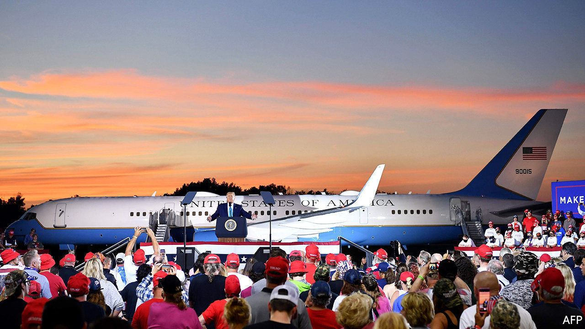
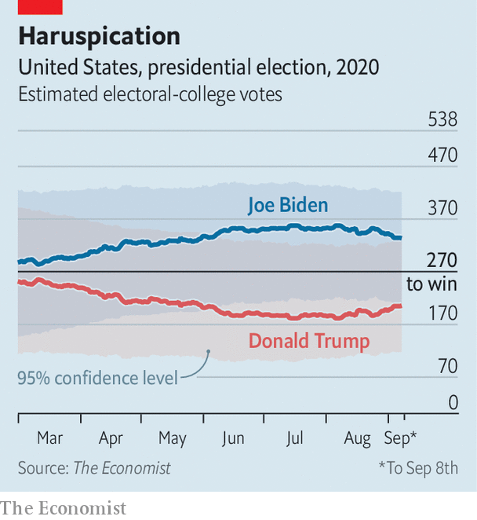

## Our election model

# Donald Trump could still stage a comeback (again)

> The newest polls and economic data have shored up the president’s odds, though they remain worse than in 2016

> Sep 12th 2020WASHINGTON, DC

EVERY FOUR years, political journalists and prognosticators deem America’s presidential contest the “election of the century”. By definition, each cannot be. But at the risk of causing readers’ eyes to roll backwards, the stakes really do appear higher than usual this time round. In early June The Economist published its own statistical forecasting model for this November’s presidential contest to guide such handicapping. Back then, it gave Donald Trump at best a one-in-five chance of winning a second term. But by July, as unrest and the coronavirus ravaged the nation, his odds had slumped to as low as one-in-ten. There they stayed until the middle of August. Now, our model shows Mr Trump has clawed back a sizeable chunk of support.

His nationwide deficit in vote-intentions versus Joe Biden has shrunk from ten points at its peak to just eight on September 9th. And in the key states of Florida and Pennsylvania—the two most likely to provide Mr Trump or Mr Biden with their 270th electoral vote—the president’s deficit has narrowed even more. Sunshine-state voters favoured Mr Biden by eight points at his peak in July. Now, they prefer him by just four. One high-quality pollster, Marist, has the candidates level in Florida (though more polls are surely needed to determine whether this is an outlier). In Pennsylvania, Mr Trump has risen from a nine-point deficit to a six-point one.

Other election indicators have also been good for the president of late. Our index of economic growth—which combines annual change in eight different indicators, from the unemployment rate to real personal income and manufacturing output—has been improving steadily since July. The August jobs report, which recorded a nearly two percentage-point drop in unemployment, contributed to a positive trend.

Mr Trump’s job-approval ratings have also gone up. In early August we calculated that 15 percentage points more Americans disapproved of the job he was doing as president than approved of it. By September his popularity had improved a bit, to just an 11-point deficit. Taken together, these economic and political variables alone suggest the president will lose the popular vote by five points; up from a negative-six-point projection two months ago.

Right now the most likely outcome of the election is still that Mr Trump loses. Our election-forecasting model projects that he will fall about 70 electoral votes shy of winning, though there is enough uncertainty in the election to suggest he could still prevail. We predict a relatively low (but by no means impossible) one-in-seven (14%) chance of a Trump victory. For context, our model would have given him more than twice the chance (37%) at this point in 2016. Because of Mr Trump’s deficit in swing-state polls and the virus-stricken economy, he will have a tough slog to get a second term—despite voters’ marginally improving evaluations of his candidacy.■

Correction: this article originally said that our model would have given Mr Trump nearly twice the chance of success at this point in 2016. It is in fact more than twice the chance. Apologies.

Dig deeper:

Read the [best of our 2020 campaign coverage](https://www.economist.com//us-election-2020) and our [presidential-election forecast](https://www.economist.com/https://projects.economist.com/us-2020-forecast/president), then sign up for Checks and Balance, our [weekly newsletter](https://www.economist.com//checksandbalance/) and [podcast](https://www.economist.com//podcasts/2020/09/04/checks-and-balance-our-weekly-podcast-on-american-politics) on American politics.

## URL

https://www.economist.com/united-states/2020/09/12/donald-trump-could-still-stage-a-comeback-again
