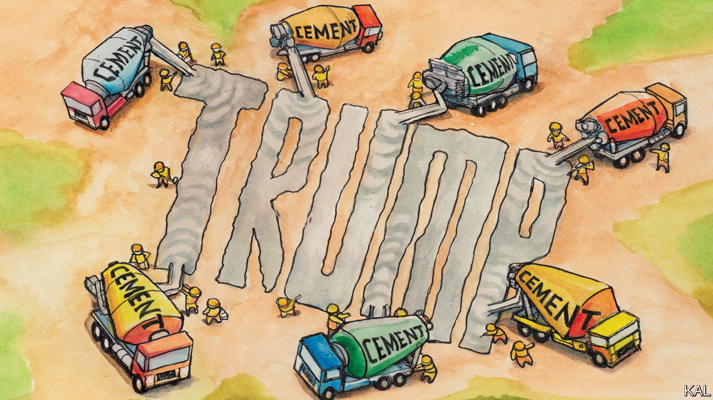

## Lexington

# How construction workers in Ohio view the election

> A return to Youngstown points to the solidity and limits of Donald Trump’s fan base

> Sep 10th 2020

A  FEW DAYS before the 2016 election, when the nature of Donald Trump’s appeal to his supporters was a matter of hot debate, Lexington joined a local builders’ union boss on a tour of construction sites in Youngstown, Ohio. Most of Rocco DiGennaro’s—male and almost exclusively white—“Local 125” members intended to vote Trump, despite many having only ever voted Democratic before. Your columnist wanted to know why.

By far their most common explanation was a hatred for Hillary Clinton. Nearly all the workmen said the Democratic candidate was dishonest and corrupt. By contrast, many expressed weaker or less defined feelings towards Mr Trump. They said they liked his tough talk, especially on immigration, and that he was a businessman. Many thought he could sort out Washington, DC, and the economy (though Youngstown’s construction industry was already booming). Those perceived qualities duly won Mr Trump a record share of white working-class votes—and thus the presidency. Even so, it was not obvious back then that his supporters would develop the ironclad allegiance to him many now profess.

Their devotion was apparent during a re-run of your columnist’s tour around Youngstown, again in Mr DiGennaro’s entertaining company. “You’re going to hear the same again, only more intense,” the burly ex-builder had predicted. He wasn’t wrong. Interviews with a score of workers on a large development project at Youngstown State University, involving several construction companies and sites, did not suggest Mr Trump had increased his local support. As in 2016, perhaps a third of the workers claimed to have no interest in the election. Yet almost all who had voted for him in 2016, even if tentatively, now vigorously endorsed him.

“He’s done a great job, he’s got everyone back to work. I’m pretty much 100% for him,” said Kyle, a 30-year-old electrician. “He shoots his mouth off but at least that shows he’s honest,” said Jason, a pipe-fitter, who said he especially liked Mr Trump’s commitment to reducing the national debt. “He’s done more for our country than the past ten presidents put together,” said an older builder, Jeff, skimming wet concrete on a new road. “He’s made—who is it, China or Japan?—pay our farmers billions of dollars. He got health care done, which the Democrats could never do. He built the wall.”

The only anti-Trump voice Lexington heard—aside from that of Mr DiGennaro, a blue-dog Democrat—belonged to Jeff’s boss, Greg, ladling concrete alongside him. “I think Trump’s bad for the country, bad for morals, a bad example to my children and I want him out,” he said—then added that his Fox News-addict wife disagreed: “I think we’re going to get divorced and I’m not joking.”

This snapshot illustrates how Mr Trump has not so much divided America as cemented its differences. Despite Joe Biden’s polling lead, Republicans are solidly behind the president. He is the most popular president with his own party on record: 94% of the people who voted for him in 2016 intend to do so again. Mr Biden’s lead owes more to his success in mobilising Democrats and former third-party voters against the president than shrinking his vote.

The construction workers’ erroneous takes on Mr Trump’s record (his administration in fact turbocharged the debt even before covid-19 struck, has reduced health-care coverage and has a lot of wall left to build) offered a clue to how he has exerted such control over his party. Notwithstanding the strength of the pre-covid economy, the loyalty of Mr Trump’s voters is not—or not mostly—a response to his policies or record. Political scientists—on the left and right—long ago discovered that most voters are flexible on such matters. They choose leaders who seem to reflect their values, rearrange their policy priorities accordingly and, in a hyper-polarised environment, also to an extent their critical judgments.

Thus the alacrity with which Republicans ditched free trade and fiscal conservatism. Thus, too, the transformation in how they viewed the economy within days of the 2016 election. Mr Trump’s subsequent success in binding in his supporters ever tighter owes to the relentlessness with which he has highlighted, again and again, the values they have entrusted him with and the threats to those values, real and imagined, he claims his critics present.

Unlike any predecessor, he has never stopped campaigning. He held a hundred rallies as president—not including presidential set pieces, such as state-of-the-union addresses, that he treats as purely political events—before his re-election campaign began. He has decried even conservative critics as enemies of what he and his voters stand for. The effect of this constant grandstanding is to keep challenging his supporters to recommit themselves to him, publicly or privately, and in the process harden their loyalty.

The only significant area of disagreement in this analysis, between scholars on the right and left, concerns what values the president is asserting. Those on the right tend to stress the populist qualities of his “America First” agenda: nationalism, paternalism, toughness—much of which Mr Trump’s supporters in Youngstown seemed to appreciate. “I want to see an end to international trade deals and all that stuff: I’m America First,” said Tony, an engineer.

The liberal consensus has the same list—but adds racial anxiety to it. And Mr Trump’s race-baiting—which he is now stepping up in veiled attacks on Mr Biden’s running-mate, Kamala Harris—makes that hard to refute. So, for that matter, did the receptiveness of some in Youngstown to it. George, an electrician, described Mr Biden’s as a Trojan Horse for Ms Harris: “He’d resign on day one and then you’ve got your first woman president and she’s black, too.”

The president’s advisers suggest the polls are missing many “shy Trumpers”. But the alacrity with which Trump supporters defend his chauvinism and sometimes display their own makes that seem unlikely. It perhaps also explains why, notwithstanding his lock on his base, Mr Trump is struggling to expand it.■

Dig deeper:Read the [best of our 2020 campaign coverage](https://www.economist.com//us-election-2020) and our [presidential-election forecast](https://www.economist.com/https://projects.economist.com/us-2020-forecast/president), then sign up for Checks and Balance, our [weekly newsletter](https://www.economist.com//checksandbalance/) and [podcast](https://www.economist.com/https://play.acast.com/podcasts/2020/01/24/checks-and-balance-our-new-weekly-podcast-on-american-politics) on American politics.

## URL

https://www.economist.com/united-states/2020/09/10/how-construction-workers-in-ohio-view-the-election
