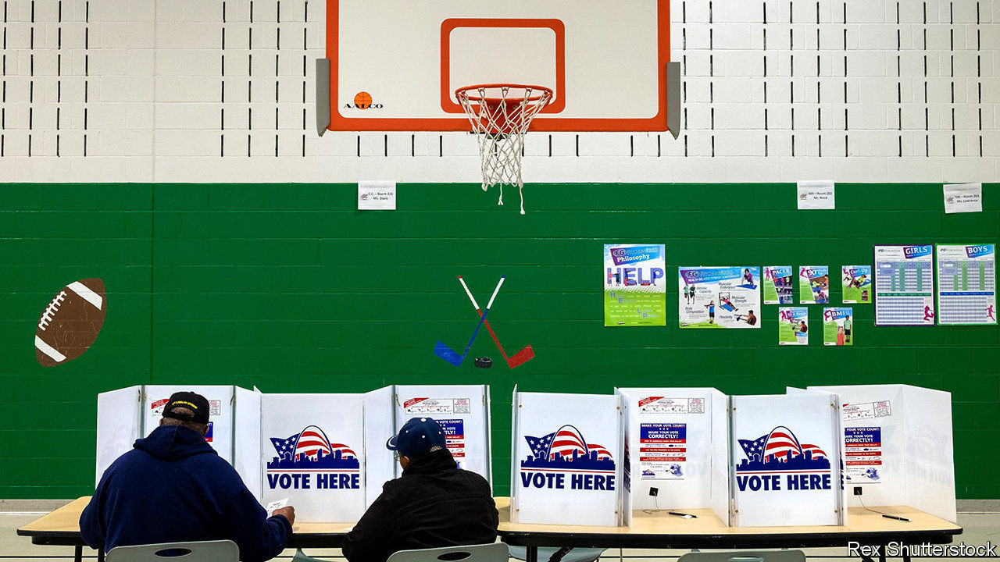

## The will of the...whatever

# Political skulduggery in Missouri

> A faction of Republicans, and a band of lobbyists, are campaigning to bring back gerrymandering

> Sep 12th 2020CHICAGO

DEMOCRACY WOULD be so much easier if the pesky voters fell in line. Consider Missouri’s elected state representatives. For years party leaders could gerrymander local voting districts so that incumbents faced less risk of losing. The drawing of electoral districts was done by a bipartisan commission appointed by lawmakers, often behind closed doors. Then, in 2018, voters upset this cosy arrangement. By an overwhelming margin they backed a ballot initiative known as Clean Missouri.

This reform put a squeeze on campaign contributions and limited the value of gifts and meals lobbyists could dish out. Most awkwardly it stated that an independent demographer, starting next year, would have the final say in the redistricting commission. The demographer would also have to ensure districts were drawn so that outcomes fairly reflected the will of voters. Under the old system Republicans had most recently taken over 70% of the seats in the lower house, a supermajority, on less than 60% of the votes.

Since 2018 a defiant faction of Republicans (plus one Democrat) and lobbyists, notably a group called Cornerstone 1791, has fought back. They got a new ballot initiative through the legislature, so in November voters will decide on “Amendment 3”. This would make trivial changes to the rules on gifts and campaign spending. More significantly, explains Dave Schatz, a state senator, it would scrap the “unelected, unaccountable demographer”, whose baleful presence, he considers, creates an “absurd and unprecedented redistricting process”. (In fact, several other states have already handed over redistricting to properly independent commissions.) In effect, party bosses would take back control.

There is some political risk in this. David Kimball, a politics professor at the University of Missouri in St Louis, points out that redistricting reform was popular, whereas “overturning the will of the people doesn’t look good”. That explains why moderate Republicans will not back their colleagues. A venerable party figure, a former three-term US senator, John Danforth, has warned that “the integrity of Missouri’s democracy [is] at stake”. Missouri’s governor, Mike Parson, a Republican facing an unexpectedly tight race in November, has stayed studiously quiet about it.

Other setbacks have arisen. To give the passage of Amendment 3 a better chance, its sponsors, such as Dan Hegeman, a state senator, fudged the wording of the ballot, hiding its main purpose. But on September 2nd a court rewrote the wording on the ballot to say bluntly that Amendment 3 would “change the redistricting process voters approved in 2018” and added that it would “substantially modify, and reorder, the redistricting criteria approved by voters”.

In fact the fine print of Amendment 3 points to more minutely crafted skulduggery. It would make it difficult for anyone to claim the legal standing to challenge gerrymandering. It also seems to open the door to districts drawn not with roughly equal populations—as is usual—but instead by numbers of eligible voters. Dean Plocher, a Republican representative in St Louis, has argued that “the apportionment process being tied to citizenship protects the [idea of] one person, one vote”.

Would that change matter? Sean Nicholson of the Clean Missouri group, which works to protect the reform of 2018, calls it “offensive, heinous”. If children and non-citizens are not counted then elected officials, though supposed to represent them, might neglect them. It would also have a predictable political effect, hurting urban districts with more Latinos, African-Americans and Asian Americans while favouring rural, whiter ones, with older residents and fewer children. Half of Missouri’s Latino population, which is notably young, would no longer count in voting districts.

The effect, says Mr Kimball, would be to “weaken political power in Democratic areas”. Cities might lose state legislative districts while rural areas would do better. That looks like rigging rules to help one side. Two years ago voters appeared to reject that sort of thing. They might again. ■

Dig deeper:Read the [best of our 2020 campaign coverage](https://www.economist.com//us-election-2020) and our [presidential-election forecast](https://www.economist.com/https://projects.economist.com/us-2020-forecast/president), then sign up for Checks and Balance, our [weekly newsletter](https://www.economist.com//checksandbalance/) and [podcast](https://www.economist.com/https://play.acast.com/podcasts/2020/01/24/checks-and-balance-our-new-weekly-podcast-on-american-politics) on American politics.

## URL

https://www.economist.com/united-states/2020/09/12/political-skulduggery-in-missouri
