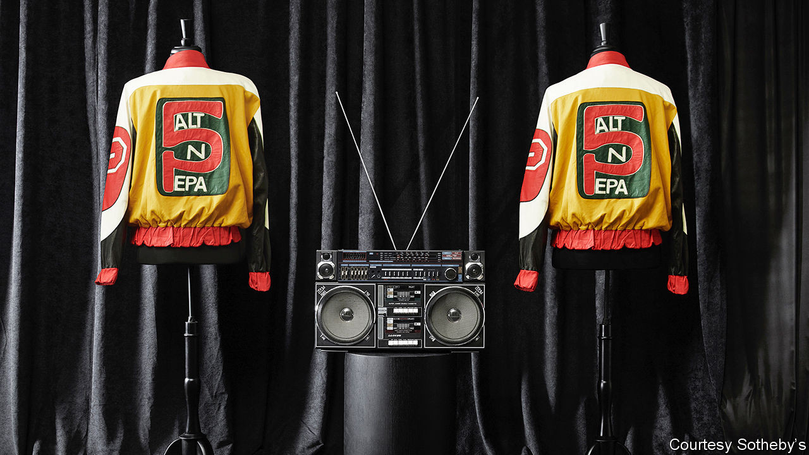

## Rap on the block

# Sotheby’s hip-hop auction

> The venerable auction house aims to push its hip-hop memorabilia real good

> Sep 12th 2020

“THE SYMBOLISM of the crown was meant to convey greatness and something bigger about hip-hop,” recalls Barron Claiborne in “Contact High: a visual history of hip-hop”. The photographer was describing a crown worn by Notorious B.I.G., also known as Biggie Smalls, in a famous snap. The crown, one of 120 lots, is on the block at Sotheby’s inaugural hip-hop auction on September 15th. The sale includes items from hip-hop’s earliest days in the 1970s through to the present. It includes jewellery, art, photography, Tupac Shakur’s teenage love letters—and fashion, such as Salt-N-Pepa’s “Push It” jackets (pictured). As people age and have more disposable income they often bid up the price of things that were desirable when they were young. This sale, which is a honeypot for those who came of age in the 1980s and 1990s, is expected to yield $1.2m-1.7m. As Biggie observed in his 1994 hit “Juicy”, “You never thought that hip-hop would take it this far.”

## URL

https://www.economist.com/united-states/2020/09/12/sothebys-hip-hop-auction
