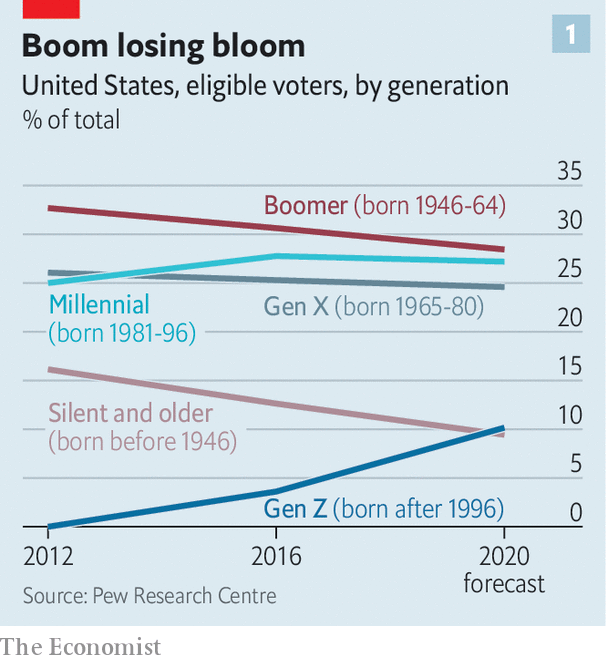
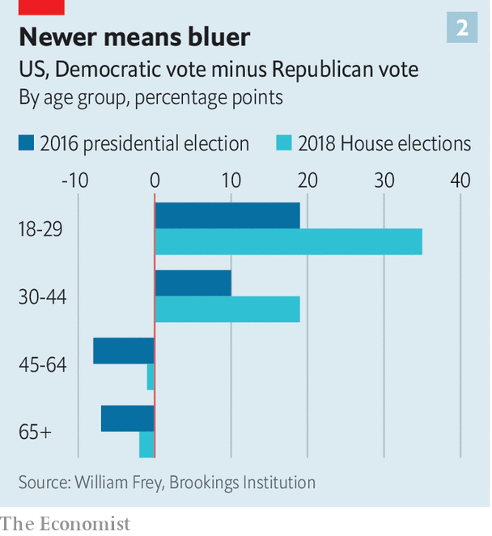

## The boomers’ last stand

# Younger Americans feel their voting weight

> After years of elder-power, a new generation may well decide the election

> Sep 12th 2020

THIS HAS been a year of the young. The protesters against racial injustice have mostly been in their 20s. The average age of demonstrators arrested since mid-June in Portland, Oregon (one of the centres of activity) was 28. The young have not suffered as much as others from covid-19 itself but were hardest hit by the consequences of the virus. More than half of those between 18 and 29 lost a job or took a significant pay cut in April, or live in a household where that has happened. About two-fifths of those aged 50 to 64 have experienced the same thing. Young people are the most likely to work in jobs vulnerable to closure, such as waitressing or retail.

And 2020 will be a year of the young in one more important respect. Electorally, it will be the last stand of the baby-boomers (born between 1946 and 1964) and the first poll in which voting will be dominated by generations younger than 40, especially millennials, defined here as those born between 1981 and 1996. As Bill Frey, a demographer at the Brookings Institution, a think-tank, puts it: “America is moving from largely white, baby-boomer-dominated politics and culture in the second half of the 20th century to a more racially diverse country fuelled by younger generations: millennials, Gen Z-ers and their juniors.”

Boomers have dominated American politics since the 1990s, when they became the largest living generation and started to cast the largest number of votes. (Boomers and millennials have an official status, since the Census Bureau uses those terms; all the other generations are private classifications.) Since Bill Clinton’s election in 1992, six of the eight presidents and vice-presidents have been boomers (Joe Biden, the Democratic candidate, is one of the exceptions, being too old). So are most of Congress. Since 1998, the median age of congressional representatives has put them in the boomer class.

But boomers lost their status as the largest generation in 2019, when millennials overtook them in absolute numbers. That year, there were 72m millennials aged 23 to 38, according to the Pew Research Centre, 500,000 more than boomers (then 55 to 73). For the first time in 2019, more than half of Americans were millennials or younger (meaning members of the generations that came afterwards, called Gen z, born between 1997 and 2012, and post-Gen Z, born after 2013). The three younger groups made up 51% of the population in 2019, compared with only 41% the beginning of the decade.

The electoral impact of these demographic shifts has been muted so far because most Gen Zs are below voting age, and because millennials have a reputation—not entirely deserved—for being apathetic about politics. But things are changing. “Millennials and Gen Z will comprise almost 40% of the electorate in 2020,” says Carolyn DeWitt, head of Rock the Vote, an electoral-mobilisation group, “giving them enormous power.” The two youngest voting-age groups are likely to have more votes than the two oldest, boomers and the so-called silent generation born before 1946 (see chart 1).

The shift towards the young has occurred surprisingly swiftly, not in tiny steps. In the 2010 mid-terms, boomers and older people outvoted the younger generations almost two to one. As recently as 2014 a disparity remained: boomers cast 57m votes; younger voters, 36m. Four years later, the three younger generations (which now include a few Gen Zs) outvoted the older ones. Not by coincidence, the 2018 mid-terms were a blue wave, in which Democrats regained the House.

Younger generations differ from their elders in attitudes, ethnicity and education. According to Pew, millennials and Gen Z-ers are the most likely to say governments should do more to solve problems, that same-sex marriage is good for society, that climate change is caused by human activity and that blacks are treated less fairly than whites. They are also more likely to say fetters should be put on capitalism, says Pew’s Richard Fry, perhaps because both generations started looking for jobs during recessions, the Great Recession for millennials, the covid recession for Gen Z.

They are also more likely to be from minorities themselves. As a simple rule, the younger you are, the more likely you are to be black, Hispanic or Asian. Mr Frey calculates that almost three-quarters of 60-somethings are white. Half of those under 20 are not. The impact of young minorities is especially great in sunbelt states. In Texas, 44% of eligible voters are Hispanic or black. But among voters under 40, the minority share is over half. In Arizona, Hispanics are 31% of all eligible voters but 44% of those under 40. In eight states, including Georgia and Florida, over half of voters under 40 are non-white. These are places that Democrats have a shot at winning for the first time in a generation. They are also the people most likely to be galvanised by the killings of George Floyd and others.

Millennials and Gen Z-ers are better educated than their parents and grandparents (though not necessarily wiser). The Pew Research Centre looked at the educational attainment of 25- to 37-year-olds in each generation. For boomers, roughly 25% had a college degree or higher. For millennials, the share was 39%. The leap has been especially great for women. Among boomers, more men than women have degrees. Among millennials, 43% of women have degrees, seven points more than men. The Republicans’ disastrous performance in 2018 in suburban counties, former strongholds, owes much to the revulsion felt by college-educated millennial women for Mr Trump. Education and race are among the most reliable predictors of party affiliation. African Americans vote for Democrats by ten to one or more; Hispanics and Asians by about two to one; 53% of college graduates identify with Democrats, only 40% with Republicans.

Put all this together, and it is hardly surprising to find that millennials and Gen Z-ers are far to the left of boomers. Younger voters identify with issues, not parties, but they tend to vote Democratic (see chart 2). In 2016, calculates Mr Frey of Brookings, people aged 30 to 44 (older millennials) voted for Hillary Clinton by ten points (55% to 45%); voters aged 18 to 29 (younger millennials and Gen Z-ers) by 19 points. Millennials form the bedrock of support for the progressive left, who have done well in Democratic primary contests this year.

But will they turn out? This year, admits Ms DeWitt, “the top of the ticket won’t be a motivator.” Voters under 30 have always voted less than older ones anyway, often by large margins, though this may owe as much to political parties as to voters themselves. In 2016 two-thirds of young voters said they had not been contacted by any party before the election, probably because parties concentrate their get-out-the-vote efforts on those who have voted before (making low turnout among the young a self-fulfilling prophecy). “Young people are issue-based voters,” says Wisdom Cole of the NAACP. “We’re not going to turn them out by just saying, ‘Go Vote! Go Vote!’.”

Pew’s Mr Fry says, “how the pandemic affects turnout is anyone’s guess.” Our guess, based on crunching Census data and polls from YouGov, is that the turnout rate for the under-30 cohort might be 11 points lower than for the other generations this November. That sounds poor, but for comparison we reckon that gap was 20 points in the 2016 election.

Turnout among voters aged 18 to 29 almost doubled between the 2014 and 2018 mid-term elections. Anecdotally, say election organisers, Gen Z activists are more engaged in the 2020 campaign than older voters. Rock the Vote’s online voter-registration platform has processed 900,000 registrations so far this year, compared with 500,000 at the same stage in 2016. It seems likely, thinks Ms DeWitt, that anger about the death of George Floyd and others will be a wake-up for the young. Disgust at Mr Trump may transcend generations.

Democrats are understandably cautious about Joe Biden’s opinion-poll lead. As 2016 showed, leads can shrink and the electoral college can let a candidate lose the popular vote but still win the White House. But from a generational point of view, it is no surprise that the Democrat should be out in front. It reflects not only Mr Trump’s personality and record but shifts in the tectonic plates of electoral demography.■

## URL

https://www.economist.com/united-states/2020/09/12/younger-americans-feel-their-voting-weight
