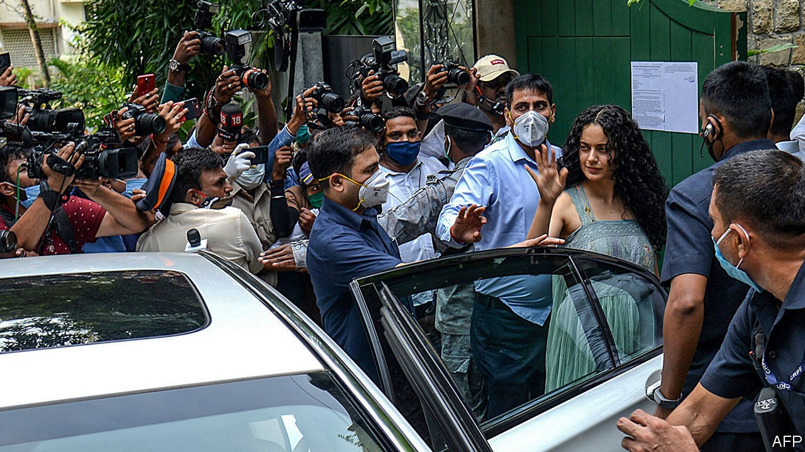

## Covid? What covid?

# A real-life Bollywood tragedy becomes a political farce

> A fallen star. A villainous girlfriend. An outspoken heroine. Inept cops. Three-letter agencies. It’s a blockbuster

> Sep 17th 2020

WHAT STORY should top the news? That covid-19 cases are rising by nearly 100,000 a day? That the economy shrank by a shocking 23.9% last quarter? Or perhaps that an increasingly bellicose China is massing troops on the border? No! Even with the darkest prospects in decades looming over India’s 1.3bn people, the spotlights of its main TV news channels have in recent weeks focused instead on the private lives of a clutch of Bollywood stars.

This great distraction began on June 14th, when the body of Sushant Singh Rajput, a 34-year-old actor, was found in his flat in Mumbai. The suicide provoked a media frenzy. Mr Rajput’s rise from the obscurity of Bihar, India’s poorest state, to screen fame as the hero of a biopic about a revered cricket captain was itself a filmi tale. His apparent slide into depression raised just the kind of questions about the underside of the film industry that India’s raucous chat shows and gossipy social media love to chew over.

Yet when an ambitious actress and members of Mr Rajput’s family began to air charges that the actor had been corrupted by an entourage of drug pushers, fleeced of his earnings and perhaps even driven to kill himself, the story took on a sinister hue. The more sensationalist news channels trained their sights on Rhea Chakraborty, a 28-year-old actress and Mr Rajput’s girlfriend, turning her into the villain of the piece. Politicians, too, swiftly spotted opportunities.

State elections in Bihar, to be held before December, represent the biggest political test for Narendra Modi, the prime minister, and his Bharatiya Janata Party (BJP) since this year’s multiple crises began. The state is India’s third most populous, and is famed for the caste-infected complexity of its politics. The party’s strategists appear to have seen the actor’s suicide as a chance to pose as upholders of rustic Bihari virtue in contrast to the wickedness of Mumbai.

There are political stakes in the big city too. Promoting Kangana Ranaut, the actress who spoke out about celebrity drug culture, as a paragon of virtue, the BJP and its media toadies raised a ruckus about the supposed ineptitude of the city’s police. The subtext is that, since elections last year, Mumbai and its surrounding state of Maharashtra have been controlled by a coalition that includes former ideological allies and now bitter opponents of the BJP.

The Supreme Court waded into the affair, ordering the Central Bureau of Investigation, a national agency, to take over the Rajput case. Two more federal bodies, the Enforcement Directorate, which combats financial crimes, and the Narcotics Control Bureau (NCB), have launched their own investigations. The drug enforcers have been the fastest to concoct a case, arresting some 18 people, including Ms Chakraborty. She and her brother, also arrested, have been denied bail.

Mr Rajput’s relations have cheered the swift action. Yet to many, the campaign smacks of mob justice. And, just as Biharis are being told to take umbrage over Mr Rajput’s demise, many people in Ms Chakroborty’s home state of West Bengal have been disgusted by her persecution. The BJP is determined to wrest that state from opposition control in an election next year. Its strategy in the Rajput affair has certainly diverted public attention from the real and numerous problems facing India. But Mr Modi may come to regret its impact on Bengali voters. The drama, as Bollywood fans like to say, is not over yet. ■

## URL

https://www.economist.com/asia/2020/09/17/a-real-life-bollywood-tragedy-becomes-a-political-farce
