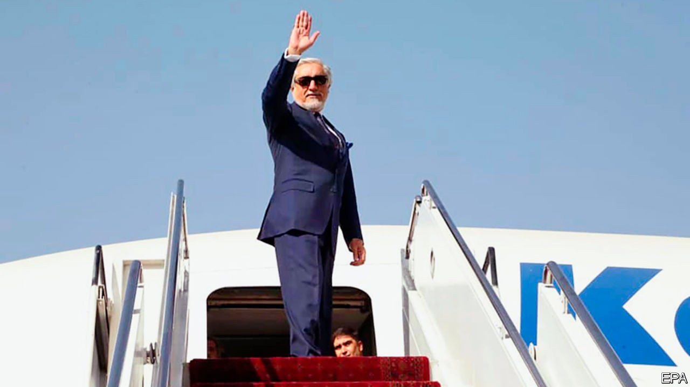

## When will the real talks begin?

# As America draws down it troops, Afghans clear their throats

> The two sides have yet to grasp the heart of the matter

> Sep 19th 2020

AFTER SIX months of intransigence and delay, the Taliban and Afghan government leaders at last sat down together on September 12th in Doha, the capital of Qatar, to seek an agreement on how to run their country. An accord in February between America and the Taliban mainly concerned the promised withdrawal of American troops by next May, as long as the Taliban guarantees not to harbour terrorists like al-Qaeda.

The Afghan government was not part of that deal. The talks that have just begun will focus on the shape of the country once the Americans have gone. Grievance and bloodshed have mounted over the four decades since a coup overthrew the monarchy in 1978. Millions have been displaced and hundreds of thousands killed. The meddling of foreign powers has made matters much worse. “The current conflict has no winner through war and military means,” said Abdullah Abdullah (pictured), the head, in effect, of the government’s negotiating team. “But there will be no loser if this crisis is resolved politically and peacefully through submission to the will of the people.”

Both sides were on their best behaviour as the talks opened in a plush hotel ballroom. Opponents greeted each other like old friends. General Austin Miller, commander of NATO forces in Afghanistan and a past target of Taliban assassins, exchanged pleasantries with his foes. Some saw hints of a less fractured country, as Masoom Stanekzai, leading the government team, and Sher Muhammad Abbas Stanekzai, the Taliban’s deputy chief negotiator, hail from the same tribe and province.

The sessions began gently, setting ground rules and an agenda. Both sides called for patience and warned against spoilers trying to sabotage the talks. The government’s priority is a ceasefire. Scores of civilians are being killed and wounded every week. Hopes that violence would subside after America’s deal with the Taliban were dampened in the summer. A study by the Afghanistan Analysts Network, a research group, found that both sides have become more restrained in proclaiming offensives; more attacks are occurring without claims of responsibility. The killing, however, has been largely undiminished. Violence is the Taliban’s biggest bargaining chip, so they will be loth to give it up. They know that force of arms is what has won them a seat at the negotiating table.

At some point the thorniest issues must be tackled. How should the country be governed? How to allocate power? What rights will be enshrined in a constitution? These issues may take months, if not years, to resolve. The Taliban have given little detail of what they want. Mullah Abdul Ghani Baradar, their deputy leader, merely declared in the opening ceremony that his side wanted “a free, independent, united and developed country...with an Islamic system in which all tribes and ethnicities find themselves without any discrimination and live their lives in love and brotherhood.”

Pressed on women’s rights, the Taliban have previously said only that they will be protected under Islam. Such vagueness has not reassured many Afghan women. After all, the Taliban claimed to protect them in the 1990s while forbidding them to work or go to school. Now they must spell out how far they have shifted from their fundamentalism. Rifts may emerge between moderate factions and doctrinaire stalwarts who want to restore their former “emirate”. Nor has the Afghan government submitted many details. Ashraf Ghani, the president, has merely called for “a sovereign, democratic and united republic”.

The talks are behind closed doors, without foreign officials. America, as the Afghan government’s main backer, still looms large, but its influence is waning and changing. The delays in getting the talks going plus intelligence that the Taliban are still chummy with al-Qaeda could have given President Donald Trump an excuse to slow his troop withdrawal. But the number fell from 13,000 in February to 8,600 in June—and is expected to fall to 4,500 before the American presidential election in November, letting Mr Trump tell voters he has kept his promise to end the war. His opponent, Joe Biden, is not keen on America’s Afghan venture either. The GIs are clearly on their way out—but it is not clear what they are leaving behind. ■

## URL

https://www.economist.com/asia/2020/09/19/as-america-draws-down-it-troops-afghans-clear-their-throats
