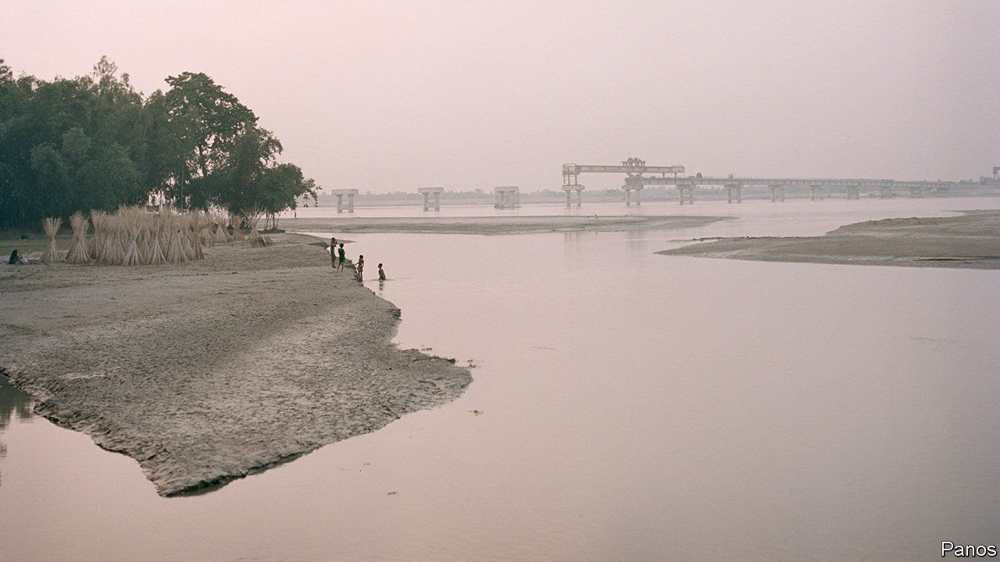
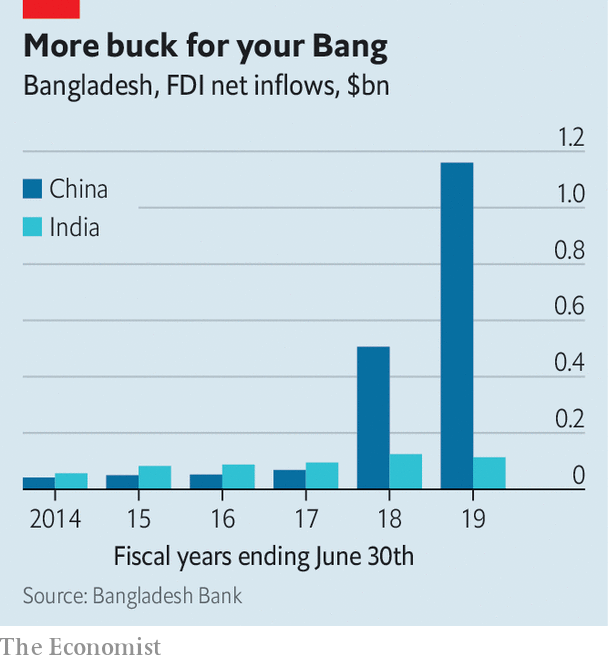

## Two-timing

# As Bangladesh’s relations with India weaken, ties with China strengthen

> But the government is keen to string both Asian giants along

> Sep 19th 2020

SYLHET, A CITY in north-eastern Bangladesh, is some 50km from the border with India. But when the government awarded a $250m contract in April to build a new airport terminal in the city, the Indian bidder lost out to a Chinese firm, the Beijing Urban Construction Group. In June China granted duty-free access to 97% of Bangladesh’s exports. And this month Bangladesh, seemingly despairing of a decade-long negotiation with India on a water-sharing pact for the Teesta river, asked China to finance a $1bn water-management project instead.

Bangladesh came into being thanks in part to India: in 1971 its army intervened on the side of separatists battling the Pakistani army in what was then East Pakistan. Ever since, ties between the two countries have been close. But many Bangladeshis have come to see India as a patronising and presumptuous ally. “They don’t really believe that we are independent,” says a Bangladeshi journalist. “They interfere in everything. They think our bureaucrats work for them.” The various anti-Muslim policies of the current Indian government have exacerbated misgivings in Bangladesh, which is 90% Muslim.

Cue a Chinese charm offensive. China has built seven “friendship bridges” in Bangladesh in recent years. In 2018 it supplanted India as the country’s biggest source of foreign investment (see chart). It is also Bangladesh’s biggest trading partner. On a state visit in 2016 Xi Jinping, China’s president, promised to spend more than $20bn on 27 infrastructure projects. “Chinese businesses are all over infrastructure development, power and telecoms,” says Zahid Hussain, a former lead economist with the World Bank in Bangladesh. 

As well as deep pockets, China has fewer scruples than most Western benefactors, notes Ali Riaz of Illinois State University. In 2013 Bangladesh rejected a $1.2bn loan from the World Bank to finance a bridge spanning the Padma river, after the bank started investigating accusations of corruption. China stepped in. 

The number of Bangladeshis studying in China has grown exponentially in the past few years, says Mr Riaz. The media, too, is being courted. “Seventy percent of the journalists at my paper have been to China,” says a reporter at a financial newspaper, who himself spent ten months in China on a fellowship in 2018. Almost as soon as covid-19 arrived in Bangladesh, so did a team of Chinese doctors sent to help fight the epidemic.

The wooing is working. The Chinese government bullies its Muslims far more systematically than India’s does. It was also slower to grant duty-free access to Bangladeshi goods. Yet China is the target of much less criticism in the Bangladeshi media.

 Bangladesh’s government is a little more circumspect. It is wary of becoming too indebted to China, and is careful not to snub India. Narendra Modi, India’s prime minister, had been due to visit in March, until the coronavirus scuppered his trip. Having such a huge and powerful neighbour nonetheless rankles. “India’s policymakers and its press cannot stop incessantly reminding Bangladesh that it is smaller and less important,” says Mr Riaz. “China does not do that.” ■

## URL

https://www.economist.com/asia/2020/09/19/as-bangladeshs-relations-with-india-weaken-ties-with-china-strengthen
