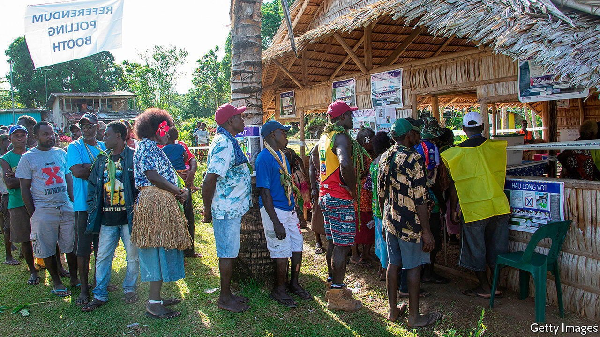
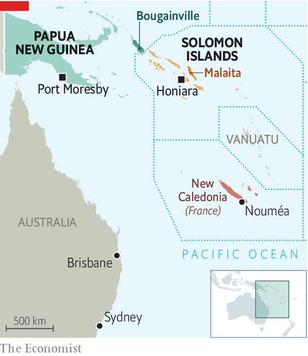

## No island is an island

# Referendums in the Pacific are attracting attention faraway

> France, China and Taiwan are all involved

> Sep 19th 2020WELLINGTON

TESTING THE popular will does not come naturally to Melanesian governments. Policy decisions are normally taken behind closed doors, away from the prying eyes of the general public. That may now be changing. New Caledonia, still a French possession, and Bougainville, an island at the eastern end of Papua New Guinea (PNG), held referendums on independence in 2018 and 2019. New Caledonia will hold a second such vote on October 4th. Enthusiasm for direct democracy is becoming infectious. The premier of tiny Malaita, the most populous province in the Solomon Islands, now wants to hold his own referendum on secession in protest against his national government’s overtures to China.

Bougainville’s 250,000 people are in the midst of their first election since the referendum of 2019, when 97.7% voted for independence. But that vote was non-binding, requiring only that the PNG government open negotiations on the island’s future status. PNG’s prime minister, James Marape, is adamant that Bougainville lacks the economic clout to survive as an independent state. Bougainville once boasted one of the world’s largest copper mines, but it was closed down in the civil war of 1988-97, leaving the island devoid of profitable exports. The front-runner in the contest to lead its autonomous government, Ishmael Toroama, once commanded the Bougainville Revolutionary Army, which fought bloodily for independence from PNG in the early 1990s.

Whereas Bougainvilleans opted emphatically for independence, New Caledonians voted against it in 2018, by 57% to 43%. That was the first of three scheduled referendums on whether to split from France, the territory’s colonial ruler since 1853. Since then, fervent French loyalists have regrouped, taking control of the local government. The French government is not neutral. It has let loyalists hoist the French tricolour on the campaign trail. On a visit to the territory in 2018, President Emmanuel Macron waxed lyrical about the vast stretches of the Pacific that remain a part of France.

Geostrategic rivalries are shaping Oceania’s local struggles. The Solomon Islands shifted diplomatic recognition from Taiwan to China last year. Malaita’s premier, Daniel Suidani, rejected that switch, condemning China for its communism and atheism. Despite the border being closed against covid-19, a direct flight from Guangzhou arrived on September 2nd, carrying Chinese workers hired to prepare facilities for the Pacific Games in 2023. “We will be closing access to Malaita,” Mr Suidani declared angrily, promising at the same time to shut down stores run by ethnic Chinese on the island.

Taiwanese diplomats stirred the pot by meeting Malaitan officials in Australia in March. Since then Taiwan has sent consignments of surgical masks, bags of rice and thermal-imaging equipment. Whether or not they are independent, the islands of the Pacific will not be insulated from big-power rivalry. ■

## URL

https://www.economist.com/asia/2020/09/19/referendums-in-the-pacific-are-attracting-attention-faraway
