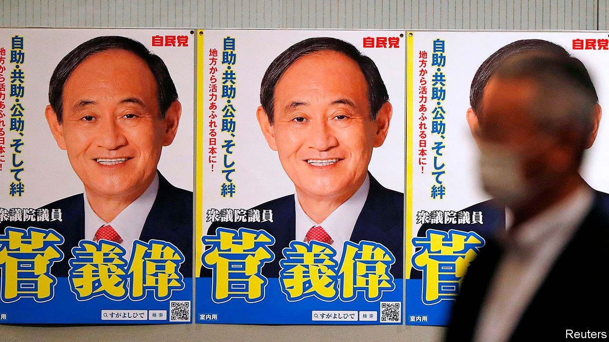

## Searching for Suga-san

# Suga Yoshihide, Japan’s new prime minister, promises continuity

> But Abe Shinzo’s successor also represents change

> Sep 19th 2020TOKYO

HISTORICAL ROLE models say a lot about political leaders. Suga Yoshihide’s is Toyotomi Hidenaga, the younger brother and right-hand man of Toyotomi Hideyoshi, the better-known warlord who united Japan in the 16th century. As Abe Shinzo’s loyal chief cabinet secretary for nearly eight years, Mr Suga played a similar behind-the-scenes part, excelling at mobilising Japan’s sprawling bureaucracy. Despite his powerful position, he was unrecognisable to many voters until last year when he revealed the name of Japan’s new imperial era, earning the moniker “Reiwa Ojisan”, or Uncle Reiwa.

Following Mr Abe’s resignation due to ill health on August 28th, Mr Suga has taken centre stage. “Now I am aiming for Hideyoshi,” he told a chapter of the ruling Liberal Democratic Party (LDP) during the brief campaign to replace Mr Abe as party leader. On September 14th he won a resounding victory in the LDP’s internal contest, collecting 377 of the 535 possible votes. Two days later he was sworn in as Japan’s 99th prime minister. Promising continuity and stability amid the covid-19 pandemic, he secured the support of party heavyweights. More than half of his cabinet are holdovers from the Abe administration; the newcomers include Mr Abe’s brother, Kishi Nobuo, as defence minister.

Although Mr Suga and Mr Abe’s fates have long been intertwined, their paths to power could not be more divergent. Mr Abe is a princeling, the son of a foreign minister and the grandson and great-nephew of prime ministers. Mr Suga is the son of a farmer and a schoolteacher from Akita prefecture, a rural backwater in the north of Japan. He is the first LDP leader since the party’s founding in 1955 who does not belong to any faction. He is also the first in nearly 30 years who did not inherit his seat in parliament from a relative.

After leaving home for Tokyo, Mr Suga first worked in a cardboard factory. He entered politics as a secretary to a politician in Yokohama, and eventually rose through the city council to the national Diet.

Those backgrounds also shaped the two leaders’ priorities. Mr Abe’s mission was reviving Japan’s standing on the world stage and revising Japan’s constitution to legalise its armed forces. He saw his plans for economic revival as a means to those greater ends. For Mr Suga, economic revival is a goal unto itself. As chief cabinet secretary, he pushed for more competition in agriculture and telecoms, advocated free-trade agreements and worked to stimulate inbound tourism. He also championed measures to admit more foreign workers. “His passion is on the domestic side,” says Gerald Curtis of Columbia University.

Mr Suga will need all the passion he can muster. Mr Abe imbued Japan’s economy with dynamism after decades in the doldrums. But covid-19 has set it back and deflationary fears have returned. Mr Suga promises to stick with “Abenomics”, including expansionary monetary policy and fiscal stimulus. Yet the Bank of Japan has little room for manoeuver left. So the “third arrow” of structural reform will become ever more essential, says Muguruma Naomi of Mitsubishi UFJ Morgan Stanley Securities, a financial joint venture.

Along with curbing the pandemic, that will be Mr Suga’s mission as prime minister. “I don’t think he will use the expression ‘third arrow’,” says Niinami Takeshi, CEO of Suntory Holdings, a giant drinks company, and an adviser to the government. “But he will work on deregulation and structural reforms.” The mix might include measures to boost workers’ productivity, digitise government services and improve co-ordination between ministries.

Such changes will face fierce resistance. Success will depend on Mr Suga’s ability to manage three challenges. First is the outside world. Mr Suga has shown little interest in foreign affairs, an area where Mr Abe shone. Second is his own party. Not belonging to a faction may afford Mr Suga some flexibility. But it may also leave him vulnerable to intraparty machinations if he stumbles, especially as next year’s LDP election draws closer. Third is the public. Mr Suga lacks charisma and has a combative relationship with the media.

Mr Suga has sought to shape a new image, emphasising his hardscrabble life story and his fondness for pancakes. “As the eldest son born on an Akita farm, I want to cherish rural regions,” he declared in his first press conference as prime minister. His chance to forge a new compact with voters may come sooner rather than later. The Diet’s mandate lasts until next autumn, but talk of an early election is rampant. It would be a perilous move amid the pandemic. But it would also be a statement that Mr Suga is ready to leave the shadows and embrace the limelight. ■

## URL

https://www.economist.com/asia/2020/09/19/suga-yoshihide-japans-new-prime-minister-promises-continuity
