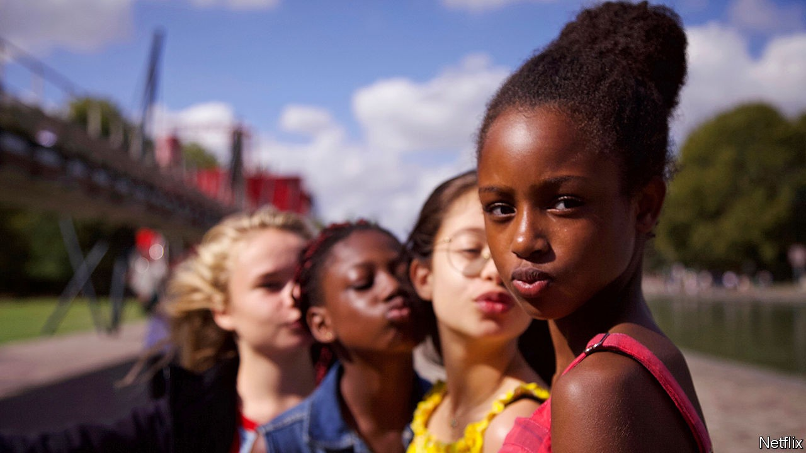

## Banlieue cinema

# A bold French film stirs controversy in America

> “Cuties” has attracted attention from Ted Cruz and QAnon

> Sep 19th 2020PARIS

LIKE ANY 11-year-old girl starting at a new school, Amy (Fathia Youssouf) just wants to fit in. The conservative Muslim teachings of her Senegalese mother’s world impose a creed of pudeur, or modesty. Passing the laundry room of her high-rise block in a banlieue of Paris, Amy is dazzled by a different universe. She glimpses Angelica (Médina El Aidi-Azouni), dressed in a crop top and practising hip-swivelling dance moves as her washing spins.

“Mignonnes” (“Cuties”) is about Amy’s painful quest to join Angelica’s dance gang. It is a powerful, disturbing story of belonging, female liberty, hysterical giggling and conflicting cultures, but also of the hyper-sexualisation of pre-teens. Inspired by much-“liked” video clips on social media, the pre-adolescent Amy naively urges the girls into ever-more explicit choreography. The Franco-Senegalese director, Maïmouna Doucouré, who won a Sundance award for the film, says she wanted to explore “dangerous” social pressures through the eyes of girls, but not to “judge” them.

Others have decided to judge, however. A low-grossing independent movie in French would ordinarily go unnoticed in America. But Netflix, which acquired the American distribution rights, has provoked a backlash. Ted Cruz, a Republican senator, wrote to the attorney-general asking him to determine whether the film “violated any federal laws against the production and distribution of child pornography”. A “cancel Netflix” petition, backed by QAnon conspiracists, is circulating online.

Netflix has apologised for the “inappropriate artwork” it initially used. It was far from the film’s French publicity shot, which showed the girls in a carefree moment of sorority. Yet the row raises a thorny question: when does a film about a troubling phenomenon become complicit in what it seeks to condemn? During dance scenes, the camera lingers uncomfortably on the children’s bodies in ways that shock and haunt the viewer. The political hijacking of the debate, though, leaves little space for subtlety. Which for a strong debut feature film by a young black female director is a shame.

## URL

https://www.economist.com/books-and-arts/2020/09/19/a-bold-french-film-stirs-controversy-in-america
