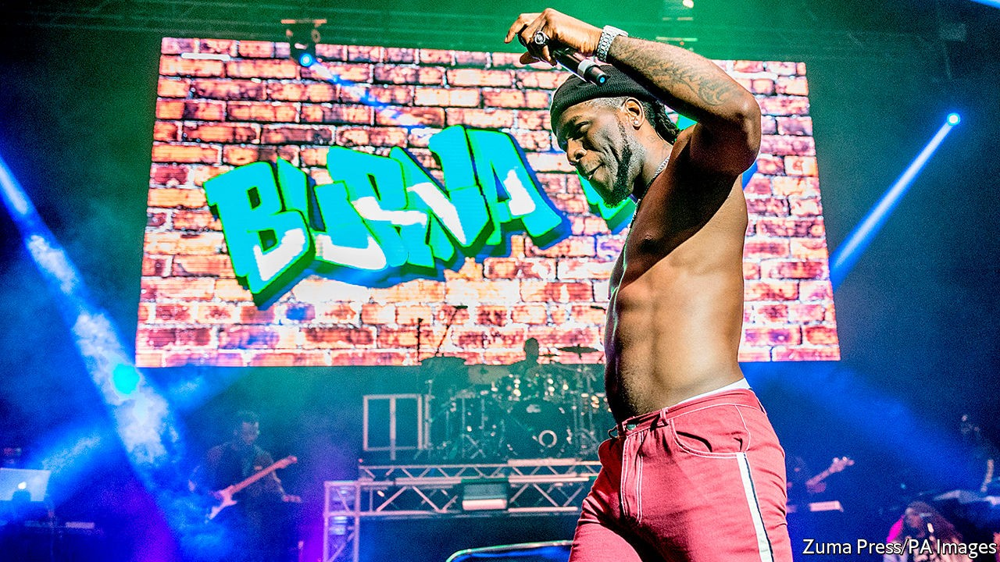

## From Nollywood to Netflix

# African entertainers are wowing global audiences

> Never before have so many burst into the global mainstream at the same time

> Sep 19th 2020JOHANNESBURG

“I SWEAR TO make sure you never forget about me,” sings Burna Boy on the opening track of “Twice as Tall”, which was released last month. These days there is little chance of that. The Nigerian musician’s fifth album, an evocative blend of contemporary sounds, score-settling and social commentary, topped the streaming charts in dozens of countries. It was streamed 5m times in the hour after it came out.

Burna Boy is one of the biggest stars associated with Afrobeats (also known as Afropop): an umbrella term for what is less a genre than a movement, encompassing influences such as Caribbean soca and dancehall, electro hip-hop, jùjú music (based on Yoruba rhythmic percussion) and auto-tune heavy pop. Other prominent artists include Davido, WizKid, Mr Eazi and Tiwa Savage. All have record deals with major Western labels, clock up tens of millions of listens on streaming sites and attract thousands of fans to concerts. Afrobeats artists have collaborated with the likes of Drake, Stormzy and Beyoncé, who last year curated an album featuring a host of African talent.

Boosted by “Black Panther” (2018), a superhero smash-hit set in a fictional African kingdom, African film and television are also drawing a broader audience. Nollywood, as Nigeria’s film industry is known, is increasingly renowned for the quality of its output as much as its quantity. Netflix recently bought the rights to Nigeria’s two highest-grossing films, “The Wedding Party” (2016) and its sequel (2017), as well as the much-praised “Lionheart” (2018). This year it released its first original African-made show, “Queen Sono”, a spy drama set mostly in Johannesburg, created by Kagiso Lediga, a South African writer-director. Next came “Blood & Water”, set in Cape Town, which became one of Netflix’s ten most popular shows in over 50 countries.

Previous African entertainers have enjoyed global success. Fela Kuti, Youssou N’Dour and Hugh Masekela sold records far beyond, respectively, Nigeria, Senegal and South Africa. In the 1970s Senegalese films such as “Touki Bouki” (1973) wowed overseas audiences. But never before have so many African artists burst into the global mainstream together. The momentum extends to literature: this week Tsitsi Dangarembga, a Zimbabwean writer, and Maaza Mengiste, who was born in Ethiopia, were shortlisted for the Booker prize for fiction.

Africa has long been seen as an importer of culture, say Matthias Krings and Tom Simmert, two academics, in a recent paper. The battered minibuses on the streets of capital cities attest to that, emblazoned as they are with the names of English Premier League footballers or American hip-hop stars. But increasingly there are posters of African pop stars on the walls of American, British or French teenagers’ bedrooms, too. African countries are exporting more of their cultural output. As Davido says of Afrobeats, “It’s our new oil.”

The moment has been a long time coming. In the 1980s and 1990s it was harder for African artists to win attention. Making music, films and TV was expensive; at home, widespread piracy made it difficult to earn money. Abroad, African music was often relegated to catch-all “world music” shelves in record shops, next to Peruvian pan pipes. The only references to the continent on mainstream Western radio shows may have been “Africa” by Toto, a weird if catchy song, or the members of Band Aid bellowing inaccurately about its lack of snow in “Do They Know It’s Christmas?”

From the 2000s changes in technology began to level the global playing field. Cheap kit let Afrobeats producers make high-quality recordings; software meant sounds could be more easily mashed together. Blogs such as notjustok.com helped broadcast music and generate followings. The market for song excerpts as ring tones provided a new source of income. For their part, film-makers benefited from fans uploading segments to YouTube. Then came streaming services such as Spotify and Apple Music, as well as Netflix and IROKOTV, which hosts Nollywood films.

Two other powerful trends have encouraged the spread of African pop culture: demography and diasporas. The median age on the continent is under 20. Like the post-war baby-boomers, such a large cohort of young people may have been bound to sway global tastes. Meanwhile first- and second-generation African populations in the West have sharply expanded.

The number of immigrants from sub-Saharan Africa in America shot from 265,000 in 1990 to 2m in 2018 (375,000 are Nigerians, the largest single group). Between 2001 and 2011 the African-born population of England and Wales rose from 800,000 to 1.3m (the Nigerian contingent more than doubled). “Once you blow in Nigeria you almost automatically blow in London,” says Joey Akan, founder of Afrobeats Intelligence, a newsletter. Since it remains hard to make money in Nigeria, he adds, its artists must reach the diaspora.

African migrants and their children are far from just passive consumers, especially when it comes to music. A London-born DJ of Ghanaian parentage, DJ Abrantee, is credited with popularising the term Afrobeats in 2011. Several well-known Afrobeats artists come from the diaspora, for example the British-born acts J Hus, Fuse ODG and NSG. Davido was born in Atlanta.

The clout of Nigerians, both on the continent and in the West, has led to some grumbling. Ghanaian artists sometimes say Nigerians play down the influence of their genres, such as hiplife and azonto, on Afrobeats. In 2015 Kenyan artists took to the streets to demand local radio stations play more of their music. Beyoncé’s album included few east Africans, noted musicians from the region. Western packaging can add to the impression that there is little happening outside Lagos. Popular “Afrobeats” streams heavily feature Nigerians.

Such worries about “Nigerianisation” in part reflect the sheer number of Nigerians (over 200m) and the role of Lagos as a creative hub. But other sounds are attracting more attention, too, for example South African house styles, gqom and amapiano. Even if these are quickly adapted by enterprising Nigerians, that stimulates interest in the original music. High-profile festivals and playlists may be dominated by Nigerians but they increasingly showcase others, such as Nasty C from South Africa, Navy Kenzo, a Tanzanian duo, or Innoss’B, a Congolese singer-songwriter.

A more piercing critique, at least of the African-made shows on Netflix, is that consumers in the rest of the world are not getting an authentic sense of African lives. “Queen Sono” is “a Hollywood spy drama copy-pasted into Johannesburg with a black female protagonist”, argues Tsogo Kupa, a South African writer and film-maker. “Blood & Water” comfortingly mimics the tropes of American teen dramas.

Yet their creators should be cut some slack. Many Westerners remain deeply ignorant about Africa. Last year the Africa Narrative, an initiative based at the University of Southern California, published a study of 700,000 hours of American TV aired in March 2018. It found that just 14% of references to Africa were positive; in 44% of cases, no particular country was specified. And even if the Netflix shows are bland, they contain telling details and asides. The first episode of “Blood & Water” makes a brief mention of the horrors of Belgian Congo—not something found in “Gossip Girl”. The films Netflix has bought are generally better than the TV shows. “Cook Off”, a Zimbabwean romcom, deliciously captures the country’s gallows humour.

If African artists still have work to do, so do cultural gatekeepers in the West. The Grammy awards still consign Afrobeats to “world music”. The application of “Lionheart” for an Oscar for best international film was turned down because most of the dialogue is in English (with a smattering of Igbo). In response, Genevieve Nnaji, who directed and stars in it, observed: “We did not choose who colonised us.” ■

## URL

https://www.economist.com/books-and-arts/2020/09/19/african-entertainers-are-wowing-global-audiences
