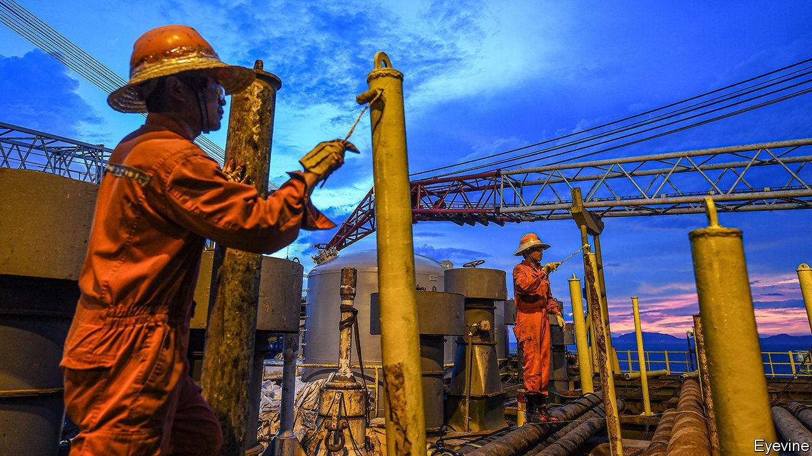

## Energy and politics

# Daniel Yergin’s new survey of the world of energy

> Though brisk and authoritative, “The New Map” is not in the same league as “The Prize”

> Sep 17th 2020

The New Map: Energy, Climate and the Clash of Nations. By Daniel Yergin. Penguin; 512 pages; $38. Allen Lane; £25.

ON ITS PUBLICATION in 1991 Daniel Yergin’s “The Prize: The Epic Quest for Oil, Money and Power” quickly attained the status of a classic. A massive narrative history, it wove the story of oil through the previous century’s economic, political and military events deftly and exhaustively. It was also well timed. The fall of the Soviet Union, a clear punctuation point, made it a good moment at which to take the measure of one of modern history’s most important threads. And with the first report of the Intergovernmental Panel on Climate Change just a year old, and the signing of the UN Framework Convention on Climate Change just a year in the future, the great issue of the 21st century was only just beginning to make itself felt.

Mr Yergin’s new book is not in the same league; nor does it pretend to be. As the use of the word “map” in the title gives notice, it is a much more schematic undertaking. Less than half the length of “The Prize”, it has a larger number of chapters, each picking off a particular topic. A place, an event or a man is normally evoked to introduce or situate the subject; the relevant issues are judiciously explained; a conclusion is reached, often buttressed by the words of an apposite CEO, minister, admiral or whoever. Thus the book breezily takes the reader through the developments of the past few decades in the oil business and energy more generally, with an eye to political repercussions. With sections on America, Russia, China, the Middle East, the car industry and climate politics and policy, at its best it is both brisk and authoritative, an impressive combination.

But it is also rather limited. The mostly geographic structure keeps out some important stories: Australia, which over the past two decades has become the world’s biggest exporter of both coal (in terms of value) and liquefied natural gas, turns up almost entirely as “and Australia”, concluding lists of other countries. Europe, which as a user of energy and a driver of policy matters a great deal, is handled better, but only in its relations with fossil-fuel producers, who remain, as in “The Prize”, Mr Yergin’s main concern. His interest in Europe’s attempts to conquer the “green commanding heights” of a post-fossil-fuel world—an ambition phrased as a play on the title of another book by Mr Yergin, which tackled free markets and globalisation—is limited.

It is greater, though, than his interest in climate change per se. Mr Yergin treats this overwhelming geophysical disruption almost entirely in terms of the way it is mediated through politics and policies, European and otherwise. In his outlook it acts purely through prices, regulations and subsidies, not through changed landscapes, displaced populations or rising seas. The idea that, as an externality of fossil-fuel use, it is already and always a part of the economy does not get a look in (the book has no room for economists of climate change such as William Nordhaus or the late Martin Weitzman). The question of what the Earth will actually be like in 2050—when Mr Yergin expects half of all cars sold still to be powered by fossil fuels—is not addressed.

In his essay “The Climate of History: Four Theses”, the historian Dipesh Chakrabarty argued that a world in which the environment as a whole is increasingly a human construction requires a new form of history, transcending the kind in which people and nations play out their dramas in front of immutable scenery. As Mr Chakrabarty’s second thesis has it: “The idea of the Anthropocene...severely qualifies humanist histories of modernity/globalisation”. The need to meld narratives of the human and no-longer-natural worlds would seem to apply in spades to an author writing about fossil fuels. That Mr Yergin has neither met nor, really, engaged with the challenge does not render his work worthless; limited perspectives have their place. But it is to be hoped that more ambitious treatments of the subject for the general reader will soon follow. ■

For more coverage of climate change, register for The Climate Issue, our fortnightly [newsletter](https://www.economist.com//theclimateissue/), or visit our [climate-change hub](https://www.economist.com//news/2020/04/24/the-economists-coverage-of-climate-change)

## URL

https://www.economist.com/books-and-arts/2020/09/17/daniel-yergins-new-survey-of-the-world-of-energy
