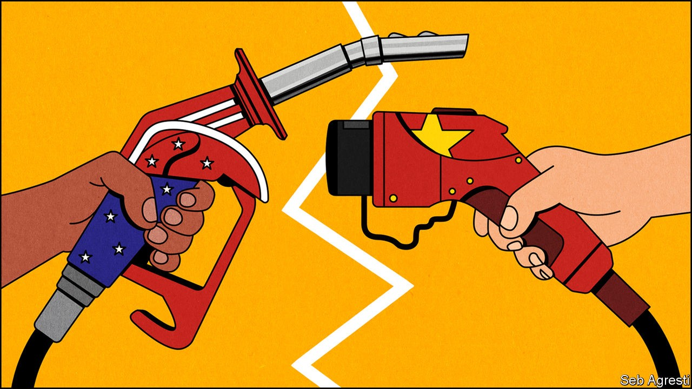
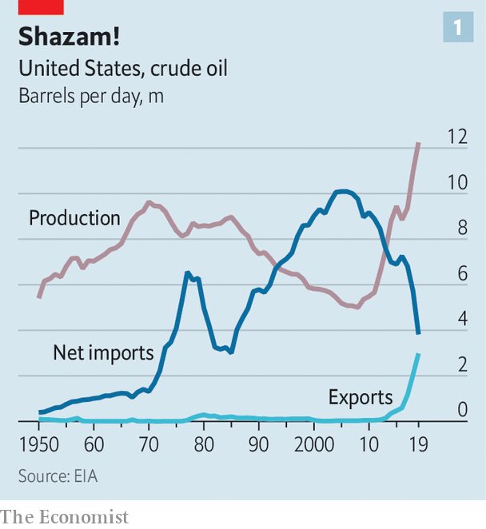
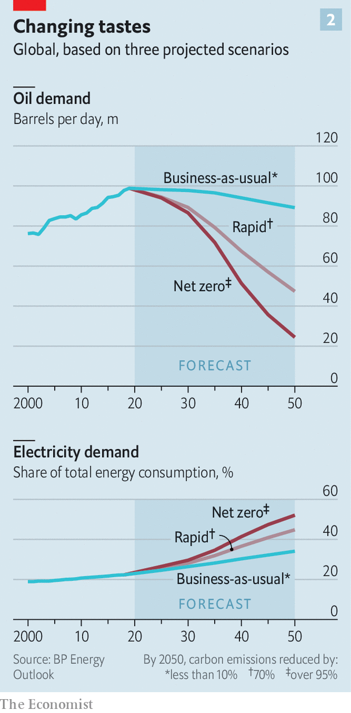

## The changing geopolitics of energy

# America’s domination of oil and gas will not cow China

> Being an importer of fossil fuels and an exporter of renewable technology is not so bad

> Sep 17th 2020NEW YORK

For more coverage of climate change, register for The Climate Issue, our fortnightly [newsletter](https://www.economist.com//theclimateissue/), or visit our [climate-change hub](https://www.economist.com//news/2020/04/24/the-economists-coverage-of-climate-change)

“THE UNITED STATES OF AMERICA is now the number-one energy superpower anywhere in the world,” President Donald Trump told oilmen in Midland, Texas this summer, from a stage decorated with gleaming black barrels. The sheer volume of hydrocarbons that such American oilmen have released from the shale beneath Midland and previously unforthcoming geology elsewhere gives substance to his boast (see chart 1). Over the past decade America’s oil output has more than doubled and its gas production increased by over 50%. America is now the world’s top producer of both fuels.

Had they heard Mr Trump say that “We will never again be reliant on hostile foreign suppliers,” presidents from Franklin Roosevelt on might have nodded in envious approval. After the second world war America’s unmatched ability to consume oil outstripped its unmatched ability to produce it. Ensuring supplies from elsewhere became an overriding priority. The oil shock of the 1970s had a profound effect both on the economy and on geopolitics, driving much of America’s subsequent involvement in the Middle East. The surge in domestic supply in the 2010s both boosted the economy and opened up new geopolitical opportunities. America can apply sanctions to petrostates such as Iran, Venezuela and Russia with relative impunity.

But what it might mean to be an energy superpower is changing, thanks to three linked global shifts. First, fears about fossil-fuel scarcity have given way to an acknowledgment of their abundance. Not least because of what has been achieved in America, the energy industry now knows that it will be lack of demand, not lack of supply, which will cause production of oil, coal and, later, gas to dwindle. In its latest “World Energy Outlook”, published on September 14th, BP, an oil company which has recently said it plans to go carbon neutral, argues that demand for oil may already have peaked, and could go into steep decline (see chart 2 ).

This is because of the second shift: an acknowledgment by most countries that, for the sake of the climate, reliance on fossil fuels needs to come to an end. And that leads to the third shift: electrification. Fossil fuels provide heat that is mostly used to move things, be they vehicles or electric generators. Solar panels and wind turbines provide energy as electricity straight off. Maximising their emissions-free benefits means processes and devices that now rely on combustion must in future use currents and batteries instead. The BP analysis argues that in a world going all out for decarbonisation the share of energy used in the form of electricity would rise from about a fifth in 2018 to just over half in 2050.

Falling demand for fossil fuels will tilt the balance of power away from producers and towards consumers—though there will doubtless be reversals now and then along the way. And in a world which needs to generate much more fossil-free electricity, mass production of the means whereby to do so will become crucial, as will government backing and know-how in deployment. Being a mighty pumper of oil will do a lot less for America under such conditions than once it might have done. But China, the world’s biggest fossil-fuel importer as well as its leading exponent of renewable energy at gigawatt scales, will have the wind, as it were, at its back.

The covid-19 pandemic has provided a dramatic preview of a world in which demand for oil falls instead of rising. When the globe stopped spinning in March, its thirst for oil suddenly subsided. Petrostates dependent on pricey oil for their spending now face gaping deficits. Investors have fallen out of love with oil companies. For all Mr Trump’s grateful boosterism, the value of America’s shale sector has fallen by more than 50% since January. ExxonMobil, an oil company included in the Dow Jones Industrial Average since 1928, has been kicked off it. With a market capitalisation of $155bn it is worth considerably less than Nike, a shoemaker with a swoosh.

In the face of this turmoil China’s demand for oil imports, already the largest in the world, continues to grow—providing some welcome stability. The country’s independent refiners—the “teapots”—have become large enough that they help set oil’s price floor. “They are essentially the vacuum cleaner of the crude market,” says Per Magnus Nysveen of Rystad Energy, a consultancy. Michal Meidan, who leads China energy studies at Oxford University, points out that the trading arms of state-owned oil giants SINOPEC and China National Petroleum Corporation are now two of the three largest traders of crude cargoes priced on the Platts Dubai futures contract, which means they influence the price of crude bound for Asia. Low prices also allow China to build up its strategic reserves.

Big finds off the coasts of Brazil and Guyana and the development of Australia’s liquefied natural gas (LNG) capacity, along with America’s shale boom, add to China’s opportunities; a buyers’ market is a good place to be the biggest buyer, notes Kevin Tu of Columbia and Beijing Normal Universities. There are plenty of bullish oilmen who think that, BP to the contrary, peak demand has yet to be reached. But even they recognise that the supply of oil below ground outstrips the thirst above it, and that competition for customers is likely to heat up.

In some instances competition for Chinese demand may be straightforward. When it embarked on a price war with Russia this spring, Saudi Arabia slashed prices on shipments bound for China. The country’s biggest refiners are mulling a plan for a buying consortium to strengthen their negotiating power with the Organisation of the Petroleum Exporting Countries. China will probably also flex its financial muscle as petrostates buckle under debt. It has issued oil-backed loans to crude-rich countries such as Angola and Brazil for more than a decade.

China’s position as a buyer also allows it to undercut America’s attempts to squeeze oil exporters. Chinese buyers long continued to import Iranian and Venezuelan crude. Its energy alliance with Russia is particularly important.

As energy expert Daniel Yergin points out in “The New Map” (see [article](https://www.economist.com//books-and-arts/2020/09/17/daniel-yergins-new-survey-of-the-world-of-energy)) Vladimir Putin realised the significance of energy relations with China early on; but the pivot to China became more urgent after the financial crisis of 2007-09. In 2009 the China Development Bank lent two state-controlled Russian companies, Rosneft, an oil producer, and Transneft, a pipeline builder and operator, $25bn in exchange for developing new fields and building a pipeline which would supply China with 300,000 barrels of oil a day.

In 2014 Western sanctions over Crimea inspired Gazprom, another Russian energy giant, to commit to a long-haggled-over gas pipeline, the Power of Siberia, which opened last December. Tying in Chinese custom gives Russia a large market unmoved by calls for sanctions at a time when European demand is faltering. But as Erica Downs of Columbia University points out, “As soon as a pipeline is built, the balance of power shifts from supplier to buyer.” After the first oil pipeline was built, China refused to pay the agreed price.

All this power in the market, though, cannot mask the geopolitical downside of relying on imports. Being a large importer may give you more power than being a smaller one; but it still leaves you vulnerable. China is acutely aware that much of its oil comes through the straits of Hormuz and Malacca, which could be closed by third-party conflicts or, in extremis, the US Navy. In recent months China’s concern about energy security has risen as relations with America have declined, notes Ms Meidan—for all the current talk of decoupling, China has been buying lots of LNG from America, as well as crude for its stockpiles. Communist Party documents for China’s new five-year plan emphasise the need for a more flexible, reliable energy system.

What China lacks in oil and gas supplies it makes up for with industrial policy, which it has long been using to support domestic coal production and nuclear power as well as what is now by far the world’s largest renewables sector. Chinese companies have invested in mines from the Democratic Republic of Congo (DRC) to Chile and Australia, securing access to the minerals needed for solar panels, electric vehicles and the like. Unable to be a petrostate, it is becoming what one might call an electrostate, investing strategically all along the chain from mine to meter.

This is not in itself anything like a triumph for climate action. China has more than 1,000 gigawatts (GW) of coal-fired generating capacity. This installed base, with which it generates 49% of the world’s coal-fired electricity, makes it the world’s biggest carbon-dioxide emitter. And its coal use is set to expand in the years to come.

Its wind and solar capacity of 445GW, vast though it is by most standards, is less than half coal’s total, and those renewables typically run at a much smaller fraction of their capacity than coal plants do. But China also has 356GW of hydropower capacity, more than the next four countries combined. It has been building nuclear power plants faster than any other country—the average age of the 48 reactors in its fleet is less than a decade—and intends to go on doing so; nuclear, which now produces less than 5% of the country’s electricity, is set to produce more than 15% by 2050.

The evolution of China’s nuclear, wind, solar and battery sectors varies somewhat, but the basic formula remains the same: learn from foreigners and then use massive investment and authoritarian dictat to support deployment on a very large scale. Subsidies at home and abroad have helped. Support for renewables in Europe in the 2000s created a demand for solar panels only Chinese firms, liberally aided by the state, could meet. Chinese battery giants, led by CATL, benefited from a policy that subsidised electric vehicles only if they used batteries from domestic suppliers.

Fossil-fuel free as they are, these technologies still require raw materials. Wind and solar power need a lot more of some non-ferrous metals—notably, if unsurprisingly, copper—than systems which burn fossil fuels; batteries require niche materials in ways that fuel tanks do not. Generally, the world has plenty of these necessary commodities—but less capacity to get them to market than rapid decarbonisation requires. As Andy Leyland of Benchmark Minerals Intelligence, a research firm, puts it, “There’s no geological shortage. It’s a financing shortage.” Mines which frequently go over budget and are too often delayed, sited in countries prone to instability, are not overwhelmingly alluring to most Western investors.

Chinese companies have helped fill the gap. Some of this is through domestic investment. China produces 60% of the world’s “rare earths”, which have properties that make them useful in electric motors, among other things. They are not, generally, rare in a geological sense, but they can be in short supply. (They are also often mined in ways that do great damage to the local environment.)

For other metals China mostly has to look further afield. Tianqi, a private company, has a minority stake in SQM, Chile’s biggest miner of the lithium on which batteries depend. Tsingshan has invested in battery-grade-nickel projects in Indonesia. The DRC’s copper and cobalt have attracted Chinese investors for over a decade, and mines owned by others often send their output to China anyway. China refines more than twice as much lithium and eight times as much cobalt as any other country, according to BloombergNEF, a research outfit (see chart 3).

Ivanhoe Mines, led by Robert Friedland, a veteran American miner, has had backing from two Chinese companies, CITIC and Zijin Mining, to build the world’s largest new copper mine in the DRC. Mr Friedland argues that Chinese investors look further into the fewer-fossil-fuels future than Western ones. “What do the batteries look like? Where is the supply chain?” These are questions, Mr Friedland says, where the Chinese “are probably ten years ahead”.

Politicians in America, Europe and Australia have expressed concern at Chinese control of minerals critical to not just energy but defence. A company backed by Bill Gates and other billionaires plans to search for cobalt in Quebec. America’s Development Finance Corporation is, for the first time, taking equity stakes in mining companies. One beneficiary is TechMet, which is betting that some investors will prefer mines independent of Chinese control. “It’s a very significant strategic issue for the United States and the West,” says Admiral Mike Mullen, a former chairman of America’s Joint Chiefs of Staff and now the head of TechMet’s advisory board. “I almost liken it to Huawei. We wake up and they’re in control of the world.”

China now produces more than 70% of the world’s solar modules. It is home to nearly half its manufacturing capacity for wind turbines. It dominates the supply chain for lithium-ion batteries, according to BloombergNEF, controlling 77% of cell capacity and 60% of component manufacturing. With its industries at such a scale, and support costs ballooning, subsidies for them have been cut. Last year China eased restrictions on foreign battery-makers, too

The rest of the world has benefited—the costs of solar panels and batteries have dropped by more than 85% in the past decade. “We will invest continuously in research to make sure we retain our leadership—in research and in mass production,” says Li Zhenguo, president of LONGi, a giant producer of solar modules. China is keen to set technical standards across a range of industries, hoping to shape the playing field for further innovation. For clean-energy technologies in particular, says Mr Tu, it has an edge.

Though it has successful and influential innovators such as Tesla (see [article](https://www.economist.com//business/2020/09/17/who-will-rule-the-teslaverse)), in this part of the energy world Mr Trump’s superpower looks like an also-ran. His rival in this November’s election, Joe Biden, promises to get back in the race. Developed countries elsewhere are further along. Panasonic in Japan and LG Chem in South Korea are both making innovations in battery technology. Europe’s generous support has provided a big market for the world’s top wind turbine manufacturers, Siemens Gamesa, which has its headquarters in Spain, and Vestas of Denmark.

And Europe’s green ambitions are growing. In her state-of-the-EU address on September 16th, Ursula van der Leyen said that the European Commission, of which she is president, will be pressing for carbon emissions 55% below those of 1990 by 2030. This means European utilities are expected to provide both a large increase in capacity and a near-zero-emissions future. To do so they will have to buy yet more hardware from China. But Europe’s aggressive strategy gives them an opportunity to take the lead in developing the systems which put that kit to work, both at home and abroad, as well as in technologies China has yet to master.

Visit a wind farm in America’s heartland and you may well find an office of Electricité de France (EDF) nestled among the corn. Enel, a utility which has its headquarters in Italy, is the single largest investor in wind and solar projects in developing countries, according to BloombergNEF, with France’s Engie and Spain’s Iberdrola not far behind. Orsted, a Danish firm, is the world’s top developer of offshore wind.

China’s national champions have invested ambitiously in power projects abroad, too. Of the roughly $575bn invested or promised under China’s Belt and Road Initiative as of 2019, nearly half has gone to energy projects, according to the World Bank. But most of this has been on coal plants, nuclear reactors and dams. And nations wary of China’s influence and motives treat its advances with suspicion. Efforts by State Grid, the world’s biggest utility, to buy stakes in European electricity companies have been rebuffed. In Britain, state-owned China General Nuclear Power Group (CGN) has minority stakes in two nuclear plants being built by EDF, but a plant to be built by CGN itself is years away from approval which may not come at all.

Nevertheless Chinese companies are starting to invest more in wind and solar power abroad. China Three Gorges, a big power company, said in August that it would buy half a gigawatt of Spanish solar capacity from X-Elio, a developer based in Madrid. Last year CGN bought more than 1GW of wind and solar farms in Brazil.

To maximise its electrostate power China needs to combine its renewable, and possibly nuclear, manufacturing muscle with deals that let its companies supply electricity in a large number of countries. The International Renewable Energy Agency has suggested that such “infrastructure diplomacy” might prove as important to Chinese power in the 21st century as the protection of sea lanes was to American power in the 20th. If it uses it deftly, the energy transition could bring it advantages beyond any achievable with rigs, derricks and pipelines.■

## URL

https://www.economist.com/briefing/2020/09/17/americas-domination-of-oil-and-gas-will-not-cow-china
