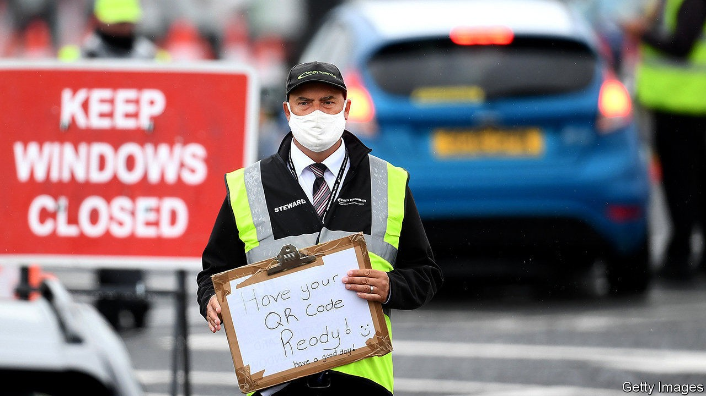

## Flunked

# Britain’s testing system seizes up just when it is needed most

> The government insists things will be back on track in a couple of weeks

> Sep 19th 2020

ON SEPTEMBER 14TH Toby’s seven-year-old son woke with a temperature—“not a huge one, but enough to keep him away from school.” As covid-19 guidance dictates, the finance worker went online to look for a test. Yet every type he asked for—at-home, drive-through or in a test centre—returned the same message: no tests available. Until a negative test result is obtained, the whole household has no choice but to isolate.

Toby’s situation is familiar to growing numbers of parents. The return of Britain’s schools has coincided with an inevitable outbreak of sniffles, as well as a less predictable rise in the number of covid cases—and the testing system has proved unable to cope. An enormous backlog of tests has built up. Even in the areas where the disease is most prevalent, people are struggling to get checked. The return of universities over the coming weeks will only add to the pressure.

Britain is now counting more than 3,000 covid cases a day, double the number it was two weeks ago. It is not just in schools that the lack of tests is proving difficult. A number of local authorities have set up testing for public-service workers, to avoid mass self-isolation. Hospitals warn they are suffering from staff shortages. One director of public health reports that he had to intervene to find a test for a 93-year-old and a five-year-old so they could go into hospital for treatment.

The government has been slow to fess up to what exactly has gone wrong. On September 15th Matt Hancock, the health secretary, said the problems lay in laboratories, rather than the centres where swabs are taken. Six enormous “Lighthouse” laboratories enabled a welcome surge in capacity in early summer. But at least one has struggled as students it employs return to university. With backlogs growing, the system as a whole has jammed up. The booking service makes it difficult to allocate what availability there is. “It’s clunky and assumes everyone can drive,” sighs the director of public health.

In the short-term, the government will have to prioritise access to testing. Mr Hancock has said those who need urgent medical care will be at the front of the queue, followed by social care, where he says the government is now sending 100,000 tests a day. The next step may be to prioritise people based on the severity of their symptoms or their vulnerability to the disease. All told, it is a very different situation to mid-July, when the health secretary urged people to get tested if they had “any doubt” about having the virus.

A new Lighthouse laboratory will soon open in Loughborough, providing 50,000 tests a day, which should help to ease the burden. The hope is both to increase the amount of automation in the system and to make use of a greater range of testing technologies. The government has, for instance, bought six endpoint PCR machines, which test only for the presence of the virus rather than its amount. Each can carry out 150,000 tests a day. The challenge now is to build the necessary infrastructure around these machines.

The government thinks current difficulties should not last longer than a couple of weeks. But that is a long time when case counts are rising. Toby’s wife eventually managed to buy a test privately. If all goes well, the family will soon be out of quarantine. Without a functioning state system, others will not be so lucky. ■

Editor’s note: Some of our covid-19 coverage is free for readers of The Economist Today, our daily [newsletter](https://www.economist.com/https://my.economist.com/user#newsletter). For more stories and our pandemic tracker, see our [hub](https://www.economist.com//news/2020/03/11/the-economists-coverage-of-the-coronavirus)

## URL

https://www.economist.com/britain/2020/09/19/britains-testing-system-seizes-up-just-when-it-is-needed-most
