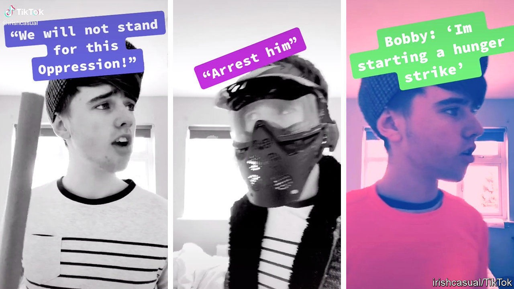

## Up(load) the RA

# The Troubles go from H-block to TikTok

> Why memes have replaced murals

> Sep 19th 2020

FEW BUSINESSES can be more certain of success than a paint shop in Belfast. Locals on both sides of Northern Ireland’s sectarian divide love the stuff. Two decades after the “Troubles”, a bloody conflict that ran from 1968-98, the colours of kerbstones and murals are still as useful to passers-by as any map: plenty of green in nationalist areas; lots of red, white and blue in unionist ones. The culture war, at least, goes on.

A new generation, though, has less need of brushes. The children of the ceasefire have TikTok, an app for sharing short videos. There, alongside films of cute puppies and dance moves, are youngsters honouring the Irish Republican Army (IRA), which led a bombing campaign for a united Ireland. One user, in camo and a balaclava, offers an “IRA outfit tutorial”. Another impersonates Bobby Sands, a republican prisoner who starved himself to death in 1981.

The videos mix TikTok staples like strobing lights and quickfire dance routines with tropes more familiar to previous generations of republican propagandists. Rebel songs provide the soundtrack. “There’s a strange mixture of the very local and the international language of TikTok,” says Duncan Morrow of Ulster University.

Some TikTokers are earnest republicans or loyalists. One, an 18-year-old from England who started posting clips during the covid-19 lockdown, proudly recalls her father’s deployment to the province with the British army. Others are Americans with little knowledge of the Troubles, who see similarities between the republican cause and the Black Lives Matter movement.

The fact that such videos find a keen audience hardly presages a return to violence. On the whole, young people in Northern Ireland are much less likely to hold sectarian attitudes than their parents. “These people are behaving like old people,” reckons Peter Shirlow of Liverpool University. “They’re out of step.”

Sometimes the clips are not even taken seriously by those who make them. Many are intended as entertainment, not propaganda, shot by history buffs who would never dream of toting an Armalite. “IrishCasual”, an 18-year-old from the Irish Republic, is at pains to point out that he has English friends. He distances himself from “extremists” who record videos in IRA clobber. His clips, he claims, are educational and fun: “It is TikTok, so you need to bring a bit of comedy.” Whenever he runs out of ideas, he falls back on a meme that will run and run. He will keep dancing, his videos boast, until there is a united Ireland.

## URL

https://www.economist.com/britain/2020/09/19/the-troubles-go-from-h-block-to-tiktok
