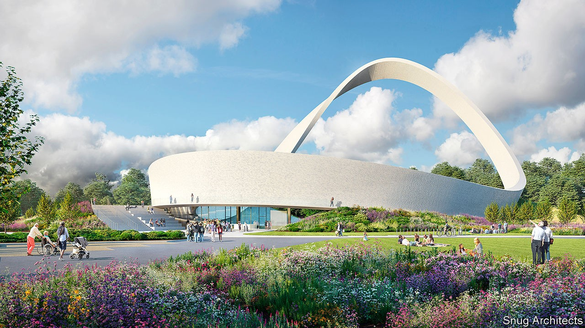

## For God’s sake

# What a huge religious monument reveals about Britain

> It will dwarf the Angel of the North, another big roadside sculpture

> Sep 19th 2020

IN ABOUT TWO years’ time, drivers on the M6 motorway will see something new. A giant 51m-high Möbius strip, illuminated at night, will rise just east of Birmingham, in the green belt. Known as the Eternal Wall of Answered Prayer, it is supposed to spark questions about faith—some of which will be answered in an attached visitor centre. Those who see it might ask another question. In a country that is fast becoming less religious and where building on green-belt land is extremely difficult, how did this happen?

“I’d put it down to prayer,” says Richard Gamble, a former Leicester City FC chaplain who has been planning the monument since 2004, when he received a vision while carrying a cross through Leicestershire. There are more earthly explanations, however. The fact that Mr Gamble has won support and permission for his project reveals something about British religion, planning and driving.

Since 1983 the proportion of people who identify as Christian has fallen from 66% to 38%. But the decline in religiosity is not quite even, says David Voas of University College London. Fervent Christianity has held up better than the lukewarm kind, because of the success of evangelical churches and immigration from more pious countries. Mr Gamble has been able to assemble a network of supporters and donors. Lord Edmiston, a successful car importer, Tory donor and evangelical Christian, provided the land.

The Eternal Wall’s huge scale perturbed planning officials, who delicately described its visual impact as “not localised”. Some locals argued that it should not be built on the green belt. But, as the officials understood, the purpose of the green belt is not to preserve greenery. It is to prevent houses from being built. By checking urban sprawl, England’s 16 green belts—which cover 12% of the country—have preserved land on which religious Möbius strips can be erected.

If road-safety inspectors had objected, the wall would have been nixed. As it happens, they have become keener on enormous monuments. Drivers become bored on motorways: traffic accidents are thought to be common in the early morning and mid-afternoon partly because the roads are so quiet. One way of keeping them alert is to build things to look at. These must be big, otherwise drivers will strain to spot them, becoming distracted. The Angel of the North, a sculpture near Gateshead, is an exemplar. But as the Eternal Wall’s backers point out, the angel, at a mere 20m high, is a stripling in comparison to the wall.

## URL

https://www.economist.com/britain/2020/09/19/what-a-huge-religious-monument-reveals-about-britain
