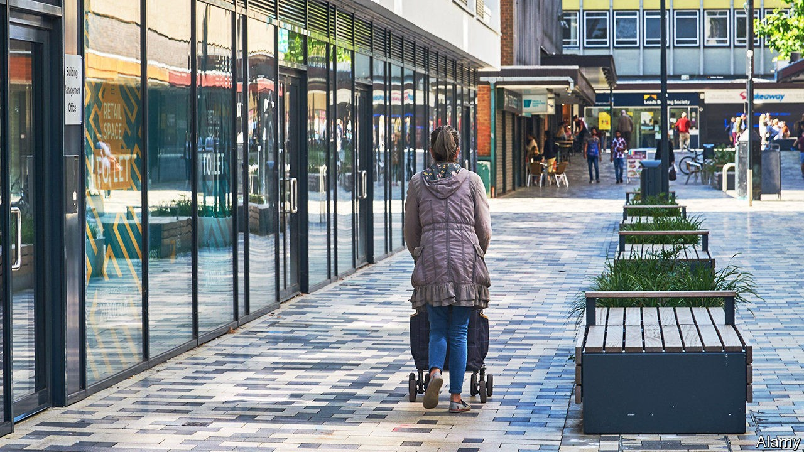

## Unusual employment

# Why poor Britons in prosperous places are suffering

> Wealthy commuters are fine. Their neighbours are not

> Sep 19th 2020STEVENAGE

MARIA MOVED to Britain from Poland a decade ago. She spent the first four years living in London before cheaper housing drew her to Stevenage, a drab but prosperous commuter town 30 miles north of the capital. Until March this year, she worked in a London sandwich shop, even though the train season-ticket swallowed around a third of her income. She was furloughed in April and recently found out her job would not be coming back. “I’m still getting paid until the end of September,” she says, “but who knows after that? I’ve applied for about 40 jobs so far”.

Economists in America have observed that poor people in prosperous areas have been hit especially hard by the covid-19 downturn. Data released by the Office for National Statistics (ONS) on September 15th suggests the same is true in Britain. The headline figures show a healthy labour market, with the unemployment rate in July just 4.1%, barely higher than in February. But as the government’s furlough scheme, which supported the jobs of more than 9m workers, is tapered back, cracks are beginning to appear.

Analysis of redundancy consultations by the Institute for Employment Studies, a research outfit, suggests that an additional 445,000 jobs will be lost between July and September. Advertised vacancies have bounced back from the record low they hit in April, but are still almost 50% below last year. Samuel Tombs of Pantheon Macroeconomics, a consultancy, fears the ONS is understating the rise in unemployment. Social distancing has disrupted the usual collection of survey data, forcing the ONS to rely more on telephone interviews. As a result, renters, who are less likely to answer the phone, are now being undercounted—and they are more likely than homeowners to have fallen out of work.

The early evidence suggests that unemployment is growing fastest far from the typical job-market black spots. Claims for universal credit, the main out-of-work benefit, rose by 57% between March and July in north-east England, but more than doubled in London and the south-east. In Stevenage, claims have increased by almost 140%. Staff at the town’s job centre can’t remember such a busy time. ONS job numbers show the biggest falls in the south-east. Thus it is areas that previously enjoyed the highest employment rates that are now seeing the steepest drops.

This reflects the pattern of the recession so far. Sectors such as physical retail and hospitality are the most likely to be harmed by social-distancing measures, and have suffered big drops in output. In normal times such sectors do well where people have more disposable income to spend. And the businesses they contain tend to run on thin margins, so even a small drop in revenue can push up unemployment.

The knock-on consequences of the rise in working from home, which has been bigger in London than in other British cities, are being felt across the capital’s enormous commuter belt. The 2,900 jobs being cut by Pret A Manger, a sandwich chain, and the 5,000 from Upper Crust, an operator of train-station food concessions, will be concentrated in the south-east. While the prosperous commuters who reside in places like Stevenage have mostly been shielded from the first wave of economic damage, the same is not true of their poorer neighbours. ■

## URL

https://www.economist.com/britain/2020/09/19/why-poor-britons-in-prosperous-places-are-suffering
