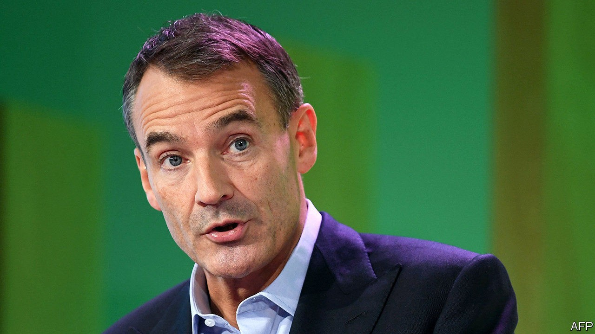
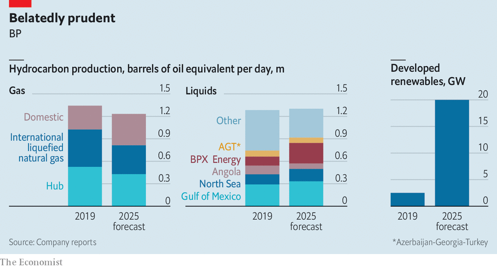

## A less oily BP

# How BP’s newish boss sees the future of fossil fuels

> Bernard Looney wants to revive the British oil major’s old slogan and move “Beyond Petroleum”. But not all at once

> Sep 19th 2020

ALL EYES of the oil world were on BP this week for the British energy giant’s annual three-day investor jamboree. Bernard Looney, who became chief executive this year, wants BP at last to make good on its old slogan, "Beyond Petroleum". Annual capital spending on oil, gas and refining projects will fall from around $13bn in 2019 to an average of $9bn in 2021-25. Gas and oil production will remain relatively steady in the short term, before falling as BP ramps up its investments in renewable power. BP’s plan is more ambitious than under Mr Looney’s predecessor, Bob Dudley. It is also by far the most aggressive of any supermajor. That is admittedly a low bar.

For more coverage of climate change, register for The Climate Issue, our fortnightly [newsletter](https://www.economist.com//theclimateissue/), or visit our [climate-change hub](https://www.economist.com//news/2020/04/24/the-economists-coverage-of-climate-change)

## URL

https://www.economist.com/business/2020/09/19/how-bps-newish-boss-sees-the-future-of-fossil-fuels
