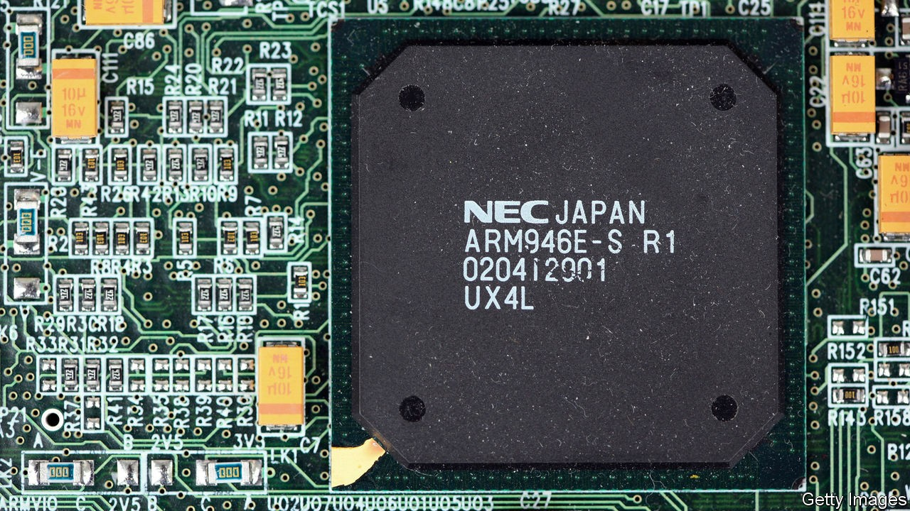
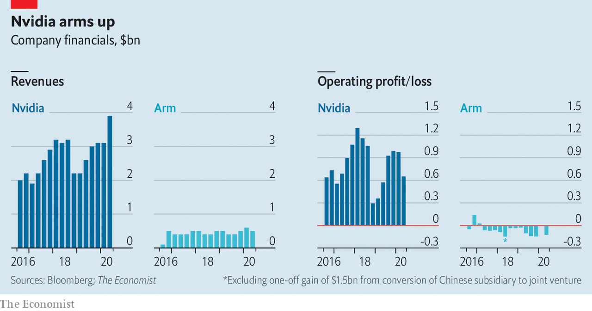

## Integrating circuits

# How Nvidia’s purchase of Arm could open new markets

> It could also be blocked by China

> Sep 19th 2020

WHEN SOFTBANK, a Japanese technology group, paid $32bn for Arm in 2016, it was the biggest deal in chipmaking history. That record held until September 13th, when Nvidia, a big American chipmaker, announced its intention to buy the Britain-based chip-designer for $40bn.

Although they share an industry, Arm and its prospective owner are very different. Nvidia makes GPUs: pricey, specialised accelerator chips for gamers and artificial-intelligence number-crunching in data centres. Arm licenses blueprints for general-purpose chips used in everything from smartphones to cars and computerised gizmos that make up the “Internet of Things” (IoT). Customers ship more than 20bn Arm-designed chips every year.

Arm’s keystone position was SoftBank’s rationale for buying the firm. But it has languished under Japanese ownership. Revenues have stagnated, and the firm has made a small but persistent loss (see chart). Geoff Blaber at CCS Insight, a firm of analysts, blames a slowdown in the smartphone market, and low margins on IoT gear. Arm’s $40bn valuation is only 25% higher than when SoftBank bought it—and just 5% higher if you deduct the $1.5bn Nvidia has offered Arm employees to stop them from leaving and a mysterious $5bn cash or stock payout that SoftBank may qualify for under some conditions. Meanwhile, Nvidia’s market capitalisation, four years ago not much bigger than what SoftBank paid for Arm, now stands at $309bn. Its sales have surged.

One motive for Nvidia’s purchase is a desire to expand beyond its existing markets. Arm’s technology could help it build its own versions of the general-purpose processors that power the data-centre computers into which Nvidia’s accelerators are installed, a lucrative market dominated by Intel, the world’s biggest chipmaker by revenue. Nvidia, for its part, hopes that baking its GPU expertise into Arm’s designs will make them more attractive to the firm’s customers.

Those customers, which include Apple, Qualcomm and Samsung, have kept a stony silence. Arm’s business model relies on being what Hermann Hauser, one of its founders, has described as “the Switzerland of the semiconductor industry”—ie, not competing with its customers by selling chips or gadgets itself. Nvidia’s purchase will threaten that neutrality if it tweaks Arm’s products to favour its own goals, or gives itself preferential access to Arm designs.

Nvidia has vowed to keep Arm’s business model intact. Having given such public assurances, says Patrick Moorhead, a chip-industry analyst, Jensen Huang, Nvidia’s boss, is unlikely to risk the opprobrium—or possible lawsuits from aggrieved licensees—that could arise from breaking them. But other analysts point out that Arm’s licensing revenues are, by Nvidia’s standards, small beer. If the Arm deal can be used to vault Nvidia into new markets, then cold commercial logic may encourage Mr Huang to push his luck. Custodians of RISC-V, a set of freely available designs, lost no time in noting that it remains independent and free of such conflicts.

Regulatory problems loom, too. Britain’s government is in an interventionist mood and is likely to attach strings, such as keeping Arm’s headquarters in the country. China may also object. It is already upset over American attempts to strangle its technology firms (see [article](https://www.economist.com//business/2020/09/16/who-are-the-tiktok-sagas-biggest-winners)). A takeover by Nvidia would bring Arm—a crucial supplier—firmly under American control. Even in normal times, says Mr Blaber, China might balk at such a prospect. It will be even less keen in the middle of a technological cold war. ■

## URL

https://www.economist.com/business/2020/09/19/how-nvidias-purchase-of-arm-could-open-new-markets
