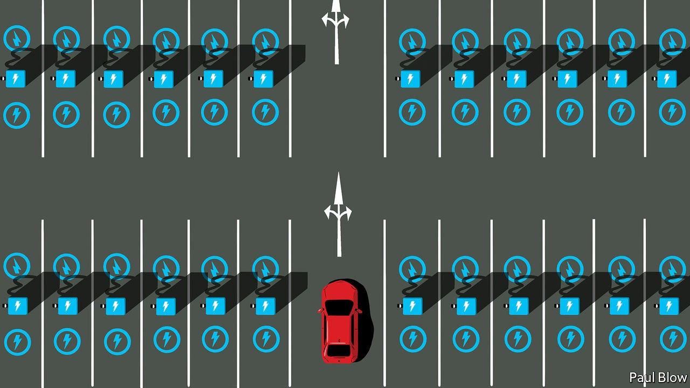
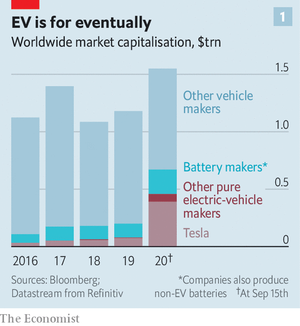
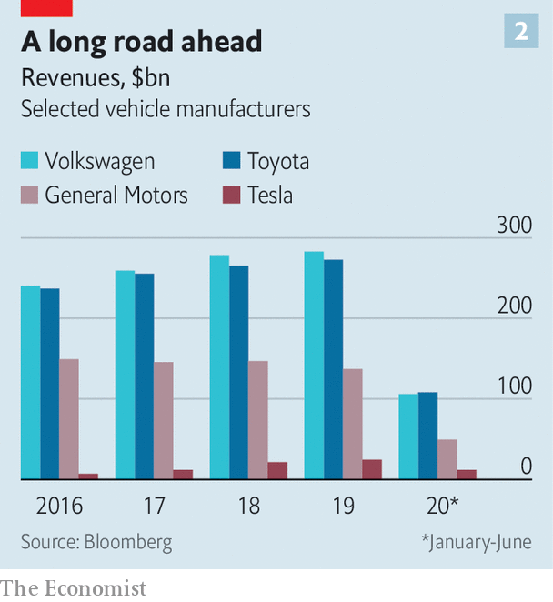

## Electric cars

# Who will rule the Teslaverse?

> The race to make the car of the future is hotting up

> Sep 17th 2020

A RECENT VIDEO of Elon Musk taking a spin in a new all-electric Volkswagen with Herbert Diess, the German carmaker’s boss, set tongues wagging. VW was forced to deny that a deal with Tesla was in the offing. A deeper bromance between Mr Musk’s firm and his main rival in the market for electric vehicles (EVs) looks unlikely. But the meeting highlights how the car industry is at last taking the impending EV revolution seriously.

Giant new businesses are gearing up to support the switch from petrol to electricity. Besides changing the way cars are propelled, this requires batteries, software to ensure these work in harmony with motors, and data harvested from cars that may one day allow them to drive themselves. Over 250 firms are manufacturing electric motors. Forty-seven battery factories are under construction. Anjan Kumar of Frost & Sullivan, a consultancy, expects total new EV-battery capacity to go from 88 gigawatt-hours in 2019, enough to power Texas for less than two hours if plugged into the grid, to 1,400 gigawatt-hours in 2025. Established carmakers are pondering how to loosen the grip of big tech on software.

The total market capitalisation of listed makers of exclusively electric cars now exceeds $400bn. Add producers of batteries that go into them, and the EV-industrial complex, which makes fewer than 400,000 vehicles annually, is worth at least $670bn (not counting miners of lithium and other battery minerals). That is nearly three-fifths as much as traditional carmakers, which churn out 86m cars a year, nearly all of them petrol-powered (see chart 1). Call it the Teslaverse.

As that moniker suggests, Mr Musk’s firm sits at its centre. In July it overtook Toyota as the world’s most valuable carmaker, and kept accelerating—never mind that it made 370,000 cars against Toyota’s 10m and a fraction of the Japanese firm’s revenues (see chart 2). By August Tesla was worth over $450bn. A market correction lopped a third off its share price but it has since rebounded. What would it mean to take it seriously, as investors appear to be?

Car sales could fall by 25% in 2020 owing to pandemic disruption. But the share of EVs on the road will continue to grow as emissions regulations tighten, the price of batteries falls and the choice of models expands. Next year three in every 100 cars sold will be pure electric or a plug-in hybrid. The share may rise to 20-25% by 2030, equal to 20m new EVs a year.

At the moment Tesla is the “apex predator”, says Adam Jonas of Morgan Stanley, a bank. It has been manufacturing EVs at scale longer than any other carmaker and sells more of them. Its elevated share price translates into the lowest cost of capital in the business. A growing offering, with a lorry and pickup soon to hit the road, will widen its appeal. It attracts the best engineers and possesses in Mr Musk, love him or loathe him, a leader with messianic zeal.

Mr Kumar puts Tesla two to three years ahead of rivals in battery technology. Its batteries have a higher energy density, which means better range and lower costs. On September 22nd Mr Musk is expected to present plans for new production capacity and fresh battery technology. Together, this would extend Tesla’s cost advantage.

The firm’s edge is even more pronounced in software. Rainer Mehl of Capgemini, a consultancy, calls Tesla cars a “shell around the software and applications inside”. Thanks to vertically integrated manufacturing, systems have been interlinked from day one. As Olaf Sakkers of Maniv Mobility, an Israeli fund, explains, big carmakers have outsourced almost all their technology apart from internal-combustion engines to suppliers, and focused on assembly and marketing. This makes for a “bird’s nest of complexity”, says Mr Sakkers. Tesla’s software and mechanics are seamless by comparison.

All this software means Teslas improve with age, thanks to regular “over-the-air” updates with new features, bug fixes and even performance upgrades. This makes up for a sometimes shabby finish and questionable reliability. Other big carmakers are five years behind, says Luke Gear of IDTechEX, a consulting firm.

Tesla also seems to have mostly put what Mr Musk has called “production hell” behind it. As Philippe Houchois of Jefferies, an investment bank, notes, a reputation for delivering models late and over budget has become one for being ahead of time and on budget. A rapidly built new factory in Shanghai began shipping in December and “gigafactories” are under construction in Berlin and Texas that will boost capacity from 700,000 units to 1.3m in 18 months, says Credit Suisse, a bank. Tesla cheerleaders talk of 3m-5m new Teslas annually by 2025, out of a global total of around 85m cars. Mr Musk eventually wants to make 20m a year.

Mr Jonas says that Tesla’s current share price implies it will end up with 30-50% of the car market. This overlooks other sources of revenue: from selling batteries, its operating system or an EV “skateboard” of battery pack and running gear to which others can add a body (and in time more futuristic data and self-driving systems). Even the most wildly optimistic scenarios for Mr Musk’s company, then, leave room in the Teslaverse for others.

Start with the established carmakers. Their lowly valuations may be read as implying they ought to give up trying to make the transition to EVs and quietly fade away. But even firms with the heftiest petrol-driven legacies should not be written off. Chinese carmakers show why. The government prodded them to go electric with tough mandates in the hope of dominating the future market. Around half the world’s EVs are currently sold in China. The likes of Geely and BYD (which also makes batteries) want to expand overseas.

There, big Western carmakers face a slog. Though some suppliers, such as Aptiv, have spun off legacy operations to concentrate on EVs and self-driving technology, most remain bound to the internal combustion engine. And lots of car firms, in particular the German premium ones, must contend with powerful unions fearful of job losses resulting from the move to EVs’ less complex—and thus less labour-intensive—mechanics.

Despite the difficulties, the industry is desperate to make the EV side work. Mr Kumar estimates that 60% of big car firms’ research-and-development spending now goes on EVs, up from 5-10% in 2012. Morgan Stanley reckons big carmakers will invest up to $500bn in EVs over the next five years. According to Bernstein, a research firm, they have been “terrible deployers of capital” but they are “waking up”. Potential big sellers on sale this year include VW’s ID.3 and Ford’s Mustang Mach-E.

VW is leading the charge. It will spend €60bn ($71bn) by 2025 on EVs and digitisation. Carmakers typically develop 2-5% of software in-house. In an effort to reinvent itself as a software company, VW wants to boost its share to 60% by 2025. Other carmakers and suppliers harbour similar ambitions. Daimler’s recent tie-up with Nvidia, a giant chipmaker, should allow remote updates by 2024. Aptiv already offers integrated software.

Big firms could create distinct units to lure outside capital and talent, and take risks, suggests Morgan Stanley’s Mr Jonas. Some already are. General Motors (GM) has the Cruise self-driving arm, BMW has iVentures and Toyota has its Mobility Foundation. Another tactic is to invest in startups. On September 8th GM said it would buy an 11% stake in Nikola, a controversial electric-lorry firm, for $2bn (see [article](https://www.economist.com//business/2020/09/17/can-nikola-become-the-next-tesla)). Ford has backed Rivian, which hopes to crack the lucrative pickup market.

The likes of Nikola and Rivian are examples of another part of the Teslaverse. Although they face some big barriers, notably in manufacturing and distribution, raising money is not one of them. Capital is pouring in, helping cars move off the drawing board and into production. Chinese Tesla copycats have sprung up. In America Lucid Motors unveiled its first car at its headquarters near San Francisco on September 9th, with a Tesla-beating 800km range. One of its biggest backers is Saudi Arabia’s sovereign-wealth fund. Lordstown, Fisker and Canoo are aiming to follow Nikola, which went public in June through a reverse merger and is now worth $13bn. Firms working on next-generation solid-state battery technology, such as QuantumScape, backed by vw and Bill Gates, plan to go public soon.

Several Chinese Tesla wannabes, such as Nio, Xpeng and Li Auto, are already listed in New York. They enjoy the benefit of cheap domestic labour, a huge local market and proximity of battery-makers such as BYD and CATL, the world’s biggest such firm. Nio, which teetered on the brink of collapse in February before a bail-out by the city government of Hefei, where it has a big factory, is now valued at around $24bn.

Carmaking remains a tough business to crack. Assembling bodywork or brakes at scale is different to making gadgets or writing code. Dyson, a British maker of high-tech vacuum cleaners and hand-driers, sunk £500m ($640m) into developing an EV before scrapping the idea. Apple abandoned plans to make a car in 2016, though it is still investing in self-driving systems. Other tech giants are opting instead to invest in startups. In China Baidu, Tencent and Alibaba have backed WM Motor, Nio and Xpeng, respectively. Amazon has put money into Rivian and ordered 100,000 of its electric lorries (in part to show it is serious about reducing its carbon footprint).

To survive in the Teslaverse, companies have to demonstrate they have valuable intellectual property that sets them apart, as many of the upstarts claim. But they must also prove they can sell and maintain their cars, where legacy carmakers have a long track-record. It is too early to divine the winners and losers. Even Mr Musk’s firm could falter. But his vision of an electric future is already emerging victorious.■

## URL

https://www.economist.com/business/2020/09/17/who-will-rule-the-teslaverse
