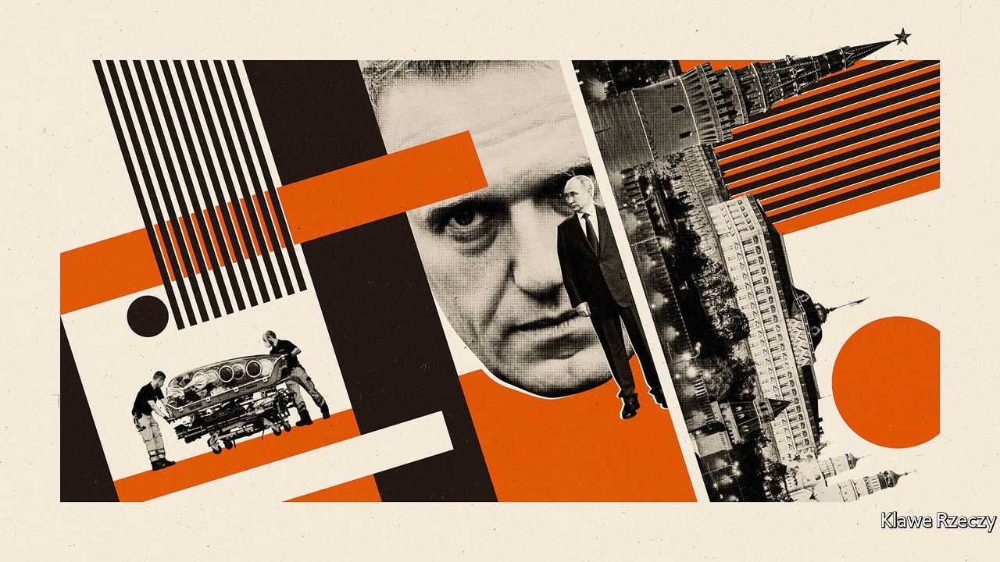

## Winning from death’s door

# Alexei Navalny, Russia’s poisoned opposition leader, has a Siberian success

> President Vladimir Putin takes a knock in local elections

> Sep 19th 2020

LAST MONTH Alexei Navalny, Russia’s main opposition leader, stood in the middle of Novosibirsk, the capital of Siberia and the country’s third-biggest city, explaining how to liberate it from occupation by crooks and thieves. For thus has he famously dubbed the United Russia party. The party is the country’s largest, and the vehicle through which President Vladimir Putin exercises legislative control. “The basis of Putin’s power is not the State Duma as is commonly believed,” said Mr Navalny. “The main strength lies in the fact that the Kremlin’s United Russia has a majority in every legislative assembly in every region and in every major city’s council.”

All these councillors, mayors and governors keep Mr Putin in power and in return are allowed to extract money from the people who live in their territory through a web of corruption that enwraps the entire country, Mr Navalny argues. “If United Russia loses this majority, the power of these villains will instantly melt away,” he explained in a sleek video aimed at mobilising voters in local elections across around a third of Russia on September 13th. “They have always defeated us. Twenty years in a row. But we need to rise and go into battle again,” he said.

By the time his video was posted on YouTube at the end of August, quickly gaining millions of views, Mr Navalny was in intensive care in Berlin, poisoned by a nerve agent. His team carried on working undeterred and, on September 13th, two of Mr Navalny’s closest allies, who head branches of his organisation in Novosibirsk and Tomsk, were elected to their respective city councils. Unlike United Russia candidates, who often tried to conceal their party affiliation, Mr Navalny’s candidates made no secret of being members of his team, and ran not on local issues but on a clear anti-Kremlin message.

Their victories hardly break United Russia’s grip on power. Its candidates won the gubernatorial elections in all 18 of the regions that held them, and retained control of the vast majority of local legislatures too. But the victories of Mr Navalny’s two main candidates in Siberia, which contributed to United Russia losing its majorities on those two councils, set a precedent for the elections to the Duma, Russia’s parliament, next year. They showed that Mr Navalny’s appeal extends well beyond Moscow and that the grip of the pro-Kremlin parties can sometimes be overcome.

They also demonstrate that Mr Navalny’s organisation has become a formidable political force, even though he was not allowed to run in the election and his party does not officially exist. To overcome these obstacles, Mr Navalny has come up with the idea of “smart voting”, where his team identifies the candidate most likely to beat United Russia. In the election on September 13th this deprived United Russia of about a tenth of its seats, despite unprecedented levels of pressure and dodgy tricks. Public-sector workers, who are dependent on the state, were ordered to vote, for instance, and the procedure was stretched out over three days, which made the task of controlling the outcome easier.

The Kremlin’s ability to manipulate elections and maintain control depends on low voter turnout. It reduces the number of people authorities need to mobilise and makes rigging simpler. In Novosibirsk, a city of 1.6m people, the turnout was indeed well below 20%. “People don’t believe that they can change anything and don’t bother to vote,” admits Sergei Boiko, the head of Mr Navalny’s organisation in Novosibirsk, who managed to form a coalition of opposition candidates as well as to get elected to the city council himself.

Ever since Mr Putin came to power 20 years ago, the Kremlin has cultivated cynicism and a sense of helplessness in Russia’s people. In 2006 it abolished an option on ballot papers for voters to reject all candidates, thus preventing protest voting. Unsurprisingly, those who opposed the Kremlin simply did not turn up to vote at all. “People need to see a success story, to start believing they can change things,” says Alexei Mazur, a democracy activist in Novosibirsk.

Yet as Leonid Volkov, Mr Navalny’s chief of staff, explains, a low turnout is a two-edged sword. It only takes a few thousand inspired and motivated voters to change the outcome. Nonetheless, if this election is anything to go by, however unpopular United Russia may be, mobilising people to vote against it is a mammoth task.

This is why Mr Navalny has directed all his energy and charisma into trying to project a sense of hope—and why he was poisoned. His biggest victory has been to survive that assassination attempt. On September 15th he published his first Instagram post since coming out of a coma. It shows him sitting in bed smiling, surrounded by his happy family. “Hi, this is Navalny,” the post read. “I have been missing you…Yesterday I managed to breathe on my own for the entire day…not even a valve in my throat. I liked it very much. It’s a remarkable process that is underestimated by many. Strongly recommended,” he wrote, pledging to return to Russia as soon as possible. Within a few hours his post had gathered more than a million “likes”. All he needs to do now is find a way of turning those “likes” into votes. ■

## URL

https://www.economist.com/europe/2020/09/19/alexei-navalny-russias-poisoned-opposition-leader-has-a-siberian-success
