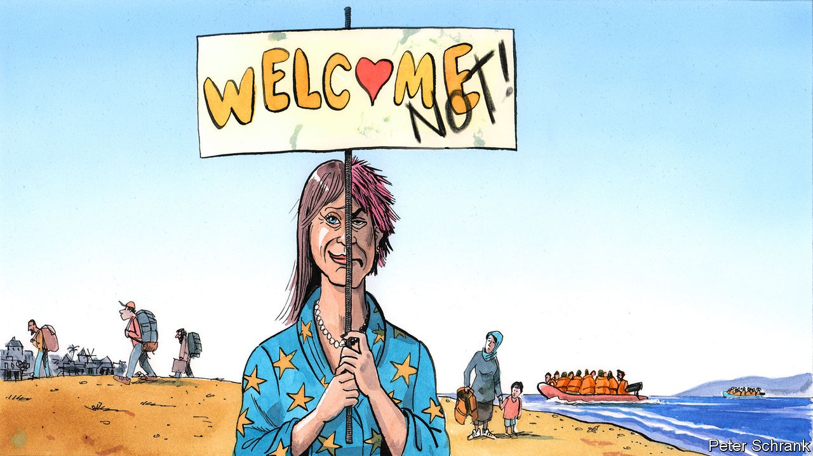

## Charlemagne

# Europe’s asylum compromise

> Let the humanitarians sound humane and the hardliners sound hard

> Sep 19th 2020

IT TAKES A lot of misery to jolt European politicians into action on migration. Only when bodies started piling up on Lampedusa, an Italian island near Tunisia, did European leaders in 2013 first properly acknowledge the refugee crisis at its border. At its peak in 2015, when 1m people entered the EU, only the very worst stories cut through. In one incident, 71 people—including four children—suffocated inside a meat lorry. Their bodies were discovered beside an Austrian motorway when a policeman noticed their liquefied remains seeping out. Compared with those horrors, the long-running misery of Moria, an overcrowded, squalid refugee camp on the Greek island of Lesbos was a side-story.

Until it burnt down on September 9th. Moria and other camps like it dotted across Greece were supposed to be the fulcrum of the EU’s asylum policy. For hosting them, Greece had received €2bn of EU funding. Yet in mid-September the fire left 13,000 people—including about 4,000 children—searching for shelter. Moria has provided a deeply inauspicious backdrop for the European Commission’s latest efforts to tackle the issue. It is due to unveil a “migration pact” on September 23rd, with a host of policies designed to overhaul the bloc’s asylum and migration rules.

Brussels has a thankless task ahead of it. Migration sits at an unhappy apex of complexity and controversy. Leaders are united only by paranoia. “Every single government can go down because of this,” says one EU ambassador. Populists have long made hay of the topic. On the other side of things, green and leftist parties hammer their mainstream rivals when they become too stern. Old divisions have already emerged from Moria’s ashes. Germany, the de facto head of the EU’s humanitarians, swiftly promised to take in 2,750 asylum-seekers from Greek camps. Austria, the leader of the anti-migration hardliners, insisted it would take none.

Coming up with a compromise between the humanitarians, the hardliners and the front-line states, such as Greece, is the commission’s job. As part of the package, the front-line states must be stricter in registering arrivals. Despite rules to the contrary, asylum-seekers and migrants who arrive in, say, Italy have a habit of ending up in the EU’s north. Under the proposals, an initial sift will see arrivals sorted into categories, with those likely to receive asylum put on one track, whereas those from relatively safe countries will be diverted for rapid deportation. After that, rather than stay in the first port of call, refugees will be distributed across the EU.

The hitch with this plan is that countries such as Hungary have refused point-blank to accept any such scheme. Forced compassion is a recipe for misery. Arrivals do not want to go to Hungary; Hungarians do not want them to come. Wealthy western European countries which have six decades of (often chequered) experience of immigration are tone-deaf when they lecture eastern European voters. Forcing countries with little history of immigration to get used to it in a few years rather than decades is clumsy and unreasonable and will win few converts. The EU is, however, a commons in which freeloaders should not be accepted. The commission is trying to come up with other ways to share out the burden.

One idea being considered by EU officials is for hardline countries to take the lead in removing people without the right to asylum. Deportation—“returns” in the euphemistic jargon—is difficult. It is expensive, legally complicated and requires strong diplomacy. Taking responsibility for deportations would be a serious job. At the moment, only 40% of failed asylum-seekers are actually sent back. Without an effective system of deportation, a dangerous trip to the EU becomes a calculated risk, even for someone from a country such as Nigeria or Senegal, whose citizens’ asylum applications are rejected 90% of the time.

Leaving the hardliners as Europe’s bouncers, in the phrase of one migration wonk, would partially solve the solidarity issue. But it would scar the EU’s self-image as a beacon of liberal values. Brutal as it may seem, the EU can either have an asylum system that lives up to humanitarian ideals but fails in practice, or it can have a system that actually works. Some European countries are happy to be humanitarian; others are happy to be hard-headed. A successful Europe-wide migration strategy would make use of both.

Even this approach may flounder. The last crisis still poisons the debate, even though things are different now. Between 2015 and 2016, 1.4m jumped the border. Now only around 140,000 people arrive every year in an “irregular” manner. Calmer heads should prevail. After all, most migration is legal and well organised, points out Ylva Johansson, the commissioner for home affairs, who oversees the reforms. About 2.5m people move to the EU each year, while 1m leave—just the ticket for an ageing bloc fond of welfare spending. “De-dramatising” the situation is the commission’s main aim, says Ms Johansson. But when it comes to refugees, EU leaders swiftly become drama queens.

Fights over money or industrial policy are comparatively simple to settle. Cash can be shuffled around on a spreadsheet. Regulatory leeway for cherished industries can be haggled over. No such easy fixes exist when it comes to migration. Taking in refugees is a decades-long commitment, which requires political consent. Integration is difficult to do well, even when a government is willing, never mind if people are being foisted upon their hosts.

If a deal is not possible in a time of relative calm, then waiting for a crisis becomes the only option. Although it was a hoary old solution to European deadlock, a similar approach on economic matters worked this summer. EU leaders took a political leap of faith by issuing mutual debt for the first time. The trouble is that the EU had to suffer its worst-ever economic slump to get there. A big enough crisis may do something similar when it comes to asylum, creating the political space for compromise. But a breakthrough will come only at an unconscionably high price. ■

## URL

https://www.economist.com/europe/2020/09/19/europes-asylum-compromise
