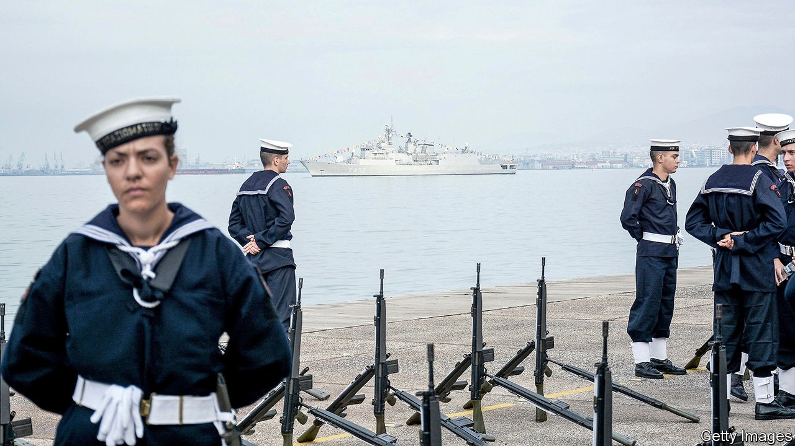

## Anchors awry

# Greece’s navy is in need of a refit

> Turkey has more and newer ships

> Sep 19th 2020ATHENS

“WE GAVE THE Turks a lesson in seamanship,” boasts Andreas Stefanopoulos, a reservist in Greece’s navy. The jingoistic mood that swept Athens after a collision in the eastern Mediterranean on August 12th, in which a newish Turkish frigate suffered visible damage while a 40-year-old Greek one was apparently unharmed, is yet to fade. Morale in the armed forces is “the highest I’ve ever seen”, a former Greek defence minister declares. “The navy and air force are both raring to take on the Turks.”

Greece has pockets of naval excellence. Its German-designed submarines are “almost undetectable by Turkish sonar”, says Emmanuel Karagiannis of King’s College London, and its nippy corvettes are armed with French Exocet missiles of the sort that wounded the Royal Navy in the Falklands war. Greece’s navy would have “considerable firepower” in the confines of the Aegean, says Mr Karagiannis. But it “lacks the means to project power in the deep waters of the eastern Mediterranean,” he warns.

Between 1970 and 2020 Greece commissioned 30 attack submarines, frigates and corvettes that are still operational, to Turkey’s 38, according to figures collected by the International Institute for Strategic Studies (IISS), a think-tank in London. The Greek fleet is also ageing, whereas Turkey is churning out modern warships. Cash-strapped Greece has largely given up on buying high-end French frigates or destroyers, opting for smaller and cheaper British corvettes instead.

Greece is especially concerned about the security of Kastellorizo, a small island far from the Greek mainland and just a mile off the Turkish coast. It lies at the heart of the current crisis. Though Turkey does not formally lay claim to the island, it objects to the idea that such a paltry territory should have its own exclusive economic zone, and complains that Greece has violated agreements on the demilitarisation of this and other islands.

Kastellorizo, which Greece’s president visited on September 13th, is not easy to defend. Turkey’s procurement of a helicopter-carrier will also bolster its ability to mount amphibious operations, including the seizure of islands, says Hugo Decis of the IISS.

Mindful of this vulnerability, Greece’s top general has warned that any local conflict would swiftly lead to a full-scale war. A Greek riposte, says Mr Karagiannis, would probably come on more favourable ground, such as the Evros river region that marks the land border between the two countries. But Greek tanks are in bad shape and the border is heavily mined. It is “not really a feasible proposition these days”, says a Western military attaché.

Greece is scrambling to redress the gap. In August the finance minister promised to boost defence spending, which fell precipitously after the financial crisis. Greece spends less than $5bn on defence each year, a third of what Turkey spends. On September 12th its prime minsiter, Kyriakos Mitsotakis, announced plans to buy 18 French Rafale fighter jets, most of them “slightly used”, plus four helicopters and advanced weapons to go with them. He also promised to buy four new frigates and to refurbish old ones. But the first planes will not turn up until next year, and the ships probably later still. Greece will be outgunned for a while yet. ■

## URL

https://www.economist.com/europe/2020/09/19/greeces-navy-is-in-need-of-a-refit
