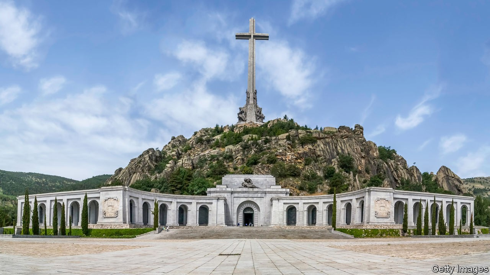

## A law to fight Franco

# The Spanish government proposes a new law on history

> It seeks to dig up the past

> Sep 19th 2020MADRID

WHEN DEMOCRACY came to Spain in the late 1970s, it arrived through agreements between moderate supporters of the long dictatorship of Francisco Franco, the victor in the Spanish civil war, and a realistic democratic opposition. At their heart was an amnesty law and a broad understanding not to use the past as a political weapon—arrangements often misleadingly dubbed a “pact of forgetting”. This largely seamless transition was widely hailed as a success. But younger generations, mainly on the left, now worry that Spain never acknowledged the crimes of its past.

A first attempt to redress this came with a law of “historical memory” in 2007, which aimed to remove fascist symbols from public buildings and recognise the mistreatment of Franco’s victims, but was only partly implemented. Now the minority left-wing coalition government of Pedro Sánchez has unveiled a draft law of “democratic memory” that would go further. 

The draft is a mixed bag. Many welcome a plan to recover the remains of victims of the civil war and the repression that followed its end. The government hopes to find up to 25,000 skeletons in five years or so. The law would also annul the verdicts of Franco’s summary trials and withdraw titles and medals awarded by the dictatorship. The Valley of the Fallen, the grandiose basilica from which Franco’s remains were removed by the government last year, will be redesignated as a civilian cemetery (rather than a church) and run by the state (rather than the Benedictine monks on whom Franco bestowed it).

More questionable are powers to shut down groups that “exalt” or “apologise for” the dictatorship, such as the Francisco Franco Foundation, a private archive for nostalgics run from an obscure Madrid flat. The foundation says this is an “attack on freedom of thought” and threatens to move to the United States. The law would also require schools to incorporate “democratic memory” into the history curriculum. Whether that will lead to good history or official propaganda is unclear.

Most troubling is that the bill sets up a special prosecutor to investigate human-rights abuses from 1936 to 1978. This is largely futile, since most perpetrators are dead. It also comes close to overturning the amnesty law, out of a conviction that justice and truth should retroactively outweigh peace and reconciliation. 

The conservative opposition claims the bill is a smokescreen to hide government mismanagement of the pandemic. It objects, too, to the likelihood that it will be approved with the parliamentary votes of Basque and Catalan separatists, who reject the current constitution. 

The bill’s defenders contrast Spain’s tolerance of Franco with Germany and Italy. But Spain’s history is different. If the government really wants to resolve unfinished business from the past, it should have tried to agree on the bill with the opposition. For all its virtues, the bill uses the past as a political weapon. And that is bad for Spanish democracy.

## URL

https://www.economist.com/europe/2020/09/19/the-spanish-government-proposes-a-new-law-on-history
