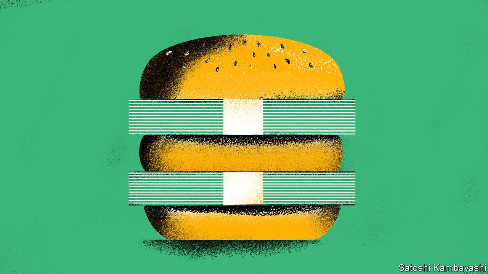

## Buttonwood

# Can you make money from the Big Mac index?

> Arbitrageurs have long sought to exploit the idea of purchasing-power parity

> Sep 19th 2020

THIS WEEK Hong Kong’s monetary officials stepped into the foreign-exchange markets after dusk to defend the city’s long-standing peg to the dollar. Given everything the financial hub has faced in recent months—protests, a pandemic and punitive American sanctions—you might assume it is battling to prop its currency up. You would be wrong. The city’s monetary authority has been forced to sell Hong Kong dollars repeatedly since April to stop the currency strengthening too much.

This resilience must be a little uncomfortable for prominent speculators, like Kyle Bass of Hayman Capital Management, a hedge fund, who have predicted a catastrophic devaluation. But it will be no surprise to followers of our Big Mac index. The tongue-in-cheek guide to the fair value of currencies showed that the Hong Kong dollar was undervalued by almost 54% in July. That suggests no urgent need for it to fall.

The Big Mac index is a simple illustration of purchasing-power parity (PPP), the notion that the fair value of a currency should reflect its power to buy goods and services. It took HK$20.50 to buy a Big Mac in Hong Kong in July and $5.71 to buy one in America. The exchange rate that would equalise their burger-buying power was therefore HK$3.59 to the dollar. That is substantially stronger than the actual exchange rate of HK$7.75.

What practical guidance, then, can the Big Mac index offer to currency speculators? Economists reckon that modest deviations from fair value halve every one to three years or so. Suppose that an investor had bought the most undervalued currency in our index, which we publish each January and July, and then sold it two years later. How would they have fared?

Not well, is the short answer. Imagine that our hypothetical punter invested $10 each time. Of the past 15 completed bets, ten would have lost money (ignoring interest and inflation). The investor would have bought the Indian rupee in January 2013 only to see it fall by 13% against the dollar over the next two years. Ukraine’s hryvnia was the most undervalued currency in July 2014, after which it proceeded to halve in value. For a total outlay of $150, our punter would have ended up with less than $138 (although they could have made another $20 or so in interest on their currency deposits, over and above the cost of borrowing in dollars).

Although not great for an investor’s wealth, these results are not quite as damaging to the idea of PPP as they first appear. Deviations from PPP can narrow in two ways: through fluctuations in the exchange rate or via movements in prices. In India, for example, the price of a Maharaja Mac (which McDonald’s serves in place of a beefy Big Mac) rose much faster than that of an American Big Mac from January 2013 to January 2015. That rise in price more than made up for the fall in the rupee, leaving India less undervalued. The same is true in four of the other nine losing currency bets.

Believers in PPP also accept that rich countries tend to be more expensive than poor ones, because their wages are higher even in parts of the economy that are not terribly productive. So The Economist also calculates an adjusted Big Mac index, which shows whether a burger is cheaper or dearer than you would expect given a country’s level of GDP per person.

Is this adjusted index a better guide to currency speculators? A similar strategy of buying the cheapest currency in the index and selling it two years later would have paid off on 12 out of 15 occasions since July 2011. In all but one case (buying Russia’s rouble in January 2016), though, gains would have been small. That is because the most undervalued economy in this version of the index is, more often than not, Hong Kong. And despite hedge-fund histrionics, betting on its currency against the dollar typically poses little risk—and offers little reward.

This Big Mac back-test is mostly a bit of fun. But the results are broadly in line with more sophisticated research. In 2011 Gianfranco Forte of the University of Milano-Bicocca, Jacopo Mattei of the University of Ferrara and Edmondo Tudini of Bocconi University showed that simple PPP-based trading strategies yielded respectable, if unspectacular, returns (although their test did not include currencies as edgy as the hryvnia). “Few empirically literate economists take PPP seriously as a short-term proposition,” Ken Rogoff of Harvard University once pointed out, but most believe it has some anchoring power over the long run. It gives investors something to chew on. But it’s not fast food.

## URL

https://www.economist.com/finance-and-economics/2020/09/19/can-you-make-money-from-the-big-mac-index
