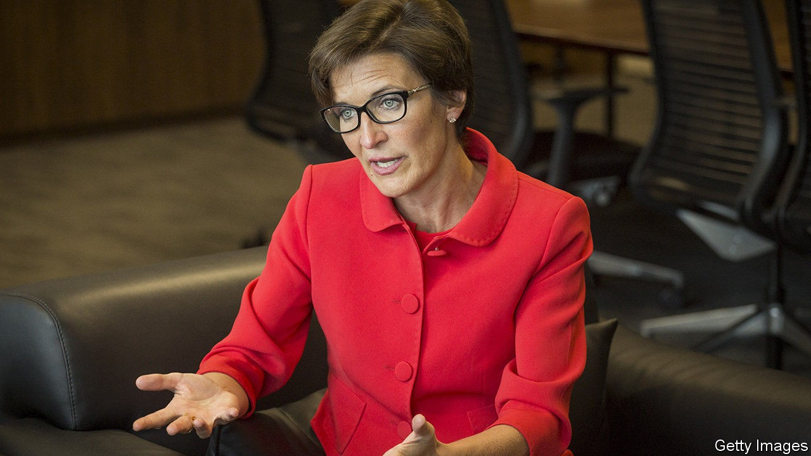
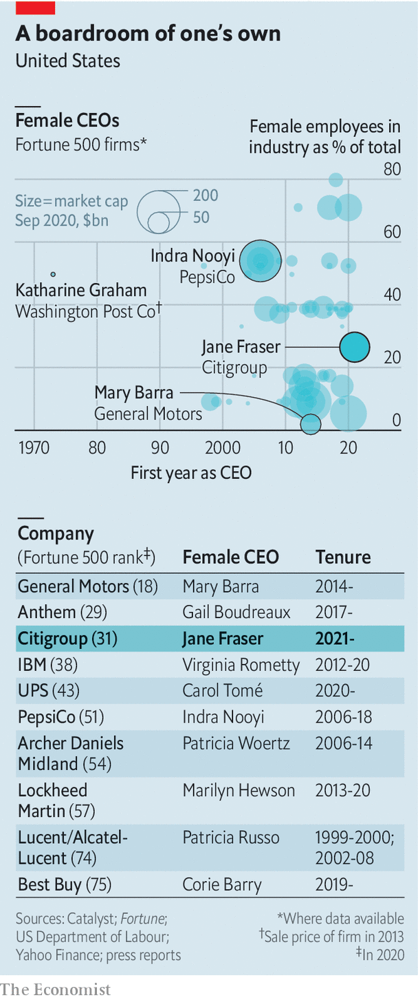

## Women on Wall Street

# How many of America’s top companies have a female CEO?

> Jane Fraser, Citigroup’s next boss, joins an elite group

> Sep 19th 2020

ON SEPTEMBER 10TH it was announced that Jane Fraser would succeed Michael Corbat as chief executive of Citigroup, a bank, in February 2021. Ms Fraser will be the first woman at the helm of a top-ten American lender. She joins an elite group: just 37 of the Fortune 500 companies are headed by women. Things have at least got better. When Ms Fraser began her first banking job in 1988, only three big American firms were run by women.

## URL

https://www.economist.com/finance-and-economics/2020/09/19/how-many-of-americas-top-companies-have-a-female-ceo
