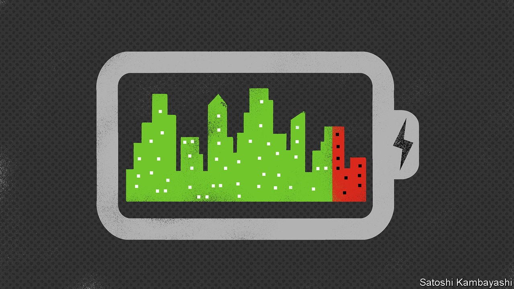
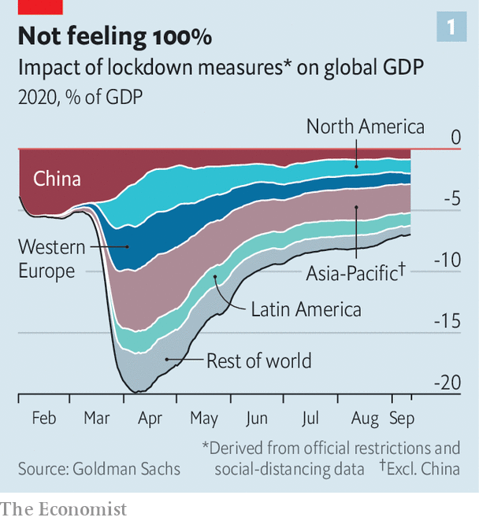
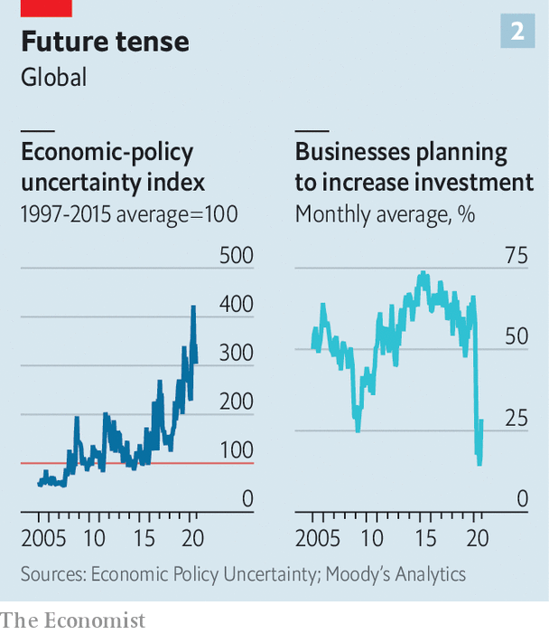

## The 90% economy, revisited

# Is the world economy recovering?

> A recovery is taking shape—but it is extraordinarily uneven

> Sep 16th 2020

Editor’s note: Some of our covid-19 coverage is free for readers of The Economist Today, our daily [newsletter](https://www.economist.com/https://my.economist.com/user#newsletter). For more stories and our pandemic tracker, see our [hub](https://www.economist.com//news/2020/03/11/the-economists-coverage-of-the-coronavirus)

THE WORST day of the covid-19 pandemic, at least from an economic perspective, was Good Friday. On April 10th lockdowns in many countries were at their most severe, confining people to their homes and crushing activity. Global GDP that day was 20% lower than it would otherwise have been (see chart 1). Since then governments have lifted lockdowns. Economies have begun to recover. Analysts are pencilling in global GDP growth of 7% or more in the third quarter of this year, compared with the second.

That may all sound remarkably V-shaped, but the world is still a long way from normal. Governments continue to enforce social-distancing measures to keep the virus at bay. These reduce output—by allowing fewer diners in restaurants at a time, say, or banning spectators from sports arenas. People remain nervous about being infected. Economic uncertainty among both consumers and firms is near record highs—and this very probably explains companies’ reluctance to invest (see chart 2).

Calculations by Goldman Sachs, a bank, suggest that social-distancing measures continue to reduce global GDP by 7-8%—roughly in line with what The Economist argued in April, when we coined the term “90% economy” to describe what would happen once lockdowns began to be lifted. Yet although the global economy is operating at about nine-tenths capacity, there is a lot of variation between industries and countries. Some are doing relatively—and surprisingly—well, others dreadfully.

Take the respective performance of goods and services. Goods have bounced back fast. Global retail sales had recovered their pre-pandemic level by July, according to research by JPMorgan Chase, another bank. Armed with $2trn-worth of cash handouts from governments since the virus struck, consumers across the world have stocked up on things to make it bearable to be at home more often, from laptops to dumbbells, which partly explains why world trade has held up better than economists had expected. Global factory output has made up nearly all the ground it lost during the lockdowns.

Services activity is a lot further below its pre-pandemic level, largely because such industries are vulnerable to people avoiding crowds. The number of diners in restaurants remains 30-40% lower than normal worldwide, according to data from OpenTable, a booking platform. The number of scheduled flights is about half what it was just before the pandemic struck.

The variation in economic performance between countries is even more striking. It is common for growth rates to diverge in downturns. But the size of this year’s collapse in output means that the differences between countries’ growth rates are enormous. On September 16th the OECD, a club of mostly rich countries, issued fresh economic forecasts. Like other forecasters—such as the Federal Reserve, which on the same day published new projections for the American economy—it has become less gloomy in recent months.

Still, the growth gap between best and worst performers in the G7 group of countries in 2020 is expected to be 6.7 percentage points, far wider than that during the last global downturn a decade ago. Of the big economies, only China is set to expand in 2020 (see [article](https://www.economist.com//finance-and-economics/2020/09/19/what-is-fuelling-chinas-economic-recovery)). Some countries, such as America and South Korea, face a downturn but hardly a catastrophic one (see chart 3). Britain, by contrast, looks to be in line for its deepest recession since the Great Frost of 1709.

Some economists contend that the huge gap between countries is a statistical mirage, reflecting different methods of computing GDP figures. In Britain, for instance, the way statisticians tot up government spending means that school closures and cancelled hospital appointments have a bigger impact on GDP than elsewhere. But this effect is small—the bulk of the fall in output has come from the private sector.

Instead, performance comes down to three factors. The first is industrial composition. Countries such as Greece and Italy, which rely on retail and hospitality, always looked more vulnerable than, say, Germany. Its large manufacturing sector has benefited from the global goods recovery.

Second is confidence, which appears to be determined by a country’s experience under lockdown. Britain’s poor economic performance is likely to be related to the government’s poor handling of the pandemic. Britons seem more nervous than other Europeans about venturing outside.

The third factor is stimulus. America’s lawmakers may be unable to agree on a top-up, but they have already enacted the world’s largest rescue package, relative to the size of its economy. The OECD thinks it will be one of the better-performing rich countries this year.

What next for the 90% economy? Some authorities have been forced to order further lockdowns. But others may be able to calibrate social-distancing measures better without jeopardising output. That might bring the world closer to, say, a 95% economy. Indeed, the OECD expects global GDP to recover further this year.

It may be tempting to think that a vaccine, if it could be rolled out widely enough, would quickly restore normality. But there will be scars. Firms’ reluctance to invest today will mean less productive capital in the future. A growing number of American workers believe they will not be returning to their old jobs. Reallocating redundant resources towards more productive firms will take time. The Fed’s rate-setters reckon unemployment will not return to its pre-pandemic rate of 4% until 2023; analysts at Goldman Sachs think it will do so only in 2025, even though they are optimistic that a vaccine will soon be widely distributed. Much as the disease itself has long-lasting effects, the covid-induced downturn will leave the world economy feeling subpar for some time to come. ■

## URL

https://www.economist.com/finance-and-economics/2020/09/16/is-the-world-economy-recovering
