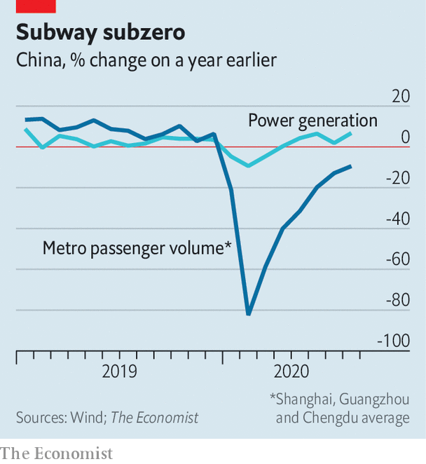

## One-armed fighter

# What is fuelling China’s economic recovery?

> Industry had a head start, but consumption is starting to pick up

> Sep 19th 2020SHANGHAI

“THE EIGHT HUNDRED” is an unusual Chinese film for its depiction of Nationalist soldiers as heroes in a grinding battle against Japanese invaders in 1937. The Nationalists, or Kuomintang, fought a long on-off civil war against the Communist Party and so are typically portrayed as villains and stooges on Chinese screens. From a global perspective, the film is unusual for a different reason. It is that rarest of things in these covid-clouded times: a box-office hit. Released a month ago, it has pulled in nearly 3bn yuan ($440m), propelling Chinese cinemas to their best showing by far since January, when the country went into near-total lockdown.

Many of China’s factories reopened as early as February, but it is only now, nearly eight months on, that the broader economy is approaching its normal trajectory. Based on a batch of activity data published on September 15th, China is on track to expand by roughly 5% in the third quarter compared with a year earlier, a smidgen below the 6% growth rate that it reported in the second half of 2019, before covid-19 erupted. That puts it well ahead of all other big economies in the scale of its recovery.

But the shape of China’s recovery is unbalanced. The supply side of the economy had a head start over the demand side, and has maintained a big lead. Industrial output rose by 5.6% year-on-year in August, while retail sales rose by just 0.5%. A range of alternative measures underline this gap. Power generation rose strongly in August thanks in part to resilient factory activity. The number of underground journeys, by contrast, levelled off at about a tenth below normal, indicating that some people are still wary of venturing into crowded places (see chart). Some analysts worry that these imbalances are spilling into the global economy as excess production ends up abroad. China’s share of world merchandise exports hit a record high of more than 13% in the second quarter, according to data from CPB World Trade Monitor.

A key question is thus whether the uneven growth is simply the ephemera of the covid-19 economy or whether it points to a more fundamental problem. The answer is probably a bit of both. Weak consumer spending has long been a feature of China’s economy. Household consumption was just 39% of GDP last year, well below the global average of 63%. The pandemic has shone a harsh light on one explanation: a threadbare social safety-net. During the depths of China’s lockdown, just 3% of the roughly 80m people without jobs collected unemployment insurance. As low-income earners have a higher propensity to spend, the lack of support weighs on consumption more generally.

Some of the extreme unevenness of the recovery will not last, however. The government prioritised reopening factories over restarting the rest of the economy because of its calculations about how to control the pandemic. That was the right call. It is easier to maintain strict health protocols in factories, which can be managed as semi-closed environments, than in shopping malls, where people come and go.

Encouragingly, a closer look at the data for August suggests that China’s consumers may be starting to close the gap with its producers. In month-on-month terms, retail sales grew a little more quickly than industrial output—the first such outperformance in half a year. The demand rebound would be even stronger except for the social-distancing rules still in place. Cinemas, for example, can sell tickets for only half their seats. “The Eight Hundred” is climbing the box-office charts with one arm tied behind its back. ■

## URL

https://www.economist.com/finance-and-economics/2020/09/19/what-is-fuelling-chinas-economic-recovery
