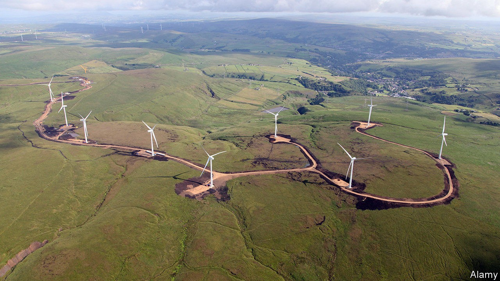
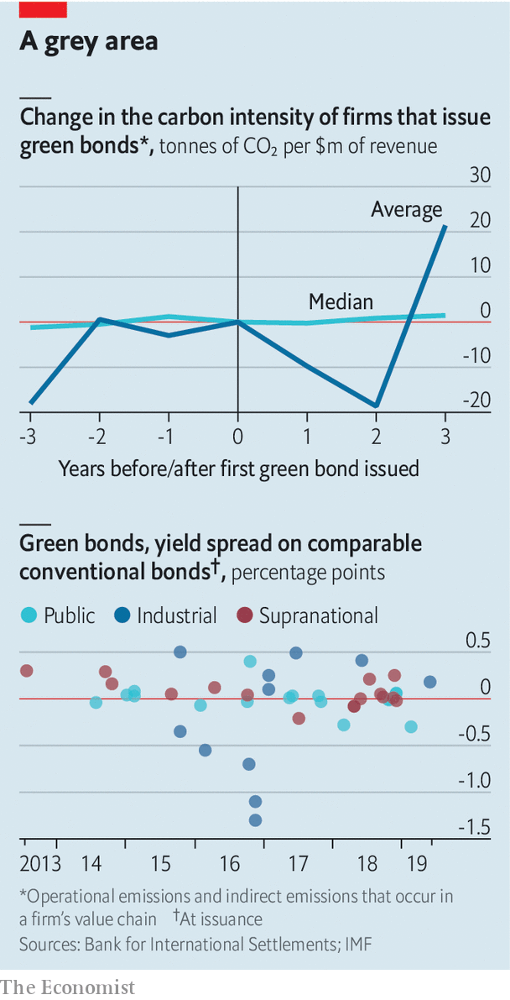

## The meaning of green

# What is the point of green bonds?

> A new study finds little evidence that they directly cut carbon or lower costs

> Sep 19th 2020

GREEN BONDS are the stars of climate finance. These instruments, which channel funds raised towards environmentally friendly projects, raised $271bn in 2019, according to BloombergNEF, a consultancy. That is only about 4% of total bond issuance worldwide, but it easily makes green bonds the most popular form of eco-friendly debt. Covid-19 has only slightly slowed the rise. On September 2nd Germany issued green paper for the first time. The European Commission is mulling using them to fund just under a third of its €750bn ($888bn) stimulus package.

Yet a new study by the Bank for International Settlements, a club of central banks, raises questions about the purpose of green bonds. Researchers looked at 200-odd large firms that issued them in 2015-18. They found that firms that issue the most tend to be cleaner in the first place—ie, they produce the least carbon for a given amount of revenue. Over 70% of issuers have a carbon intensity equivalent to a consumer-staples firm, such as Procter & Gamble, or lower. Large polluters rarely issue such bonds for fear of being accused of greenwashing, and because the bonds would be excluded from green funds.

Another finding was that green-bond issuance did not seem to lead to decarbonisation. In the years after issuance, the average carbon intensity oscillates wildly, but the changes are not statistically significant. Moreover, though some issuers claim that tapping the green-bond market lowers their cost of borrowing, data from the IMF suggest a discount is rare (see chart).

If green bonds cut neither costs nor carbon directly, then what are they for? Proponents still see benefits. Some green bonds fund worthy projects that do not reduce carbon footprints, such as improving water management. This is the case for at least a fifth of the stock of green bonds by value, reckons HSBC, a bank. Moreover, many bonds are used to refinance genuinely green projects. So the reduction in carbon dioxide may have happened before issuance, argues Sean Kidney of the Climate Bond Initiative, a non-profit group.

For issuers, one advantage is reputational. Issuing a green bond sends virtuous signals to regulators. Chris Kaminker of Lombard Odier, a bank, argues that the green label may also attract a wider pool of lenders than conventional bonds.

Green bonds can also make life easier for institutional investors pressed by clients to become more climate-conscious. They could invest directly in green projects, which often take the form of infrastructure. But a failed project may default on its repayments to direct investors. Green-bondholders face less risk; the issuer must pay even if the project fails. Issuers also typically disclose the details of projects, such as their size and location. Such morsels are otherwise hard to come by.

Investors seeking to encourage decarbonisation could turn to newer instruments. Big polluters can use the proceeds of “transition” bonds to decarbonise. In March Cadent Gas, a British firm, raised a €500m note to reduce leakages from its pipeline, among other things. “Sustainability-linked” bonds tie interest payments to the achievement of a target. The first of these was issued by Enel, an Italian electricity firm, last year, and is linked to increasing the share of renewables in its generation capacity.

So far there have only been a handful of issuances of these newer sorts of bonds. Expanding the market will take time, as investors become familiar with them. For now, climate-conscious investors may have to stick with green bonds—and doing less good for the planet than they may have claimed to their clients. ■

For more coverage of climate change, register for The Climate Issue, our fortnightly [newsletter](https://www.economist.com//theclimateissue/), or visit our [climate-change hub](https://www.economist.com//news/2020/04/24/the-economists-coverage-of-climate-change)

## URL

https://www.economist.com/finance-and-economics/2020/09/19/what-is-the-point-of-green-bonds
