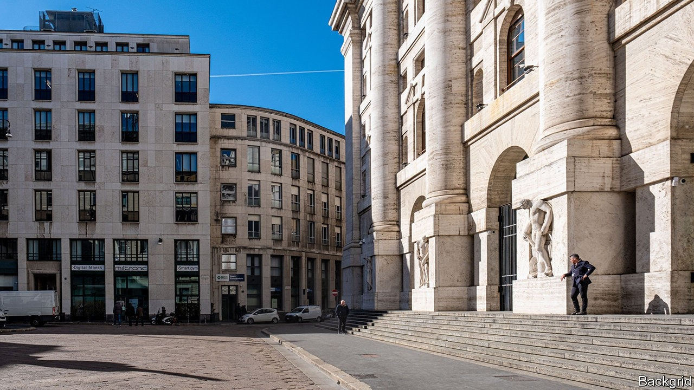

## Shotgun wedding

# Who will buy Borsa Italiana?

> Euronext is not the highest bidder, but it is the most politically expedient choice

> Sep 19th 2020BERLIN

IN AN AUCTION, the highest bidder usually walks away with the asset on sale. Yet considerations that are not purely commercial are likely to determine who wins the London Stock Exchange’s auction of Borsa Italiana. The LSE is selling the Italian stock exchange in order to ensure regulatory approval of its takeover of Refinitiv, a financial-data provider that it agreed to buy last year for $27bn. The bidder least likely to upset European politicians and regulators seems likely to prevail, rather than the one offering the most dosh.

There are three suitors on the scene. The highest bidder is reportedly Switzerland’s SIX, a Zürich-based stock exchange which brings a big war chest and a strong credit rating to the party. (A spokesman for SIX did not confirm the offer.) The mooted price is €3.4bn ($4bn)—and could go higher. Deutsche Börse, Germany’s main stock exchange, made a non-binding offer to buy Borsa Italiana on September 11th. Euronext followed suit with its offer on September 14th. The Paris-based exchange, which has already hoovered up bourses in Amsterdam, Brussels, Dublin, Lisbon and Oslo, has teamed up with Cassa Depositi e Prestiti Equity (CDP), a bank controlled by the Italian state that invests the country’s postal savings, and Intesa Sanpaolo, Italy’s biggest bank, to buy Borsa.

The LSE has owned both the Milan-based exchange and MTS, the Borsa group’s bond-trading platform, since 2007. It had no plans to sell until the European Commission in June began sniffing around its planned takeover of Refinitiv. Brussels frets that a combined firm could wield significant market power in the electronic trading of European sovereign bonds and derivatives. The commission’s investigations have wrecked many a European merger. So, in order to satisfy regulators, the LSE has put the Borsa group, which includes MTS, on the block. And with the commission due to conclude its antitrust review by December 16th, LSE wants to agree on a sale quickly.

Euronext is the most likely victor, according to Ian White at Autonomous, a financial-research firm. Michael Werner, an analyst at UBS, a bank, agrees, and adds that Deutsche Börse is the least likely to win. MTS provides LCH, a clearing-house owned by LSE, with around €45m of revenue a year. LSE will therefore be keen to ensure MTS continues to use the clearing-house after the sale. As Euronext owns 11% of LCH, the odds are it would keep doing so. Deutsche Börse, by contrast, would probably divert clearing business from LCH to Eurex, its subsidiary. For its part, Euronext has been an active buyer of European exchanges in recent years. Mr Werner thinks it can make the most of any synergies.

Euronext’s trump card, though, is its decision to partner with the Italian state: CDP would own 8% of Borsa. Earlier this year Italy’s government extended its “golden-power” law, which entitles it to intervene in deals in strategically important sectors, such as financial infrastructure.

Politicians have made their intentions clear. The populist Five Star movement, which is part of the ruling coalition, wants Borsa to be brought back under Italian influence. The Northern League, a right-wing party, warns against a sale to foreigners. Consob, the financial regulator, is headed by Paolo Savona, a Eurosceptic notorious for his aversion to Germany. Binding offers are expected next month, but insiders say LSE could make a decision even sooner. With Rome on its side, the deal is Euronext’s to lose. ■

## URL

https://www.economist.com/finance-and-economics/2020/09/19/who-will-buy-borsa-italiana
