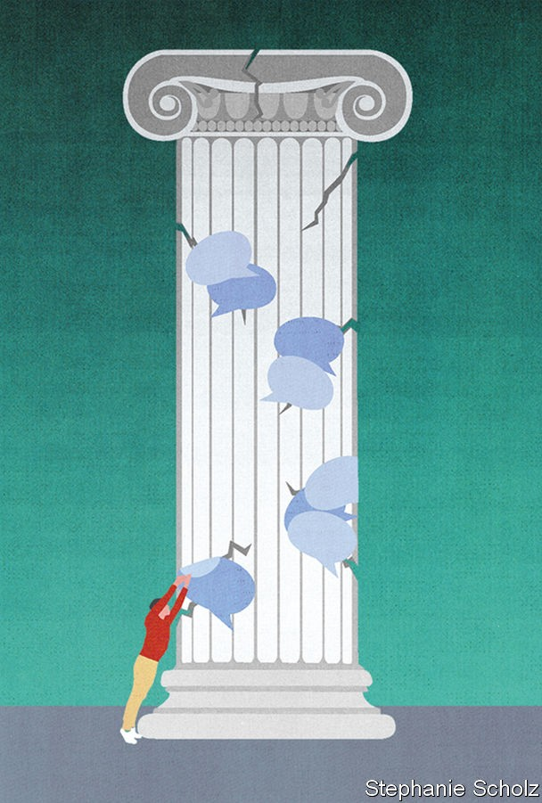

## Some assembly required

# Citizens’ assemblies are increasingly popular

> Do they work?

> Sep 19th 2020GLASGOW, PARIS AND ZOOM

SHIRLEY ISLAM has little faith in politics. Elected representatives “are either bickering on TV, or wasting taxpayer money, or trying to sell something,” says the 48-year-old care worker from West Lothian, in Scotland. “They are all saying the same thing,” she sighs. But she has felt a little more hopeful of late. Her optimism is a result of her involvement in a “citizens’ assembly” in Scotland to debate the country’s future—held first in a conference centre in Glasgow and since September 5th on Zoom. Politics, she thinks, “needs to be in touch with people.” “This is the way forward,” she continues. “It has to be.”

Over the past decade democratic institutions have taken a battering. According to Pew Research Centre, an average of 64% of people across 34 countries do not believe that elected officials care what ordinary folk think. Fully 69% of Britons are dissatisfied with the way democracy is working at home, as are 59% of Americans.

One solution, long favoured by political scientists, is to include more deliberation within democracy. Citizens’ assemblies are an increasingly popular way of doing so. These involve a group of around 100 people, broadly representative of the population (by gender, age and socioeconomic status, say), meeting over several weeks or months to debate tricky topics, such as whether to legalise abortion or how to respond to climate change. In the course of the best-organised assemblies participants hear from experts on all sides and produce recommendations to which their governments have promised to respond.

Several big citizens’ assemblies are under way or have recently concluded. Last year President Emmanuel Macron created a “citizens’ convention on climate” to come up with measures that will enable France to reduce greenhouse gas emissions by at least 40% by 2030. The proceedings, which were disrupted first by national strikes and then by the covid-19 lockdown, concluded in June. The 150 participants called for two changes to the constitution to help preserve the environment and biodiversity, and a law to criminalise “ecocide”. A “climate assembly” in Britain issued its final report, completed via Zoom, on September 10th. “Deliberación País”, a large-scale deliberative process in Chile to debate pension reform and health care, has been postponed to December and will be online only.

Although citizens’ assemblies had been tried in Canada and the Netherlands in the early 2000s, the recent craze started in Ireland. Two citizens’ assemblies have taken place there to discuss a variety of topics. The original impetus was the financial crash of 2007-09, which left many in the country feeling disillusioned with politics and made politicians more willing to experiment, recalls David Farrell of University College Dublin (UCD), who advised the Irish government on the projects. A similar sense of crisis informed the citizens’ convention in France, which was set up in response to the gilets jaunes protests.

The Irish assemblies led to two referendums, on same-sex marriage and on abortion, topics long considered too divisive for politicians even to broach in a country where three-quarters of the population still describe themselves as Catholic. The results were striking. In 2015 same-sex marriage was approved by 62% of the population; 66% voted in 2018 in favour of making abortion available in the first 12 weeks of pregnancy. The citizens’ groups foreshadowed these results.

“Ireland is the Rolls-Royce of citizens’ assemblies,” says Iain Walker of the newDemocracy Foundation in Australia, which has run similar pow-wows in that country. Mr Farrell is more circumspect. Ireland’s convocations were not perfect: at one the supposedly randomly selected citizens, rustled up by a market-research firm, included a couple. At another seven participants turned out to be friends with one of the recruiters. Nonetheless, the fact that the assemblies helped pave the way for significant reforms makes Ireland something of a “beacon”, he thinks.

Ideally the gatherings should resemble the public at large. France selected the members of its assembly at random by telephone. Some 255,000 people were contacted. To the organisers’ surprise 70% said they were willing to take part. Of those, 150 French citizens who reflected the country’s make-up in terms of gender, age, income and place of residence were invited to participate. The minimum age was set at 16 to enable high-school pupils to be involved. Each person was paid €86 ($97 then) a day (the same sum paid in France to those on jury duty). Child-care costs were reimbursed, and the assembly paid directly for hotels and train fares. The budget was over €5m. In order to drum up 120 people for Scotland’s meeting, the teams organising it knocked on some 10,000 doors across the country. Each participant is paid £200 for every weekend they attend; the assembly costs £1.4m ($1.8m).

Participants seem to enjoy the process. Isabelle, a finance director from western France, said she initially thought the invitation to take part in the convention there was “a joke”. It turned out to be anything but. The experience, she says, has been “enriching” but also “shocking”, as it has opened her eyes to the climate crisis.

But can deliberation change people’s views? In America James Fishkin, a professor at Stanford and the director of the Centre for Deliberative Democracy, has run a series of “deliberative polls”—similar to citizens’ assemblies but much larger, with 500 or so people involved, totally randomly selected—to see if the process can bridge the partisan divide.

One of Mr Fishkin’s gatherings, in September 2019, demonstrated that Americans could indeed change their opinions. After four days hearing from experts and discussing with their peers five policy areas (immigration, health care, the economy, the environment and foreign policy) those involved concluded that democracy was in fact working rather better than they had thought. On particularly divisive topics, people tiptoed to the centre ground: support for reducing the number of refugees allowed to resettle in America dropped by 15 percentage points, to 22%. Among Republicans it fell by 32 percentage points, to 34%. Meanwhile support for increasing the federal minimum wage fell by 23 percentage points among Democrats, to 59%.

A larger question is whether these processes can change opinions among the broader population. According to research by Mr Farrell, Jane Suiter of Dublin City University and others, those who voted in the referendum to liberalise abortion in Ireland were more likely to have heard of the assembly, suggesting a possible causal relation between the two.

To work well, these assemblies need a clear subject to discuss. Alan Renwick, a specialist in deliberative democracy at University College London, thinks that they are best suited to grappling with large, seemingly intractable problems, such as climate change. But it is also helpful if that topic can be framed as a choice: the subject is fraught, but debating whether abortion should be legalised is more straightforward than trying to paint a picture of Scotland’s future, as the citizens’ assembly there is supposed to do. In Australia, Mr Walker notes, deliberative groups are typically given a question of no more than ten words to discuss. Anything longer than that, the thinking goes, and it becomes harder for people to understand, and easier for politicians to ignore any solutions that might be proposed.

Some worry that the shift online will undermine the value of these meetings—even though, as with many aspects of life, many participants feel it has worked surprisingly well. Most of the assemblies that have moved online this year had an advantage: the members had met in real life before. It is hard to see the process of a “group forming and becoming committed” happening in an online-only forum, says Mr Renwick, without the ability to hobnob over lunches or tea. Ms Islam was nervous about the change. She had to remind herself of how committed she felt to the assembly to gee herself up for the sessions, and has been reading up before the discussions to keep engaged. As more assemblies, such as the one in Chile, are held entirely online, it will become clearer how well they work at a distance.

What is clear is that citizens’ assemblies are most successful when politicians actually listen to them. For a long time, that looked improbable. Matthew Taylor recalls that when he was the head of the prime minister’s policy unit in Britain, he tried to get the two prime ministers he worked for, Tony Blair and Gordon Brown, interested in the idea of assemblies. “On both occasions both the politicians and officials loved the idea, up to the point at which I said, ‘You can’t control the outcome and you will have to respond to it positively. Not to implement it, but to respond to it positively.’”

By contrast, the French government went out of its way to demonstrate its support for the citizens’ assembly. Mr Macron dropped by for an evening sitting in January, and stayed to answer questions for over two-and-a-half hours. In June, he invited the participants to his official residence and gave a speech in the garden in which he promised to put either into legislation, or to a referendum, all but three of the 149 proposals put forward by the assembly. (That pledge was looking shaky on at least one count this week after the president vowed to press ahead with the roll-out of 5G networks, despite the assembly’s proposal for a moratorium.) He also promised €15bn towards the implementation of the proposals. 

In Scotland the assembly was set up by Nicola Sturgeon, the first minister. Several participants felt confident that their proposals would be acted on in Holyrood. “I really feel they are going to listen,” said Lynsay Walton, a 61-year-old cleaner. “That’s why I keep coming.” Others were more dubious. “If it is not responded to, it’s a waste of time,” said David Farrell, a joiner.

Not everyone is entirely convinced of the virtues of this kind of deliberative democracy. According to Kevin Elliott of Murray State University in America, however these groups are chosen, there will always be an element of self-selection, as it is not a compulsory process. “You are always extending an invitation that can be refused,” he points out. He worries that citizens’ assemblies are an attempt “to solve the problem of distrust [in democracy] with a technocratic fix”. Samuel Bagg of Oxford University wonders whether, if assemblies are given more power, they will be subject to more influence from lobby groups: a climate assembly lobbied by a fossil-fuel company, and so on.

It is inevitable that, as assemblies proliferate, some will be considered flops. But when they work well, these groups provide elected representatives with a mind-clearing idea of what voters really want. ■

## URL

https://www.economist.com/international/2020/09/19/citizens-assemblies-are-increasingly-popular
